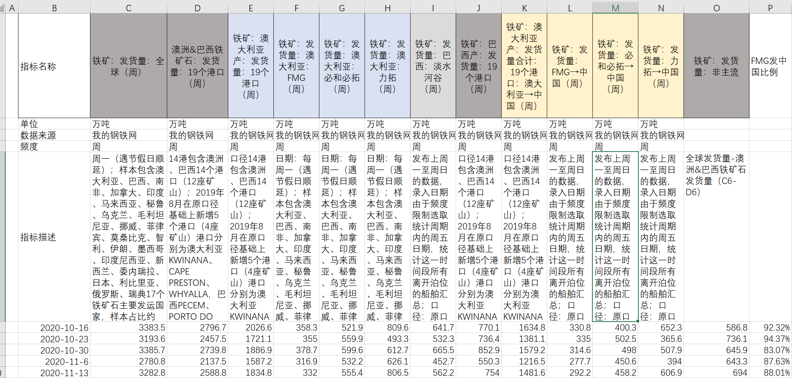
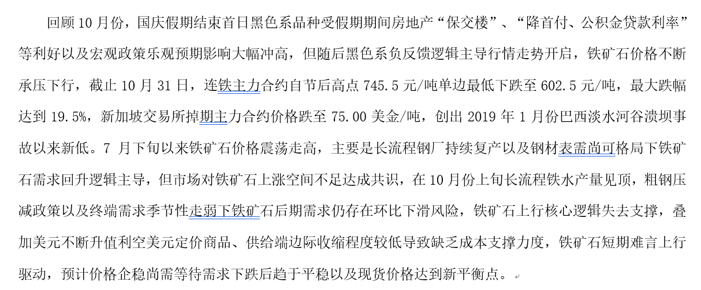
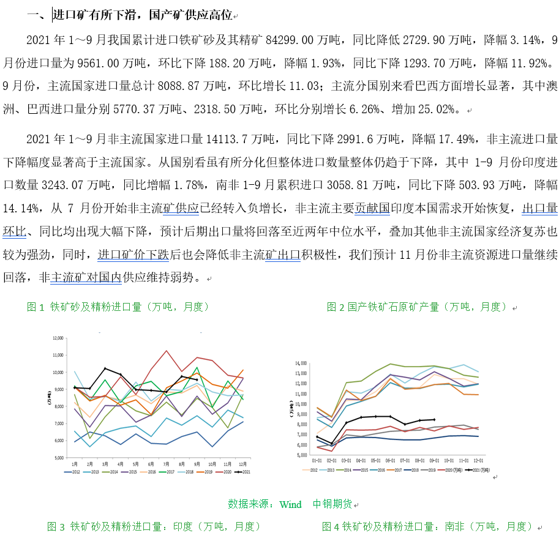
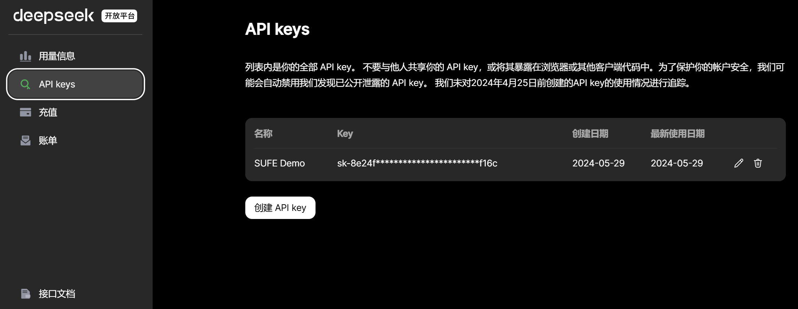
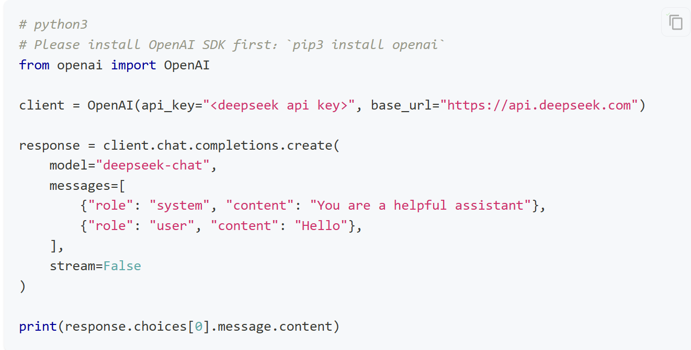

# 智能研报生成任务

## 项目背景

本项目需要根据已有数据，生成**铁矿石投资研报**

已有数据：
+ 一段时间以内所有的铁矿石投资相关的各类指标数据，

+ 2020-2022年可供参考的往期研报。

## 项目目标
使用大模型（API、本地部署均可，推荐使用API）按月度自动化生成研究月报中的**走势回顾**和**供给分析**两个板块的内容。

+ **走势回顾**
> 走势回顾内容示例：
> 

+ **供给分析**
> 供给分析内容示例：
> 

+ 具体需要生成研报的月份为：2022年9月、11月、12月；2023年3月、5月、6月、8月、9月

+ 可以仅生成纯文字报告，也可以自动化生成带有图表的报告

##  数据说明

本项目提供了所有相关结构化数据指标，以及2020-2022年的完整铁矿石研报以供参考。为了降低实施难度并方便评估，你不必生成包含所有完整指标的研报，可以自由发挥。**但是可以重点关注以下内容**：

+ 指标数据相关内容：
+ 走势回顾相关：普氏62%指数价格，日照港Pb粉等现货价格，合约价格、DCE01、DCE05、DCE07
+ 供给分析相关：各类矿石的产量和发运、IronOre_supply文件中各字段
+ 往期研报内容：走势回顾与供给分析部分行文参考：2022年各月报的开头若干段落，与预期测试的文本较为类似。

## 模型评价

1.  生成研报**定量分析的准确性**：生成文本的数字描述与原始数据的相符程度

2.  生成研报**定性分析的准确性**：生成文本对趋势的描述与真实数据的相符程度

3.  生成研报的**专业性**：是否覆盖重要信息，具有一定的专业参考价值

## 项目链接&参与注意事项

具体的数据集及项目介绍，已经发布在Kaggle竞赛平台上，你需要从以下链接进入该项目，注册账
号并加入竞赛。（必须从下面的邀请链接中进入）：

+ 项目邀请链接：https://www.kaggle.com/t/6c4c34c6b4584b188922a4f0b7594a96

**注意事项**

1.  本任务**可以且推荐**使用各类大模型API，包括GPT系列、DeepSeek等。

2.  务必将Kaggle排行榜的名字，改为
    **SUFEDL_你的名字_你的学号**，否则视为无效提交。

3.  Kaggle显示指标为**Bleu Score。**但是请特别注意！**Bleu
    Score不作为最终打分依据，仅供参考，最终成绩将还会包含大模型自动评估和专家打分评价。**

4.  如果你的方法可以自动化生成带有图表的报告，请将带有图表的报告打包发送到助教邮箱：2281766692@qq.com

## 参与指引
附：本任务推荐使用的DeepSeek API Quick Start**

**URL：**<https://www.deepseek.com/zh>

1. 注册账号后，进入控制台申请API Key
    
   

2.  在你使用的Python环境中安装openai包，
> 命令示例：pip install openai

3.  参考[快速开始 \| DeepSeek API
    Docs](https://platform.deepseek.com/api-docs/zh-cn/)文档中的例子与参数设置发起调用请求即可。

> 例如：
> 
