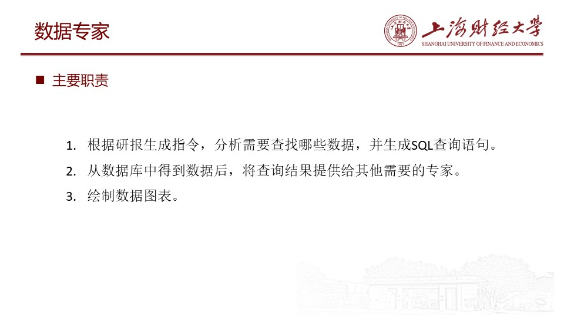

# 研报生成项目

## 样例展示


更多样例可在本项目的 `/reportResults`中查看

## 运行方式
在`Config/config.py`中配置相关参数

```python
deepseek_key = "你的api" # API key
# 关于如何申请deepseek api ,请参考 https://platform.deepseek.com/api-docs/zh-cn/

databaseDir = '你的项目路径/dataAgent/ironDB.db' # 数据库路径
saveReportDir = '你的项目路径/reportResults' # 保存研报的生成路径
```


运行`main.py`

```python
# 在这里设置需要生成研报的日期
yearMonList = ["2022年9月","2022年11月","2022年12月","2023年5月","2023年6月","2023年8月","2023年9月"]
```

你可以在`ReportGenerateAgent/reportAgentNew.py`中配置研报的结构和主题
```python
# 研报片段的分析主题
topics=[
    "走势回顾情况：普氏62%指数价格，日照港Pb粉等现货价格，合约价格、DCE01、DCE05、DCE07变化",
    "国际铁矿石供给情况:铁矿砂及精粉进口量、到港量变化(可以分主流矿和非主流矿)",
    "国际铁矿石供给情况:四大矿山(巴西的淡水河谷、澳大利亚的力拓、必和必拓和福蒂斯丘)年度年产量变动情况",
    "国内铁矿石供给情况:国产铁矿石原矿产量",
    "国内铁矿石供给情况:矿山产能利用率"
]
```

## Kaggle比赛链接
https://www.kaggle.com/competitions/research-report-generation/leaderboard

## 项目概述





