# 2022年11月月报：走势回顾与供给分析：铁矿石
## **2022年11月铁矿石价格波动回顾**
自2022年11月以来，2022年11月，铁矿石价格普涨，日照港Pb粉现货及DCE合约均显示上涨趋势。 指标走势方面，日照港Pb粉现货价格在2021年11月至2022年11月期间呈现波动上升趋势，从2021年11月的643元/吨上涨至2022年11月的766元/吨，涨幅达19.13%。DCE01合约价格同期从628.0元/吨上涨至770.5元/吨，涨幅为22.69%；DCE05合约价格从604.0元/吨上涨至748.5元/吨，涨幅为23.92%；DCE07合约价格从579.0元/吨上涨至718.5元/吨，涨幅为24.09%。各合约价格在2022年11月均显示出较强的上涨动力。 日照港Pb粉现货价格在2021年11月至2022年11月期间呈现波动上升趋势，从2021年11月的643元/吨上涨至2022年11月的766元/吨，涨幅达19.13%。DCE01合约价格同期从628.0元/吨上涨至770.5元/吨，涨幅为22.69%；DCE05合约价格从604.0元/吨上涨至748.5元/吨，涨幅为23.92%；DCE07合约价格从579.0元/吨上涨至718.5元/吨，涨幅为24.09%。各合约价格在2022年11月均显示出较强的上涨动力。这一上涨趋势主要受到市场对铁矿石需求增加的预期影响，以及供应端的不确定性因素，如矿山产能调整和国际贸易环境变化。同时，国内政策的调整和市场情绪的波动也对价格产生了一定影响。
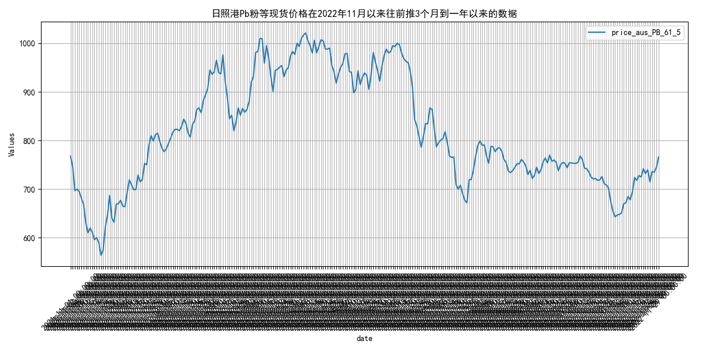
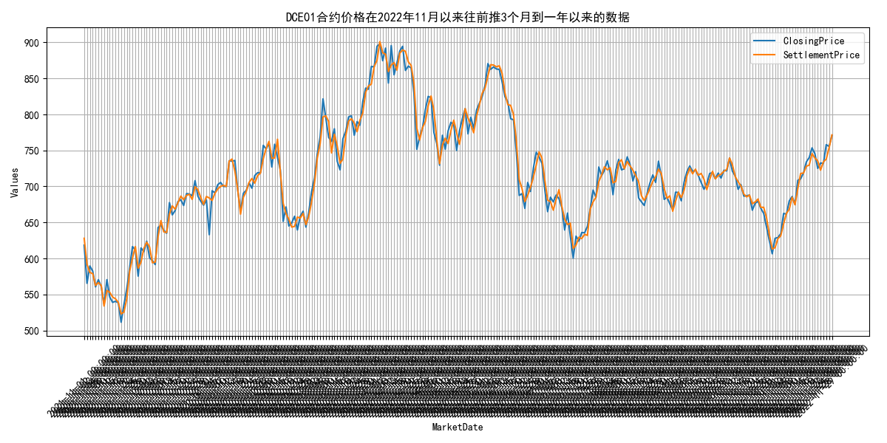
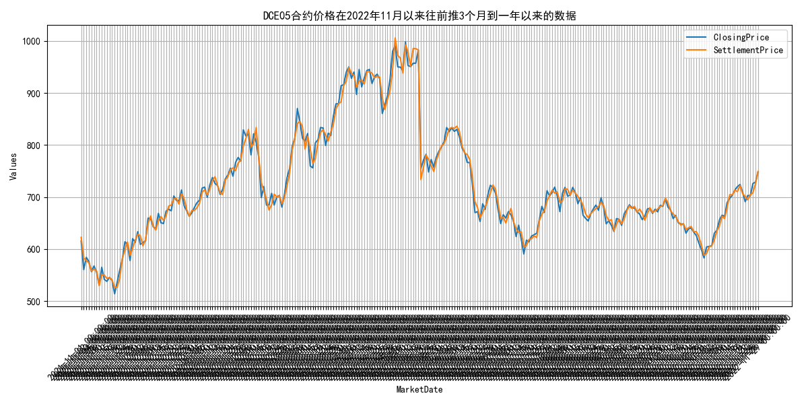
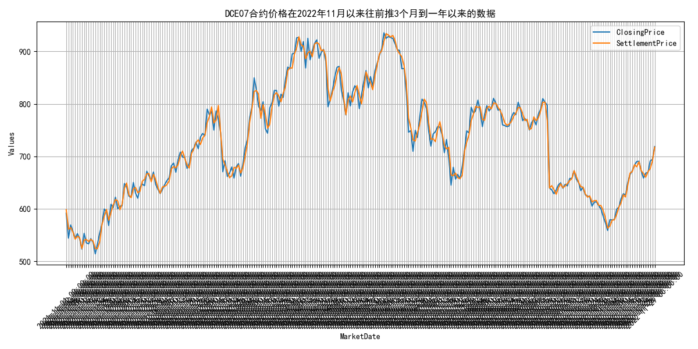

## **2022年11月国际铁矿石供给分析**
自2022年11月以来，2022年11月，主流矿发货量增加，非主流矿显著下降。 指标走势方面，2022年11月，国际铁矿石供给情况显示，全球发货量、澳洲和巴西发货量以及非主流矿发货量分别为3103.2万吨、2624.9万吨和478.3万吨。从月度总计来看，2022年11月全球发货量为11807.1万吨，澳洲和巴西发货量为10165.7万吨，非主流矿发货量为1641.4万吨。与2021年11月相比，全球发货量从12204.6万吨增加到11807.1万吨，澳洲和巴西发货量从9713.1万吨增加到10165.7万吨，非主流矿发货量从2491.5万吨减少到1641.4万吨。整体来看，主流矿发货量有所增加，而非主流矿发货量显著下降。 2022年11月，国际铁矿石供给情况显示，全球发货量、澳洲和巴西发货量以及非主流矿发货量分别为3103.2万吨、2624.9万吨和478.3万吨。从月度总计来看，2022年11月全球发货量为11807.1万吨，澳洲和巴西发货量为10165.7万吨，非主流矿发货量为1641.4万吨。与2021年11月相比，全球发货量从12204.6万吨增加到11807.1万吨，澳洲和巴西发货量从9713.1万吨增加到10165.7万吨，非主流矿发货量从2491.5万吨减少到1641.4万吨。整体来看，主流矿发货量有所增加，而非主流矿发货量显著下降。这可能是由于全球经济复苏带动需求增加，尤其是中国市场的强劲需求，推动了主流矿的发货量。同时，非主流矿由于成本较高和市场竞争力较弱，导致其发货量减少。展望未来，随着全球经济的进一步复苏和基础设施建设的加速，预计主流矿的发货量将继续保持增长，而非主流矿的发货量可能会受到价格和市场竞争力的影响，保持较低水平。
        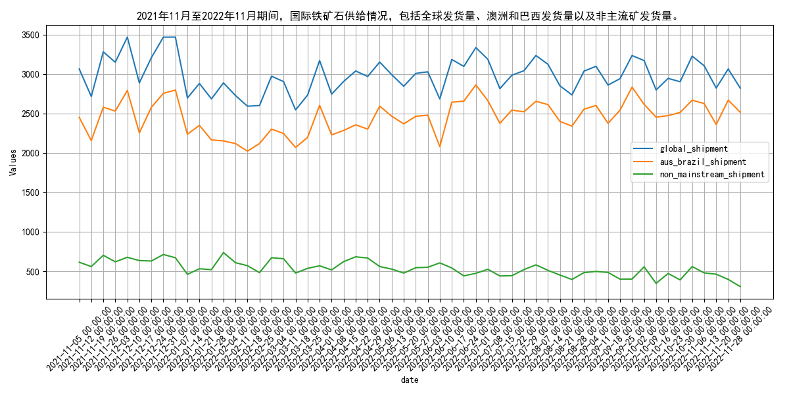
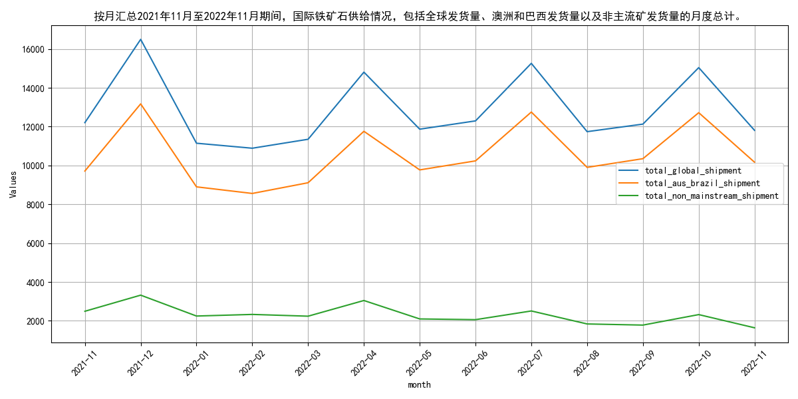

## **2022年四大矿山铁矿石产量显著增长**
自2022年11月以来，2022年，四大矿山铁矿石产量均大幅增长，淡水河谷、力拓、必和必拓和福蒂斯丘产量显著提升。 指标走势方面，近3年内，四大矿山年度年产量变动情况显示，2022年总产量较2021年有显著增长。具体来看，巴西淡水河谷的年度出货量从2021年的4932.5万吨增加到2022年的23880.6万吨，澳大利亚力拓从6040.5万吨增加到28501.7万吨，必和必拓从5116.0万吨增加到25433.6万吨，福蒂斯丘从3266.5万吨增加到17133.5万吨。这些数据显示，四大矿山的年度产量在2022年均实现了大幅增长。 近3年内，四大矿山年度年产量变动情况显示，2022年总产量较2021年有显著增长。具体来看，巴西淡水河谷的年度出货量从2021年的4932.5万吨增加到2022年的23880.6万吨，澳大利亚力拓从6040.5万吨增加到28501.7万吨，必和必拓从5116.0万吨增加到25433.6万吨，福蒂斯丘从3266.5万吨增加到17133.5万吨。这些数据显示，四大矿山的年度产量在2022年均实现了大幅增长。原因可能包括全球经济复苏带动需求增加，以及矿山自身产能扩张和技术升级。展望未来，随着全球经济的进一步恢复和矿山产能的持续优化，预计四大矿山的年度产量将继续保持增长态势。
        年度年产量变动情况；时间范围：2022年11月以来，往前推3个月到一年以来的相关数据，按月汇总。.png)
年度年产量变动情况；时间范围：2022年11月以来，往前推3个月到一年以来的相关数据，按年汇总。.png)

## **2022年11月国内铁矿石原矿产量波动分析**
自2022年11月以来，2022年11月，国内铁矿石原矿产量自3月高峰后持续下降，10月降至7267.5万吨。 指标走势方面，2021年11月至2022年11月，国内铁矿石原矿产量呈现波动变化。2021年11月产量为7839.6万吨，随后数月基本稳定在7850万吨左右。2022年3月产量显著增加至9476.2万吨，之后在5月达到峰值9780.5万吨。随后产量逐渐下降，至2022年10月降至7267.5万吨。整体来看，2022年国内铁矿石原矿产量在3月至5月间达到高峰，之后呈现下降趋势。 2021年11月至2022年11月，国内铁矿石原矿产量呈现波动变化。2021年11月产量为7839.6万吨，随后数月基本稳定在7850万吨左右。2022年3月产量显著增加至9476.2万吨，之后在5月达到峰值9780.5万吨。随后产量逐渐下降，至2022年10月降至7267.5万吨。整体来看，2022年国内铁矿石原矿产量在3月至5月间达到高峰，之后呈现下降趋势。这一变化可能受到国内需求波动、政策调控以及国际市场价格影响。展望未来，随着国内经济政策的调整和市场需求的变化，预计铁矿石原矿产量将继续呈现波动，但整体趋势可能受限于环保政策和市场供需平衡。
        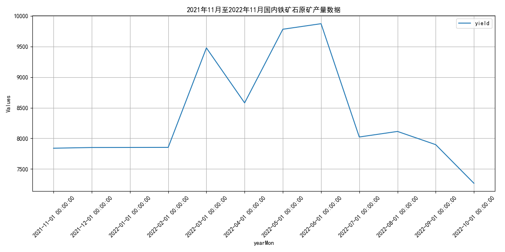

## **2022年11月国内铁矿石供应总量下降**
自2022年11月以来，2022年11月国内铁矿石供应总量7267.5万吨，较2021年同期下降，全球发货量略有增加。 指标走势方面，2022年11月，国内铁矿石供应总量为7267.5万吨，较2021年11月的7839.6万吨有所下降。从2021年11月至2022年11月，国内铁矿石供应总量呈现波动变化，2022年3月达到最高点9476.2万吨，随后有所下降。同期，澳大利亚到中国的铁矿石发货量也呈现波动，2022年11月的发货量较2021年11月有所增加。全球铁矿石发货量在2022年11月为3103.2万吨，较2021年11月的3062.4万吨略有增加。澳大利亚和巴西的铁矿石产量在2022年11月分别为2037.7万吨和587.2万吨，较2021年11月有所增加。 2022年11月，国内铁矿石供应总量为7267.5万吨，较2021年11月的7839.6万吨有所下降。从2021年11月至2022年11月，国内铁矿石供应总量呈现波动变化，2022年3月达到最高点9476.2万吨，随后有所下降。同期，澳大利亚到中国的铁矿石发货量也呈现波动，2022年11月的发货量较2021年11月有所增加。全球铁矿石发货量在2022年11月为3103.2万吨，较2021年11月的3062.4万吨略有增加。澳大利亚和巴西的铁矿石产量在2022年11月分别为2037.7万吨和587.2万吨，较2021年11月有所增加。这些变化可能受到全球经济复苏、钢铁需求增加以及矿山生产调整的影响。展望未来，随着全球经济的进一步复苏和钢铁需求的持续增长，预计国内铁矿石供应总量将保持稳定增长态势。
        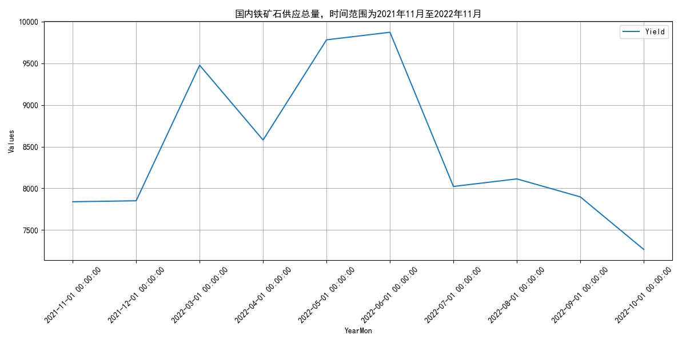
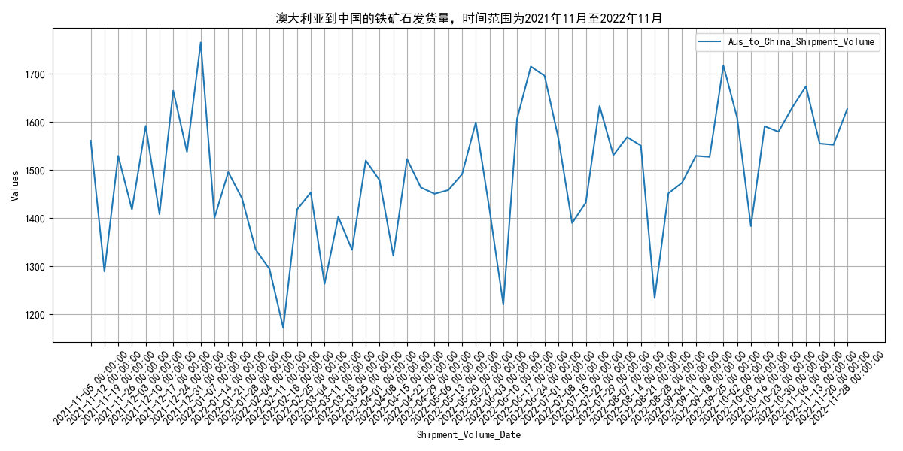
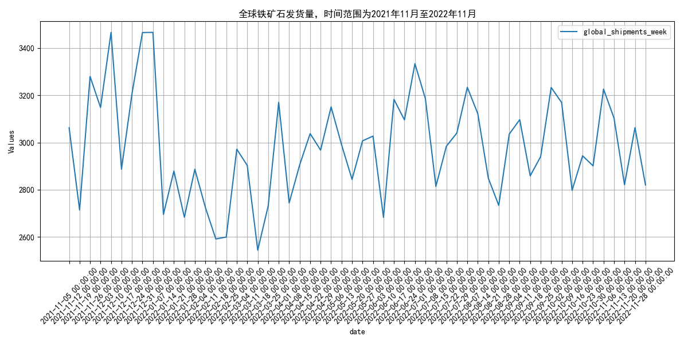
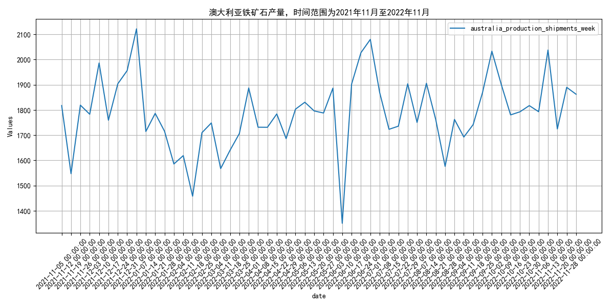
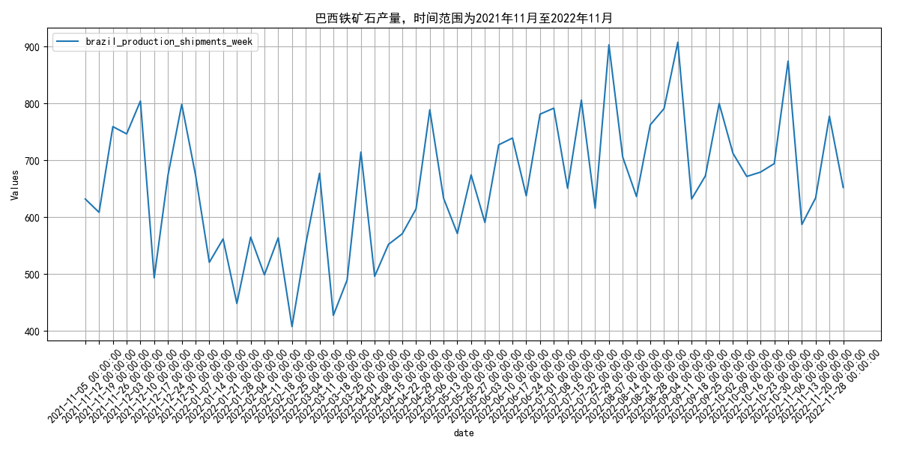
