# 2022年12月月报：走势回顾与供给分析：铁矿石
## **2022下半年铁矿石价格波动下降**
自2022年12月以来，2022下半年，铁矿石价格波动下降，供需关系变化和宏观经济影响显著。 指标走势方面，2022年6月至12月，日照港Pb粉现货价格从980元/吨降至843元/吨，呈现下降趋势。DCE01期货合约价格从840.5元/吨波动至865.0元/吨，DCE05期货合约价格从806.0元/吨波动至863.0元/吨，DCE07期货合约价格从905.5元/吨波动至837.5元/吨，均显示出波动中的下降趋势。整体来看，铁矿石价格在2022年下半年经历了明显的波动和下降，反映出市场供需关系的变化和宏观经济环境的影响。 2022年6月至12月，日照港Pb粉现货价格从980元/吨降至843元/吨，呈现下降趋势。DCE01期货合约价格从840.5元/吨波动至865.0元/吨，DCE05期货合约价格从806.0元/吨波动至863.0元/吨，DCE07期货合约价格从905.5元/吨波动至837.5元/吨，均显示出波动中的下降趋势。整体来看，铁矿石价格在2022年下半年经历了明显的波动和下降，反映出市场供需关系的变化和宏观经济环境的影响。7月份，铁矿石供需关系正式由阶段性性偏紧转向宽松，终端需求羸弱下长流程钢厂主动限产调节不断恶化的供需关系，产业链负反馈向原材料端传导，叠加全球经济衰退预期和美联储加息节奏加快，但在国际宏观悲观预期阶段性缓和、国内钢材供需边际走强以及钢厂端即期利润由负转正等因素共振作用下导致黑色系集体走强，叠加市场对三季度终端需求韧性仍存在一定信心，当前钢厂市场化减产源动力在产业链利润转好格局下或将减弱，叠加钢厂端原材料铁矿石库存处于同期低位，原材料有较强补库预期。展望未来，由于当前终端需求偏弱，钢厂利润薄弱，钢厂复产动力略有不足，但5月份全国疫情有望得到有效遏制，叠加经济刺激预期较强、终端需求也处于传统旺季阶段，综合看，5月份铁矿石有望保持稳中有增态势。
        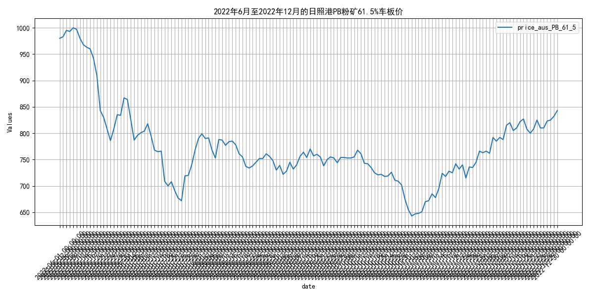
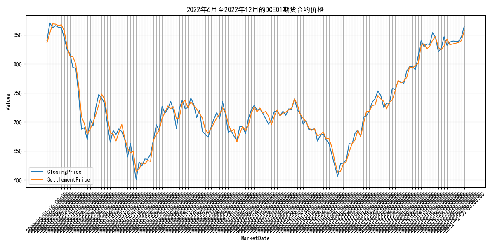
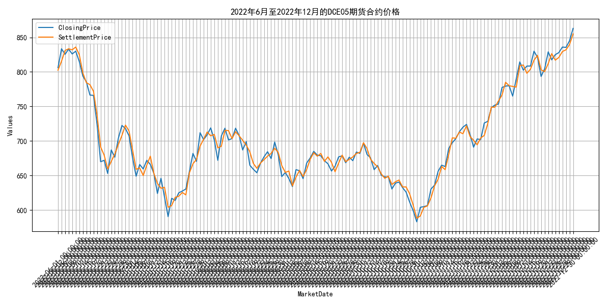
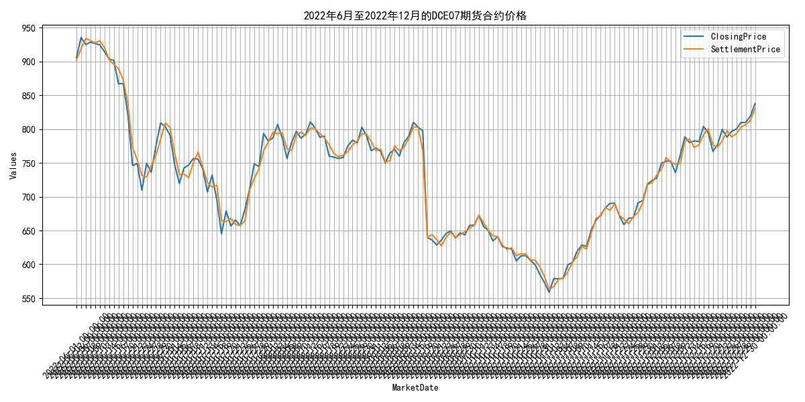

## **2022年12月铁矿石供给分析：主流与非主流矿发货量**
自2022年12月以来，2022年12月，全球铁矿石发货量12597.9万吨，主流矿10535.2万吨，非主流矿2062.7万吨，主流矿稳定，非主流矿波动。 指标走势方面，2022年6月至12月，全球铁矿石发货量呈现波动，总计12597.9万吨，主流矿（澳洲和巴西）发货量10535.2万吨，非主流矿发货量2062.7万吨。主流矿中，澳大利亚到中国的发货量在12月达到6590.0万吨，其中FMG、BHP和力拓的发货量分别为1380.8万吨、1948.1万吨和2327.1万吨。非主流矿发货量在12月为2062.7万吨，显示出一定的波动性。整体来看，主流矿供应相对稳定，非主流矿供应波动较大。 2022年6月至12月，全球铁矿石发货量呈现波动，总计12597.9万吨，主流矿（澳洲和巴西）发货量10535.2万吨，非主流矿发货量2062.7万吨。主流矿中，澳大利亚到中国的发货量在12月达到6590.0万吨，其中FMG、BHP和力拓的发货量分别为1380.8万吨、1948.1万吨和2327.1万吨。非主流矿发货量在12月为2062.7万吨，显示出一定的波动性。整体来看，主流矿供应相对稳定，非主流矿供应波动较大。原因可能包括非主流矿山的价格敏感性较高，以及全球经济和政治事件对非主流矿供应的影响更为显著。预计未来，随着全球经济的逐步复苏和主要矿山的产能恢复，主流矿供应将继续保持稳定，而非主流矿的供应波动可能会随着市场条件的变化而调整。
        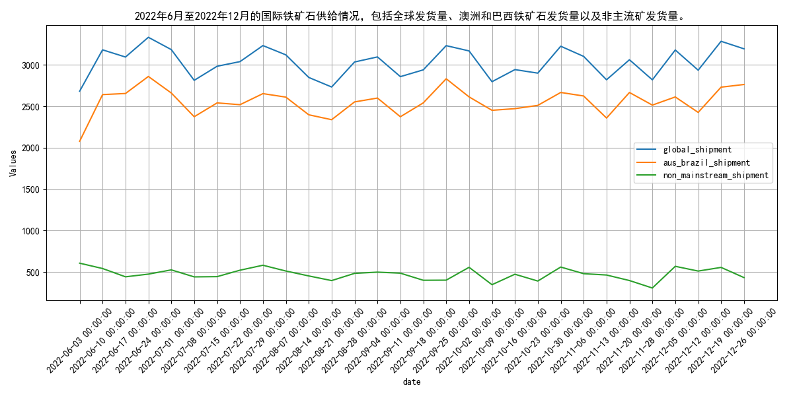
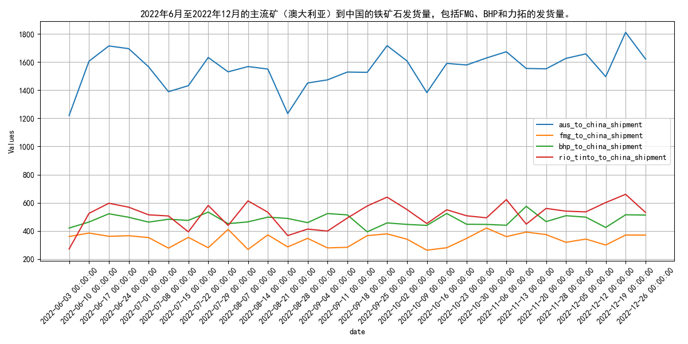
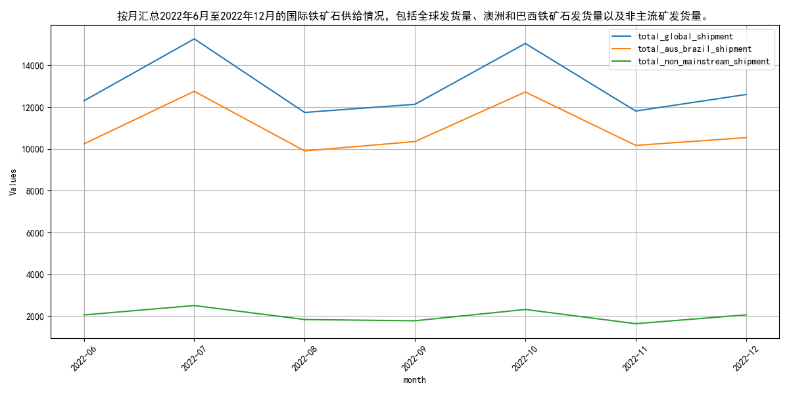
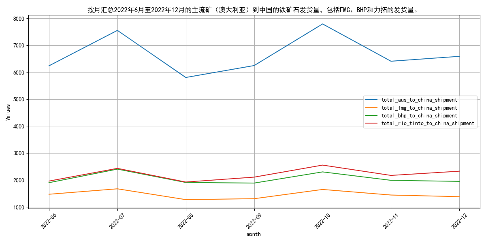

## **2022年四大矿山铁矿石发货量波动分析**
自2022年12月以来，2022年6-12月，四大矿山全球发货量波动，7月和10月高峰，8月和11月较低，澳大利亚和巴西发货量趋势相似。 指标走势方面，2022年6月至12月期间，四大矿山全球发货量呈现波动，其中7月和10月达到高峰，分别为15257.3万吨和15037.5万吨，而8月和11月相对较低，分别为11740.1万吨和11807.1万吨。澳大利亚和巴西的发货量也呈现类似趋势，澳大利亚发货量在7月和10月较高，分别为8982.9万吨和9085.3万吨，而巴西发货量在7月和10月分别为2911.8万吨和2869.4万吨。各矿山的发货量中，力拓和必和必拓在多数月份保持较高水平，而淡水河谷和福蒂斯丘的发货量相对较低且波动较大。 2022年6月至12月，四大矿山全球发货量波动明显，7月和10月高峰分别达15257.3万吨和15037.5万吨，8月和11月较低。澳大利亚和巴西发货量趋势相似，7月和10月澳大利亚发货量高，巴西发货量同期间也较高。各矿山中，力拓和必和必拓发货量稳定，淡水河谷和福蒂斯丘波动较大。原因可能包括季节性需求变化、矿山生产调整及全球经济活动影响。预计未来，随着全球经济逐步复苏和矿山生产策略调整，铁矿石发货量将呈现稳定增长趋势。
        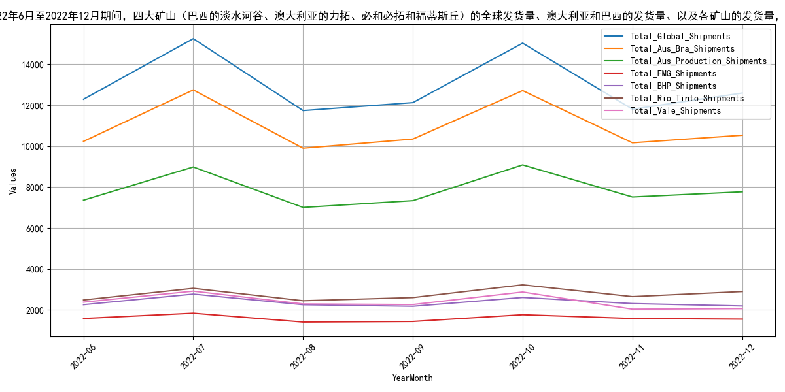
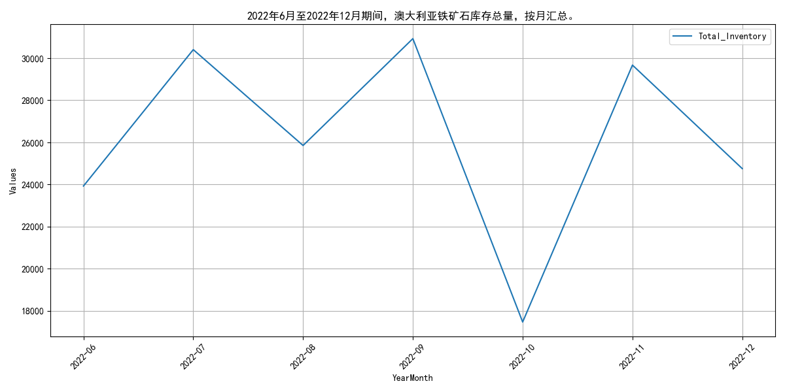
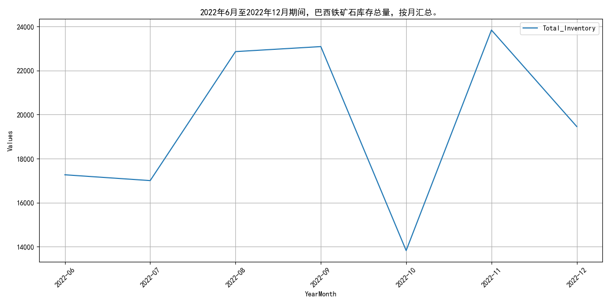

## **2022年12月国内铁矿石原矿产量波动下降**
自2022年12月以来，2022年12月，国内铁矿石原矿产量降至7953.6万吨，下半年呈现波动下降趋势。 指标走势方面，2022年6月至2022年12月，国内铁矿石原矿产量呈现波动下降趋势。6月份产量达到9871.08万吨，为期间最高点，随后逐月下降，至12月份降至7953.6万吨。具体来看，7月份产量为8022.68万吨，8月份略有回升至8113.3万吨，9月份再次下降至7897.6万吨，10月份进一步降至7267.5万吨，11月份小幅回升至7953.6万吨。整体来看，下半年铁矿石原矿产量较上半年有所减少，显示出一定的季节性调整和市场供需变化。 2022年6月至2022年12月，国内铁矿石原矿产量呈现波动下降趋势。6月份产量达到9871.08万吨，为期间最高点，随后逐月下降，至12月份降至7953.6万吨。7月份产量为8022.68万吨，8月份略有回升至8113.3万吨，9月份再次下降至7897.6万吨，10月份进一步降至7267.5万吨，11月份小幅回升至7953.6万吨。这一波动可能受到市场需求变化、环保政策调整以及矿山生产季节性因素的影响。展望未来，考虑到国内经济刺激政策和市场需求恢复，预计铁矿石原矿产量将逐步稳定并可能有所回升。
        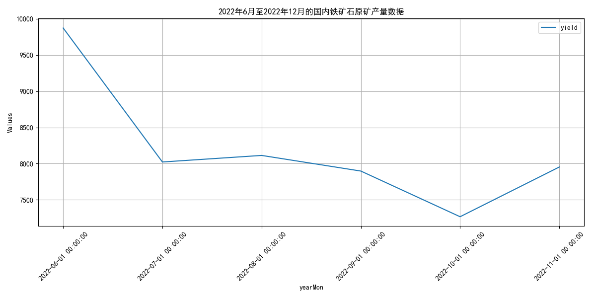

## **2022年12月国内铁矿石供给分析**
自2022年12月以来，2022年12月，国内铁矿石原矿产量下降，进口量波动，产能利用率受市场和成本影响。 指标走势方面，2022年6月至12月，国内铁矿石原矿产量呈现波动下降趋势，从6月的9871.08万吨降至12月的7953.6万吨。同期，澳大利亚到中国的铁矿石发货量总体保持稳定，但存在一定波动，从6月初的1220.6万吨增加到12月底的1622.5万吨。这一变化表明国内矿山产能利用率可能受到市场需求和生产成本的影响，而进口铁矿石的供应相对稳定，但受国际市场波动影响。 2022年6月至12月，国内铁矿石原矿产量呈现波动下降趋势，从6月的9871.08万吨降至12月的7953.6万吨。同期，澳大利亚到中国的铁矿石发货量总体保持稳定，但存在一定波动，从6月初的1220.6万吨增加到12月底的1622.5万吨。这一变化表明国内矿山产能利用率可能受到市场需求和生产成本的影响，而进口铁矿石的供应相对稳定，但受国际市场波动影响。预计未来国内铁矿石原矿产量将继续受到市场需求和成本因素的影响，而进口铁矿石的供应将保持相对稳定，但仍需关注国际市场的变化。
        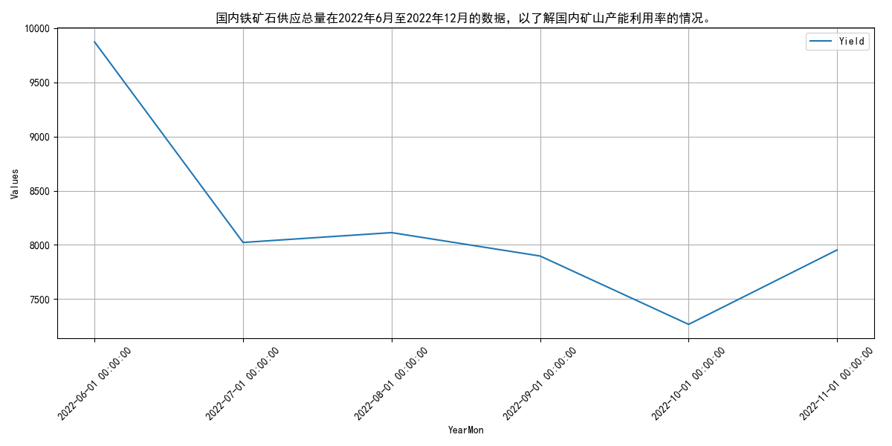
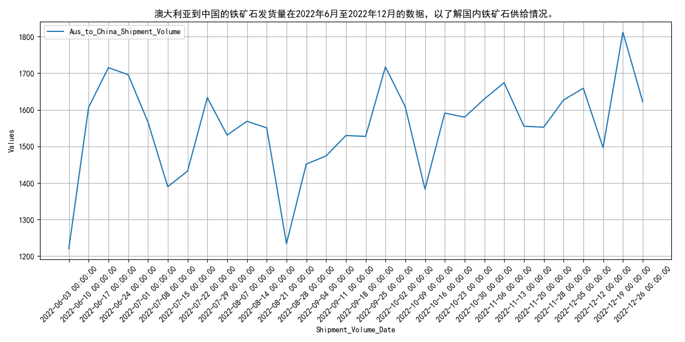
