# 2022年9月月报：走势回顾与供给分析：铁矿石
## **2022年铁矿石价格上半年上涨下半年回落**
自2022年9月以来，2022年铁矿石价格上半年上涨，受供需和宏观政策影响，下半年明显回落。 指标走势方面，2022年3月至9月，日照港PB粉矿61.5%车板价从880元/吨上涨至1000元/吨，随后波动下跌至739元/吨。DCE01合约价格从693.0元/吨上涨至866.5元/吨，后回落至675.5元/吨。DCE05合约价格从737.5元/吨上涨至915.5元/吨，后降至645.5元/吨。DCE07合约价格从717.0元/吨上涨至905.5元/吨，后跌至767.0元/吨。整体来看，铁矿石价格在上半年呈现上涨趋势，下半年则出现明显回落。 2022年3月至9月，日照港PB粉矿61.5%车板价从880元/吨上涨至1000元/吨，随后波动下跌至739元/吨。DCE01合约价格从693.0元/吨上涨至866.5元/吨，后回落至675.5元/吨。DCE05合约价格从737.5元/吨上涨至915.5元/吨，后降至645.5元/吨。DCE07合约价格从717.0元/吨上涨至905.5元/吨，后跌至767.0元/吨。整体来看，铁矿石价格在上半年呈现上涨趋势，下半年则出现明显回落。这一变化主要受供需关系、宏观经济政策及市场预期影响。上半年，随着全球经济复苏和国内需求增加，铁矿石价格上涨；下半年，受国内粗钢压减政策和全球经济放缓影响，价格出现下跌。
        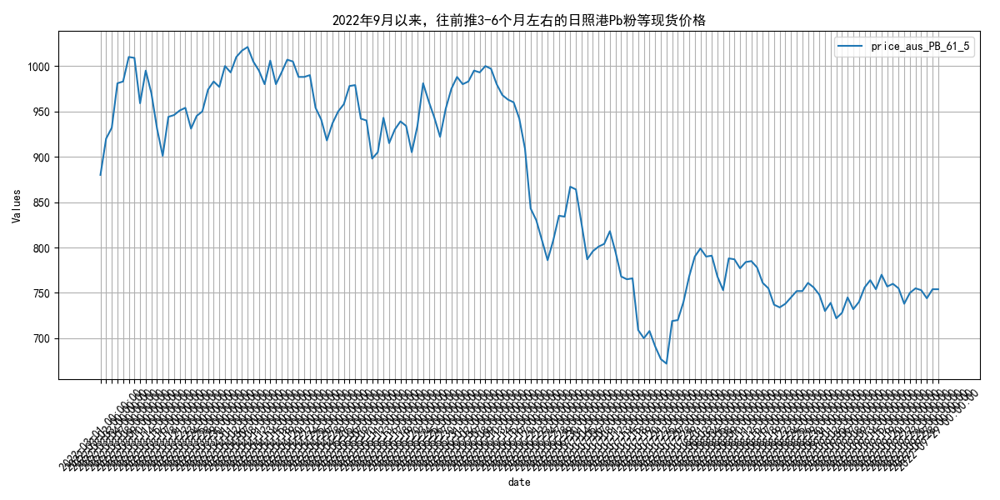
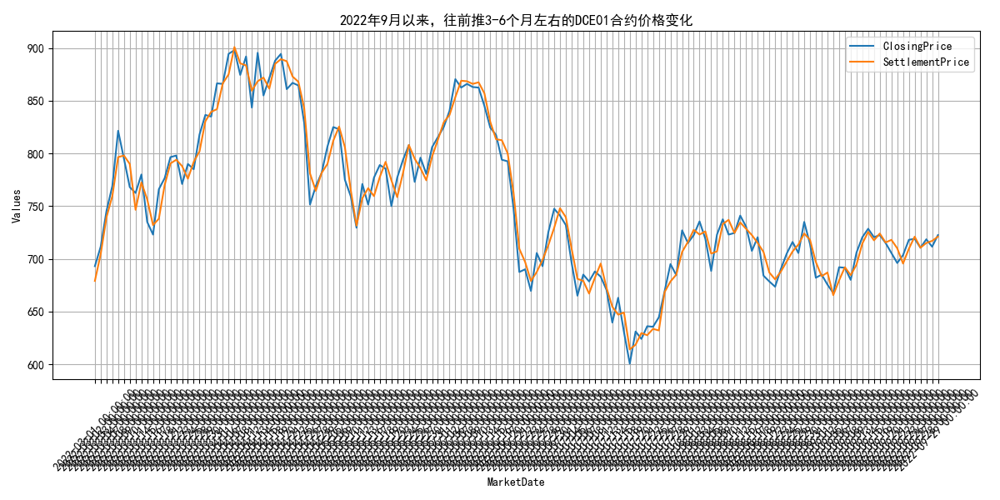
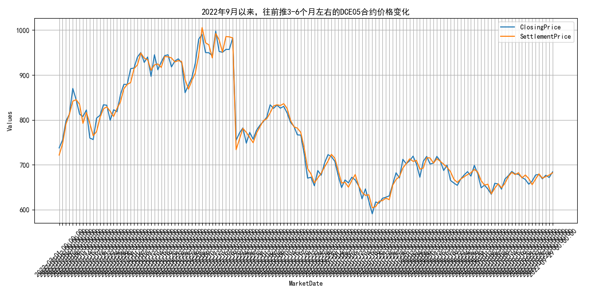
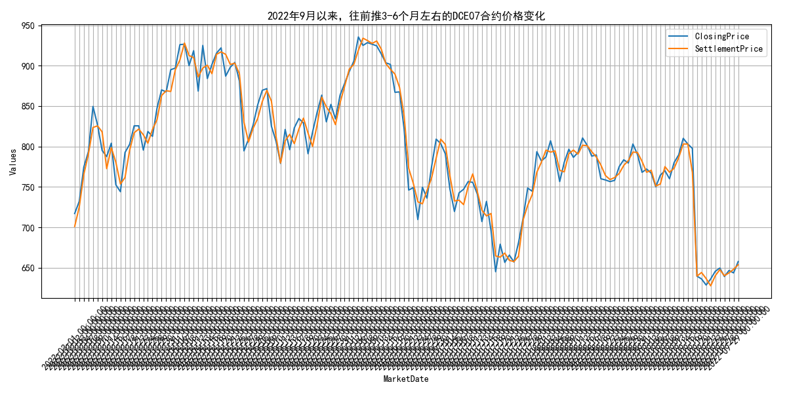

## **2022年9月铁矿石供给波动分析**
自2022年9月以来，2022年9月，全球铁矿石发货量12129万吨，主流矿10348.8万吨，非主流矿1780.2万吨，显示供给波动。 指标走势方面，2022年3月至9月，全球铁矿石发货量呈现波动，其中3月和4月较高，分别为11348.2万吨和14804.8万吨，而8月和9月相对较低，分别为11740.1万吨和12129.0万吨。主流矿（澳洲和巴西）发货量在这期间也显示出类似趋势，3月和4月分别为9109.7万吨和11758.9万吨，而8月和9月为9901.1万吨和10348.8万吨。非主流矿发货量在3月至9月间波动较小，3月和4月分别为2238.5万吨和3045.9万吨，而8月和9月为1839.0万吨和1780.2万吨。澳大利亚到中国的主流矿发货量在3月至9月间波动，3月和4月分别为5520.6万吨和7238.7万吨，而8月和9月为5805.2万吨和6248.2万吨。 2022年3月至9月，全球铁矿石发货量波动明显，3月和4月达到高峰，分别为11348.2万吨和14804.8万吨，随后在8月和9月降至11740.1万吨和12129.0万吨。主流矿（澳洲和巴西）发货量同样呈现波动，3月和4月分别为9109.7万吨和11758.9万吨，8月和9月则降至9901.1万吨和10348.8万吨。非主流矿发货量相对稳定，3月和4月为2238.5万吨和3045.9万吨，8月和9月为1839.0万吨和1780.2万吨。澳大利亚到中国的主流矿发货量在3月至9月间波动，3月和4月分别为5520.6万吨和7238.7万吨，8月和9月为5805.2万吨和6248.2万吨。预计未来几个月，随着全球经济复苏和需求增加，铁矿石发货量可能会有所回升，但仍需关注全球供应链和贸易政策的变化。
        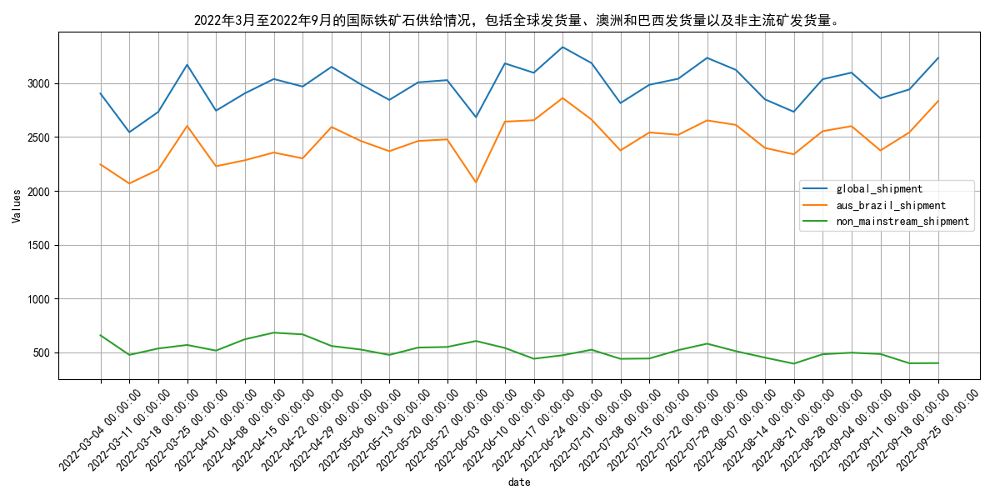
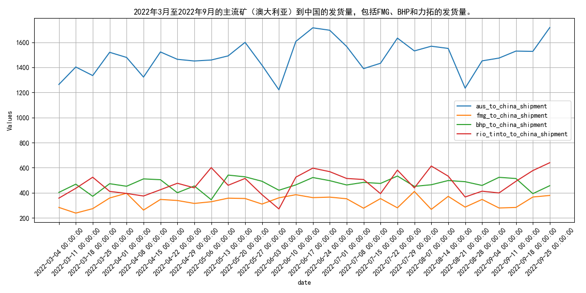
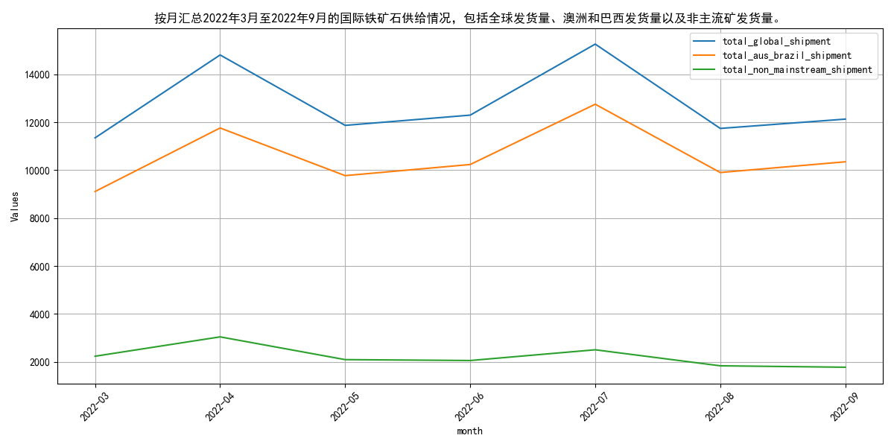

## **2022年9月四大矿山铁矿石发货量波动分析**
自2022年9月以来，2022年3-9月，四大矿山铁矿石发货量波动，7月最高，8月最低，力拓和必和必拓相对稳定，福蒂斯丘和淡水河谷波动大。 指标走势方面，在2022年3月至9月期间，四大矿山（巴西的淡水河谷、澳大利亚的力拓、必和必拓和福蒂斯丘）的铁矿石发货量呈现波动。总体来看，2022年7月达到最高点，总发货量为15257.3万吨，而2022年8月为最低点，总发货量为11740.1万吨。具体到各矿山，澳大利亚的力拓和必和必拓在多数月份的发货量较为稳定，而福蒂斯丘和巴西的淡水河谷则显示出较大的波动性。例如，淡水河谷在2022年7月的发货量为2911.8万吨，而在2022年5月则为1908.1万吨。整体上，四大矿山的发货量在考察期间内显示出一定的季节性波动特征。 在2022年3月至9月期间，四大矿山（巴西的淡水河谷、澳大利亚的力拓、必和必拓和福蒂斯丘）的铁矿石发货量呈现波动。2022年7月达到最高点，总发货量为15257.3万吨，而8月为最低点，总发货量为11740.1万吨。澳大利亚的力拓和必和必拓发货量相对稳定，而福蒂斯丘和淡水河谷波动较大。例如，淡水河谷7月发货量为2911.8万吨，5月则为1908.1万吨。这种波动可能受全球经济状况、季节性需求变化及矿山运营效率影响。预计未来几个月，随着全球经济逐步复苏和季节性需求增加，四大矿山的发货量可能会有所回升，但仍需关注全球经济政策变动和矿山运营状况。
        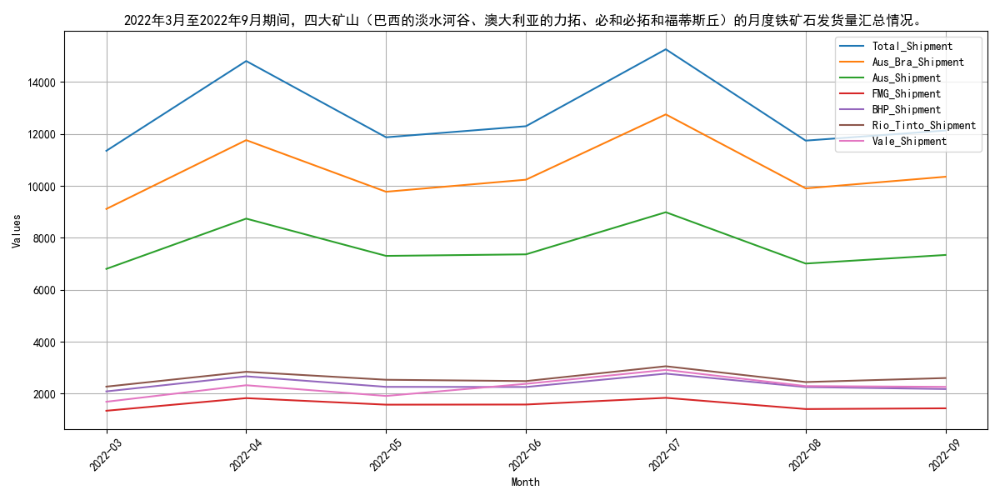
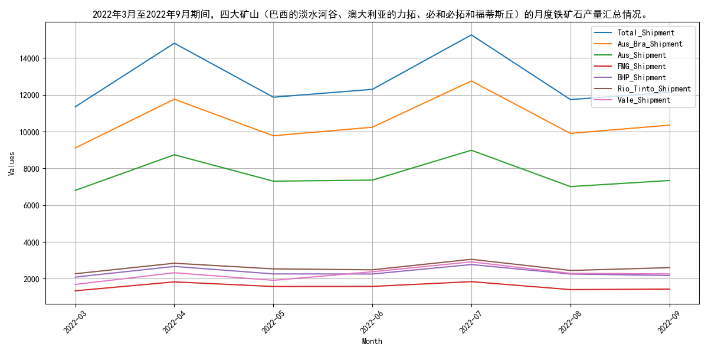

## **国产铁矿石原矿产量波动分析**
自2022年9月以来，2022年9月以来，国产铁矿石原矿产量波动，3-6月先降后升，7-8月再降。 指标走势方面，2022年9月以来，国产铁矿石原矿产量呈现波动变化。具体来看，3月份产量为9476.2万吨，4月份下降至8579.4万吨，5月份回升至9780.5万吨，6月份达到9871.08万吨，7月份降至8022.68万吨，8月份略有增加至8113.3万吨。整体来看，国产铁矿石原矿产量在2022年9月前的6个月内经历了先降后升再降的波动趋势。 2022年9月以来，国产铁矿石原矿产量呈现波动变化。3月份产量为9476.2万吨，4月份下降至8579.4万吨，5月份回升至9780.5万吨，6月份达到9871.08万吨，7月份降至8022.68万吨，8月份略有增加至8113.3万吨。这种波动可能受到国内外需求变化、矿价波动以及政策调控的影响。例如，2021年国内铁矿石供应整体走低，非主流矿山下降显著，而2022年一季度供应整体下滑，主要原因是主流矿山供应季节性下降、非主流矿受矿价下跌以及地缘政治影响供应偏弱。展望未来，随着国内外经济形势的变化和政策调控的持续，国产铁矿石原矿产量可能会继续呈现波动趋势，但整体上可能保持稳定或略有增长。
        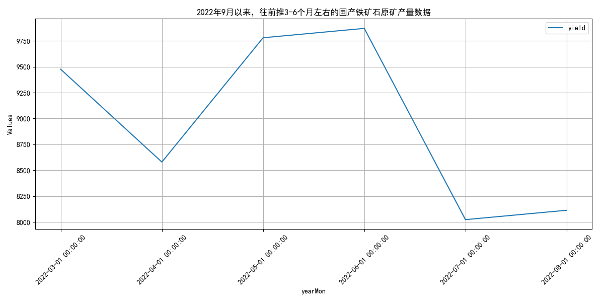

## **2022年9月国内铁矿石供应波动分析**
自2022年9月以来，2022年9月，国内铁矿石供应总量波动，澳大利亚发货量增加，生铁产量稳定。 指标走势方面，2022年3月至9月，国内铁矿石供应总量呈现波动，3月和6月产量较高，分别为9476.2万吨和9871.08万吨，而4月和7月较低，分别为8579.4万吨和8022.68万吨。澳大利亚到中国的铁矿石发货量在3月至9月间波动较大，3月和9月发货量较高，分别为1519.9万吨和1717.3万吨，而6月和8月较低，分别为1220.6万吨和1234.3万吨。生铁产量在3月至9月间也呈现波动，5月产量最高，为8048.9万吨，7月最低，为7048.62万吨。 2022年3月至9月，国内铁矿石供应总量呈现波动，3月和6月产量较高，分别为9476.2万吨和9871.08万吨，而4月和7月较低，分别为8579.4万吨和8022.68万吨。澳大利亚到中国的铁矿石发货量在3月至9月间波动较大，3月和9月发货量较高，分别为1519.9万吨和1717.3万吨，而6月和8月较低，分别为1220.6万吨和1234.3万吨。生铁产量在3月至9月间也呈现波动，5月产量最高，为8048.9万吨，7月最低，为7048.62万吨。这些波动可能受到国内外市场需求变化、矿山生产调整、以及政策调控等因素的影响。展望未来，随着国内外经济形势的变化和政策调整，铁矿石供应和需求可能会继续呈现波动，但整体趋势可能保持稳定。
        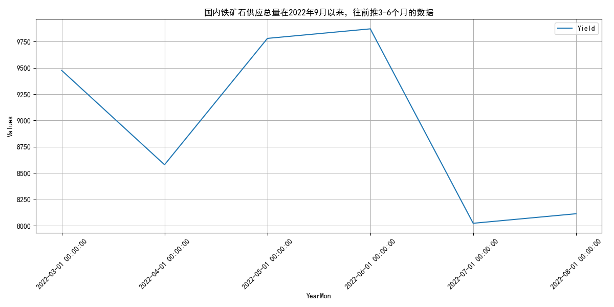
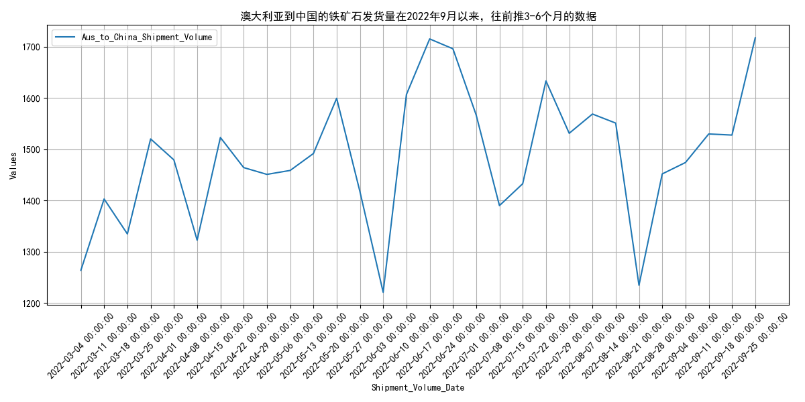
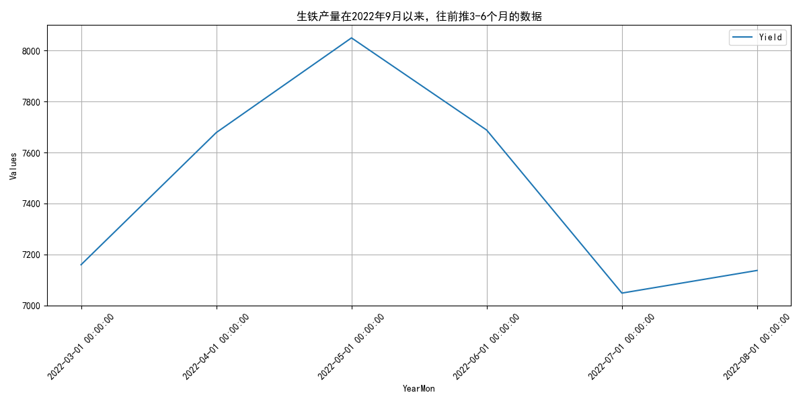

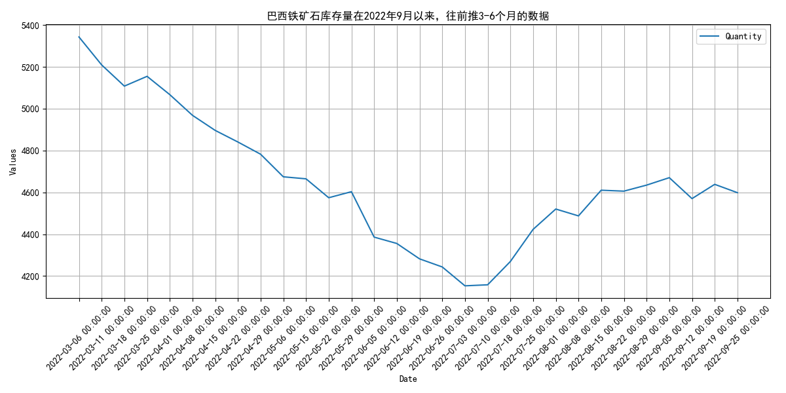
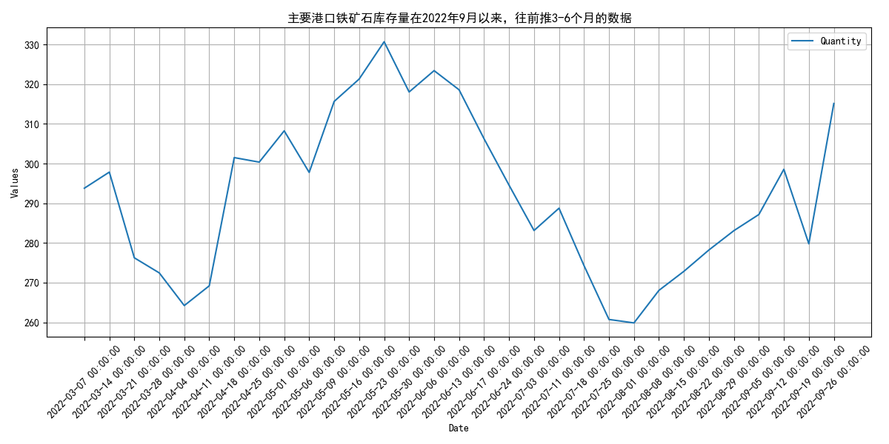
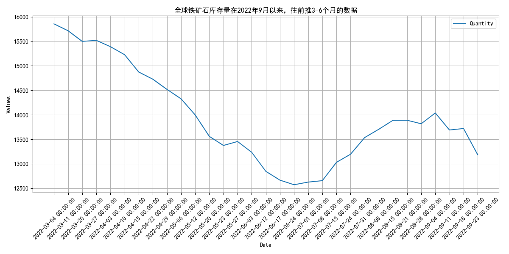
