# 2023年5月月报：走势回顾与供给分析：铁矿石
## **5月至8月铁矿石价格波动上升**
自2023年5月以来，2023年5月至8月，日照港Pb粉和DCE合约价格均呈上升趋势，受多种因素影响。 指标走势方面，2023年5月以来，日照港Pb粉现货价格呈现波动上升趋势，从5月初的780元/吨上升至8月底的907元/吨，期间最高达到942元/吨。DCE01合约价格从5月初的657.5元/吨上升至8月底的849元/吨，DCE05合约从840元/吨上升至929.5元/吨，DCE07合约从698.5元/吨上升至923元/吨。整体来看，铁矿石现货和期货价格在5月至8月期间均显示出上升趋势，尽管过程中存在波动。 2023年5月以来，日照港Pb粉现货价格呈现波动上升趋势，从5月初的780元/吨上升至8月底的907元/吨，期间最高达到942元/吨。DCE01合约价格从5月初的657.5元/吨上升至8月底的849元/吨，DCE05合约从840元/吨上升至929.5元/吨，DCE07合约从698.5元/吨上升至923元/吨。整体来看，铁矿石现货和期货价格在5月至8月期间均显示出上升趋势，尽管过程中存在波动。这一上升趋势可能受到全球经济复苏预期、国内基础设施建设和房地产市场的需求增加以及供应端相对稳定的影响。然而，市场仍需关注政策调控、环保限产以及国际贸易环境变化等因素对铁矿石价格的潜在影响。
        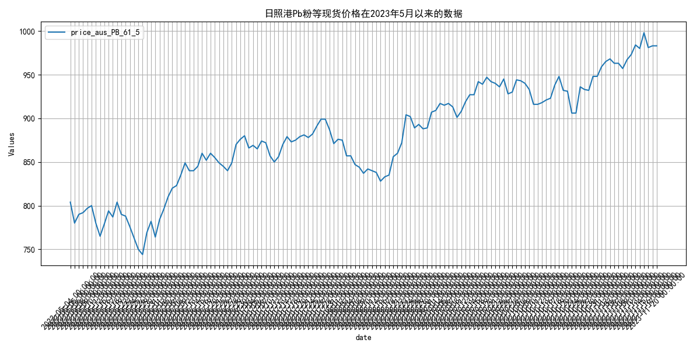
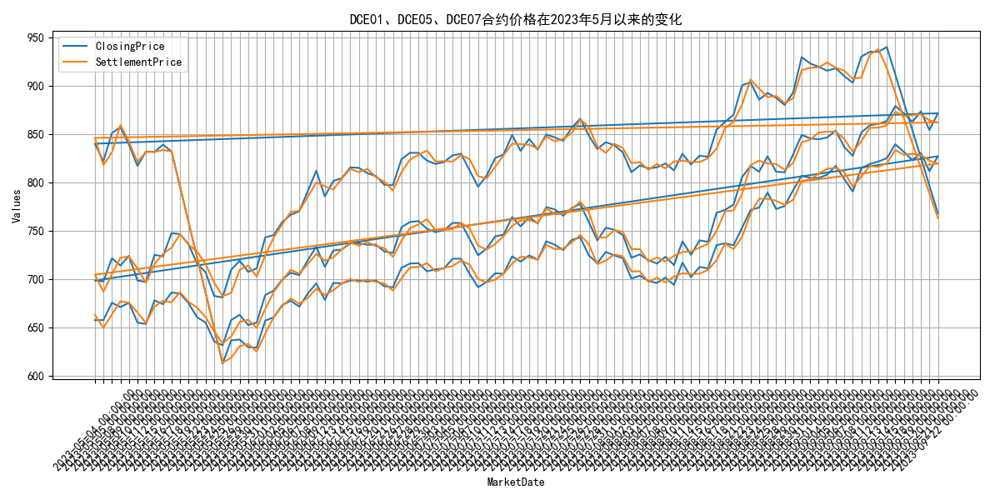

## **2023年5月国际铁矿石供给增长分析**
自2023年5月以来，2023年5月以来，全球铁矿石发货量波动上升，主流矿稳定增长，非主流矿显著增强。 指标走势方面，2023年5月以来，国际铁矿石供给情况显示，全球发货量整体呈现波动上升趋势，从5月的2965.0万吨增至10月的3144.4万吨。澳洲和巴西铁矿石发货量作为主流矿，其发货量在5月为2615.4万吨，至10月增至2629.1万吨，显示出相对稳定的增长。非主流矿发货量从5月的349.6万吨波动增加至10月的515.3万吨，增幅显著，表明非主流矿的供给在逐步增强。整体来看，主流矿和非主流矿的供给均有所增加，但非主流矿的增长更为明显。 2023年5月以来，国际铁矿石供给情况显示，全球发货量整体呈现波动上升趋势，从5月的2965.0万吨增至10月的3144.4万吨。澳洲和巴西铁矿石发货量作为主流矿，其发货量在5月为2615.4万吨，至10月增至2629.1万吨，显示出相对稳定的增长。非主流矿发货量从5月的349.6万吨波动增加至10月的515.3万吨，增幅显著，表明非主流矿的供给在逐步增强。整体来看，主流矿和非主流矿的供给均有所增加，但非主流矿的增长更为明显。展望未来，随着全球经济的逐步复苏和需求的增加，预计主流矿和非主流矿的发货量将继续保持增长态势，尤其是非主流矿的供给可能会有更大幅度的提升。
        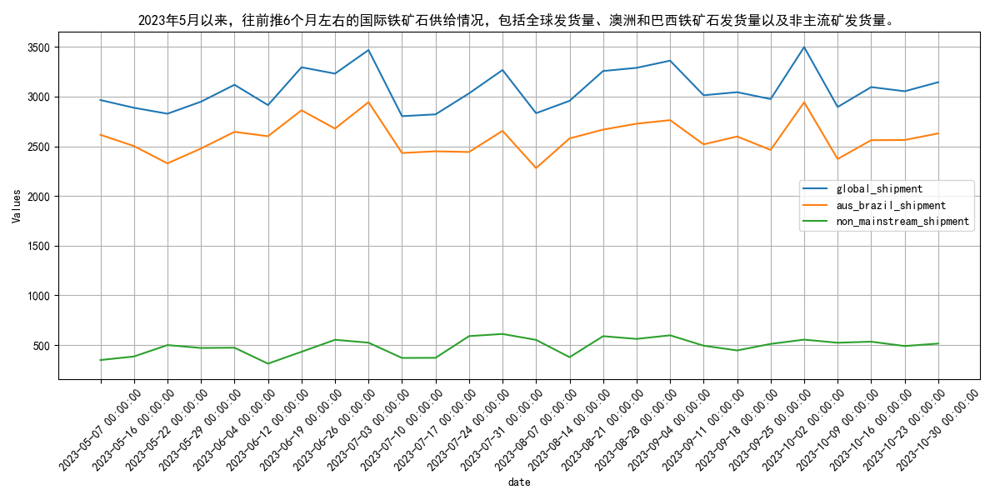

## **四大矿山铁矿石发货量波动分析**
自2023年5月以来，2023年5月，四大矿山铁矿石发货量波动，澳大利亚发货量下降，巴西发货量微增。 指标走势方面，2023年5月以来，四大矿山（巴西的淡水河谷、澳大利亚的力拓、必和必拓和福蒂斯丘）的铁矿石发货量呈现波动。具体来看，2023年4月总发货量为14295.8万吨，而5月下降至11628.3万吨。澳大利亚的发货量从4月的8580.599999999999万吨降至5月的7115.799999999999万吨，巴西的发货量则从4月的2346.1万吨增至5月的2078.9万吨。此外，澳大利亚和巴西的铁矿石库存也呈现波动，澳大利亚从2023年4月的31052.05万吨降至3月的25942.300000000003万吨，巴西则从4月的21965.96万吨降至3月的19066.22万吨。 2023年5月以来，四大矿山（巴西的淡水河谷、澳大利亚的力拓、必和必拓和福蒂斯丘）的铁矿石发货量呈现波动。2023年4月总发货量为14295.8万吨，而5月下降至11628.3万吨。澳大利亚的发货量从4月的8580.599999999999万吨降至5月的7115.799999999999万吨，巴西的发货量则从4月的2346.1万吨增至5月的2078.9万吨。澳大利亚和巴西的铁矿石库存也呈现波动，澳大利亚从2023年4月的31052.05万吨降至3月的25942.300000000003万吨，巴西则从4月的21965.96万吨降至3月的19066.22万吨。这种波动可能受到全球经济状况、矿山生产效率、以及市场需求变化的影响。展望未来，随着全球经济逐步复苏和矿山产能的进一步释放，预计铁矿石发货量将趋于稳定，并可能逐步增加。
        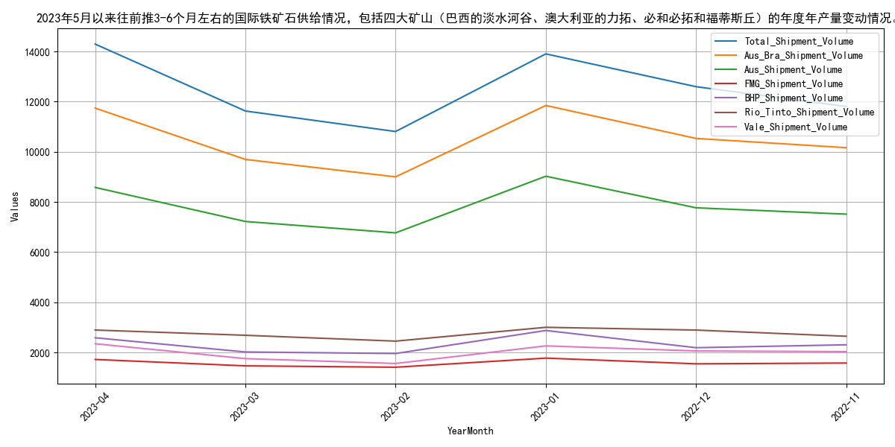
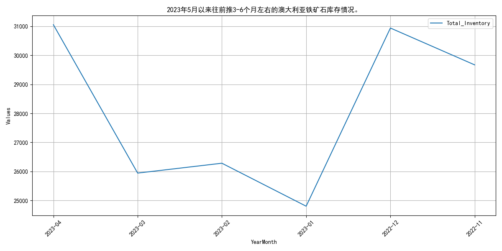
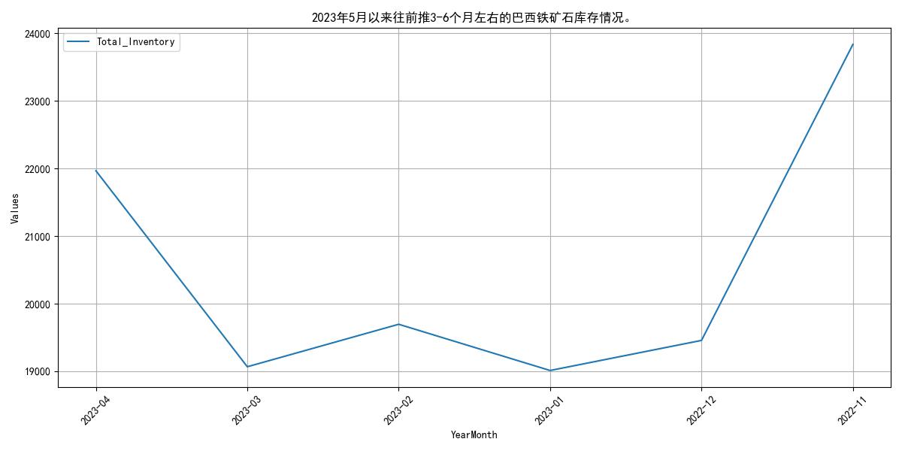

## **国产铁矿石原矿产量波动上升**
自2023年5月以来，2023年5月以来，国产铁矿石原矿产量波动上升，总体保持增长态势。 指标走势方面，2023年5月以来，国产铁矿石原矿产量呈现波动上升趋势。具体来看，5月份产量为7760.1万吨，随后逐月增加，6月份达到8515.54万吨，7月份为8570.9万吨，8月份进一步增至8633.3万吨。然而，9月份产量略有下降至8436.8万吨，但在10月份又回升至8644.5万吨。整体来看，自5月份以来，国产铁矿石原矿产量总体保持增长态势，尽管在9月份出现小幅回调。 2023年5月以来，国产铁矿石原矿产量呈现波动上升趋势。5月份产量为7760.1万吨，随后逐月增加，6月份达到8515.54万吨，7月份为8570.9万吨，8月份进一步增至8633.3万吨。9月份产量略有下降至8436.8万吨，但在10月份又回升至8644.5万吨。整体来看，自5月份以来，国产铁矿石原矿产量总体保持增长态势，尽管在9月份出现小幅回调。这一增长趋势可能受到国内需求稳定、矿山生产效率提升以及政策支持的影响。展望未来，随着国内经济的持续复苏和基础设施投资的增加，预计国产铁矿石原矿产量将继续保持增长态势，尽管可能会受到国际市场价格波动和环保政策调整的影响。
        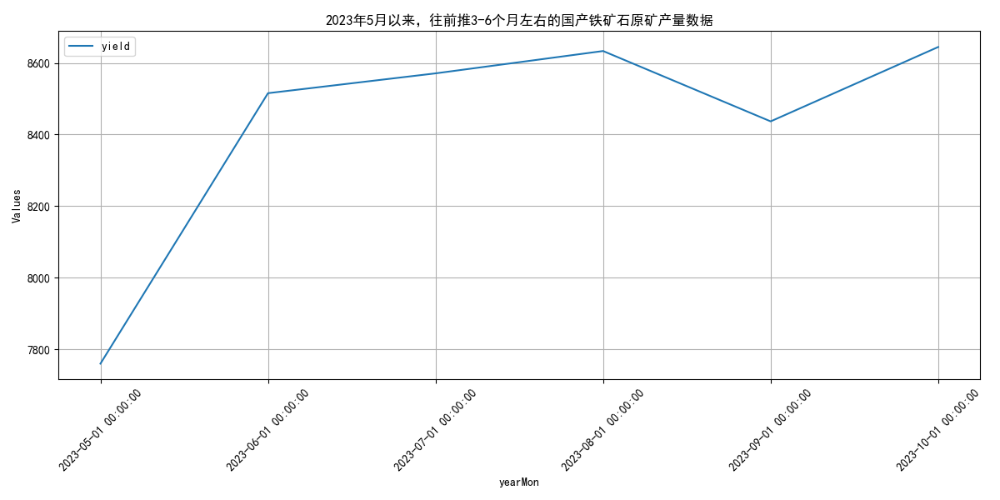

## **国内铁矿石供应波动上升 澳大利亚产量稳定**
自2023年5月以来，2023年5月以来，国内铁矿石供应总量波动上升，澳大利亚产量稳定，库存下降。 指标走势方面，2023年5月以来，国内铁矿石供应总量呈现波动上升趋势，从5月的7760.1万吨增加至10月的8644.5万吨。澳大利亚到中国的铁矿石发货量在5月至11月期间波动较大，从5月的1553.1万吨波动至11月的1580.0万吨。全球及澳大利亚铁矿石产量数据显示，澳大利亚的产量在5月至11月期间整体呈上升趋势，从5月的1875.8万吨增加至11月的1911.0万吨。澳大利亚铁矿石库存量在5月至11月期间总体下降，从5月的5970.43万吨降至11月的4830.87万吨。这些数据表明，尽管国内铁矿石供应总量和澳大利亚的产量有所增加，但澳大利亚的库存量却在减少，可能反映出市场需求的变化。 2023年5月以来，国内铁矿石供应总量呈现波动上升趋势，从5月的7760.1万吨增加至10月的8644.5万吨。澳大利亚到中国的铁矿石发货量在5月至11月期间波动较大，从5月的1553.1万吨波动至11月的1580.0万吨。全球及澳大利亚铁矿石产量数据显示，澳大利亚的产量在5月至11月期间整体呈上升趋势，从5月的1875.8万吨增加至11月的1911.0万吨。澳大利亚铁矿石库存量在5月至11月期间总体下降，从5月的5970.43万吨降至11月的4830.87万吨。这些数据表明，尽管国内铁矿石供应总量和澳大利亚的产量有所增加，但澳大利亚的库存量却在减少，可能反映出市场需求的变化。展望未来，随着国内需求的持续增长和澳大利亚产量的稳定，预计国内铁矿石供应总量将继续保持增长态势，而澳大利亚的库存量可能会因需求增加而逐步回升。
        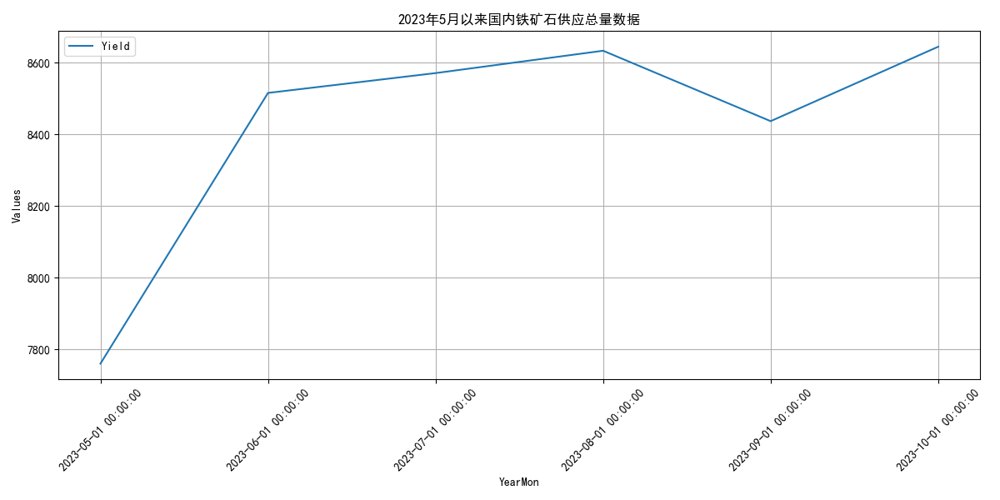
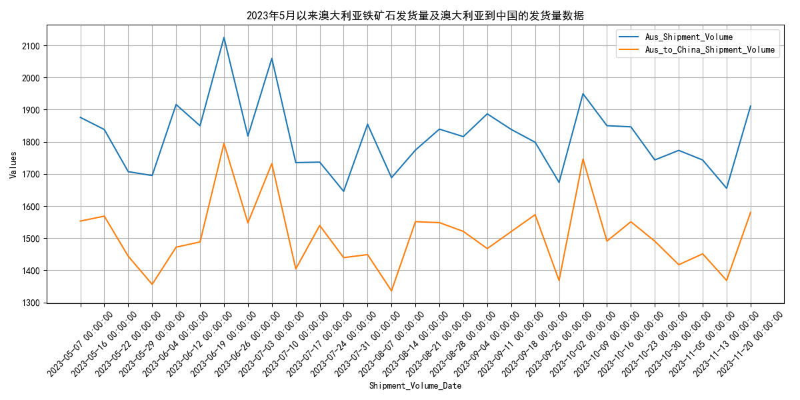
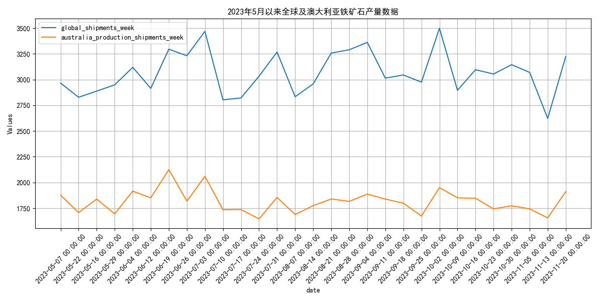
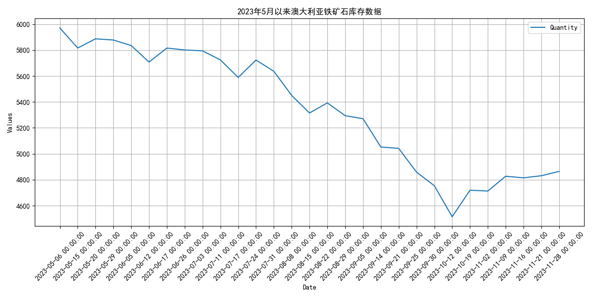
