# 2023年6月月报：走势回顾与供给分析：铁矿石
## **6月铁矿石价格全面上涨，市场表现强劲**
自2023年6月以来，2023年6月，日照港Pb粉和DCE合约价格均呈现上涨趋势，市场表现强劲。 指标走势方面，2023年6月，日照港Pb粉现货价格呈现上升趋势，从月初的784元/吨上涨至月末的880元/吨。DCE01合约价格在6月期间从683.5元/吨上涨至752元/吨，DCE05合约价格从657元/吨上涨至708元/吨，DCE07合约价格从743元/吨上涨至822.5元/吨。整体来看，铁矿石相关价格在6月均显示出上涨态势，现货和期货市场均有所增强。 2023年6月，日照港Pb粉现货价格从月初的784元/吨上涨至月末的880元/吨，显示出明显的上升趋势。DCE01合约价格从683.5元/吨上涨至752元/吨，DCE05合约价格从657元/吨上涨至708元/吨，DCE07合约价格从743元/吨上涨至822.5元/吨，各合约价格均呈现上涨态势。这一变化可能受到市场对铁矿石需求增加的预期影响，以及供应端可能的调整。整体来看，6月份铁矿石市场表现出较强的价格支撑和上涨动力。
        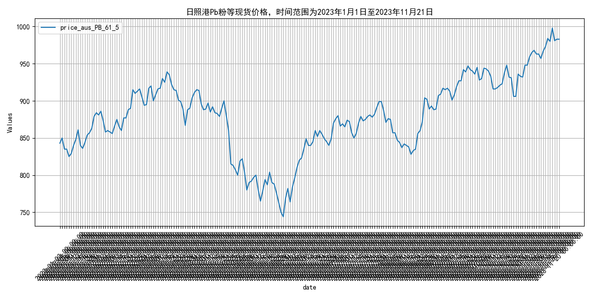
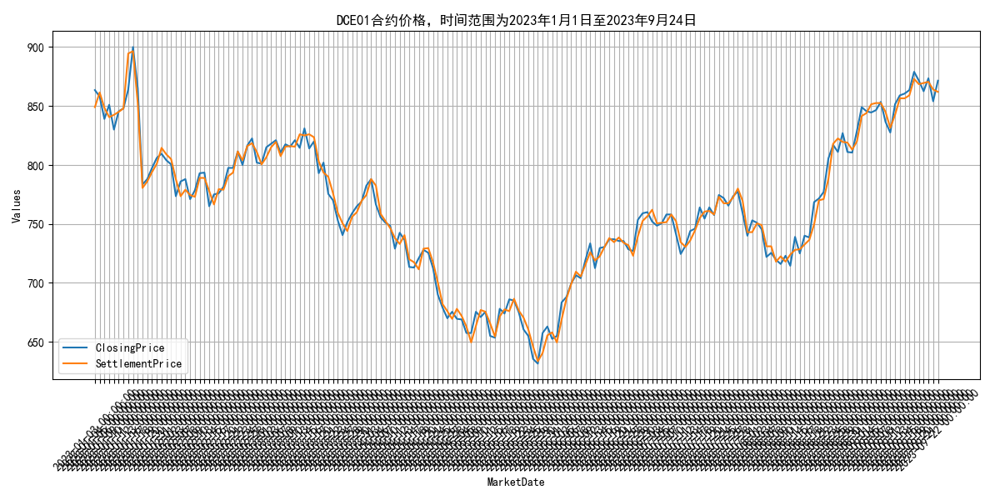
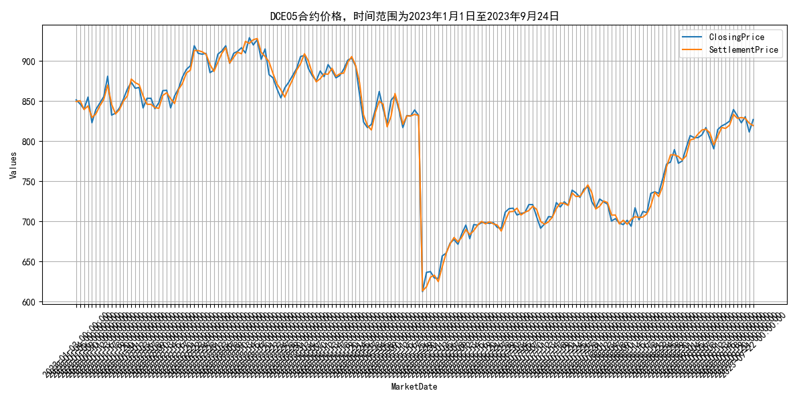
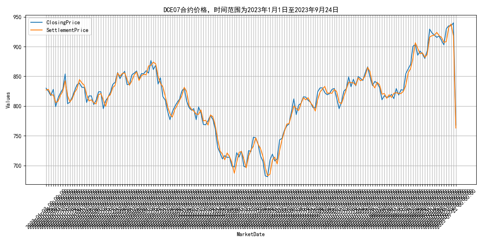

## **2023年6月铁矿石供给波动分析**
自2023年6月以来，2023年6月，全球铁矿石发货量波动，澳大利亚和巴西发货量下降后回升，非主流矿发货量显著增加。 指标走势方面，2023年6月以来，全球铁矿石发货量呈现波动，从6月初的3118.6万吨降至7月中旬的2802.8万吨，随后回升至9月初的3361.2万吨。澳大利亚和巴西的发货量也呈现类似趋势，从6月初的2645.1万吨降至7月中旬的2432.4万吨，随后回升至9月初的2762.9万吨。非主流矿的发货量波动较大，从6月初的473.5万吨降至7月中旬的370.4万吨，随后显著增加至9月初的598.3万吨。国内铁矿石供应总量在6月至10月间从8515.54万吨增至8644.5万吨，显示出供应增加的趋势。澳大利亚和巴西的库存量在6月至11月间分别从5835.22万吨和4348.64万吨降至4864.47万吨和4523.39万吨，表明库存量有所下降。 2023年6月以来，全球铁矿石发货量呈现波动，从6月初的3118.6万吨降至7月中旬的2802.8万吨，随后回升至9月初的3361.2万吨。澳大利亚和巴西的发货量也呈现类似趋势，从6月初的2645.1万吨降至7月中旬的2432.4万吨，随后回升至9月初的2762.9万吨。非主流矿的发货量波动较大，从6月初的473.5万吨降至7月中旬的370.4万吨，随后显著增加至9月初的598.3万吨。国内铁矿石供应总量在6月至10月间从8515.54万吨增至8644.5万吨，显示出供应增加的趋势。澳大利亚和巴西的库存量在6月至11月间分别从5835.22万吨和4348.64万吨降至4864.47万吨和4523.39万吨，表明库存量有所下降。这些变化可能受到全球经济复苏、矿山生产调整以及贸易政策变动的影响。展望未来，随着全球经济的进一步复苏和矿山产能的逐步恢复，预计铁矿石发货量和库存量将趋于稳定，但仍需关注全球贸易政策和市场需求的变化。
        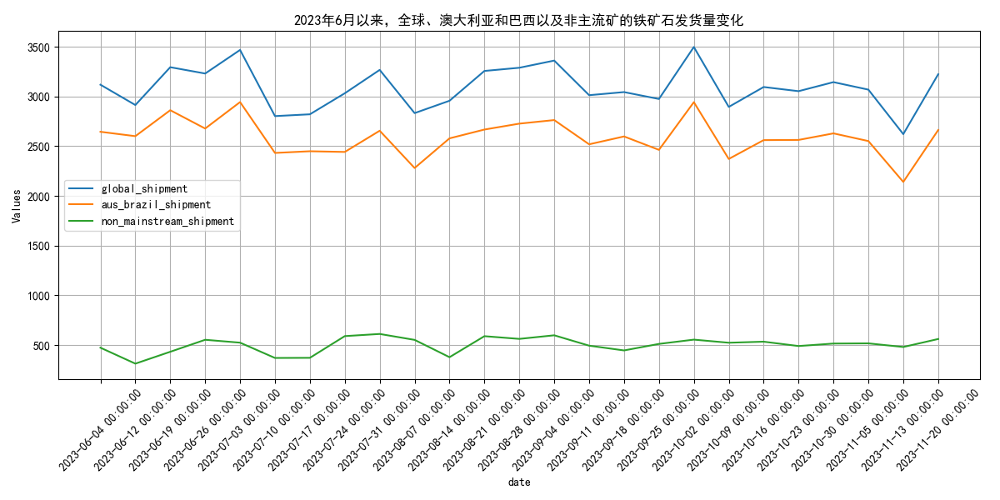
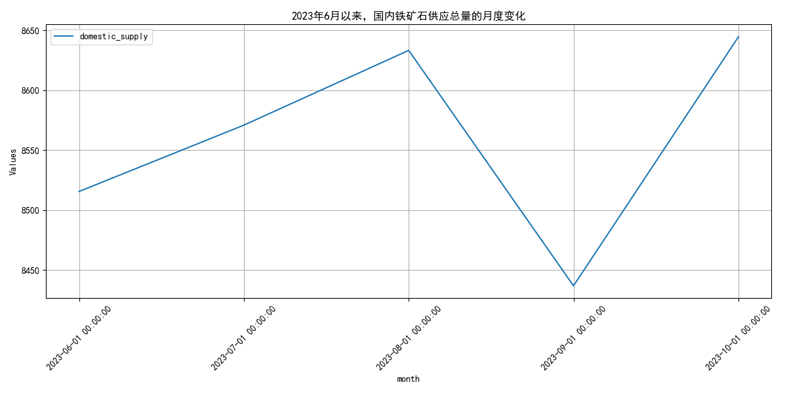
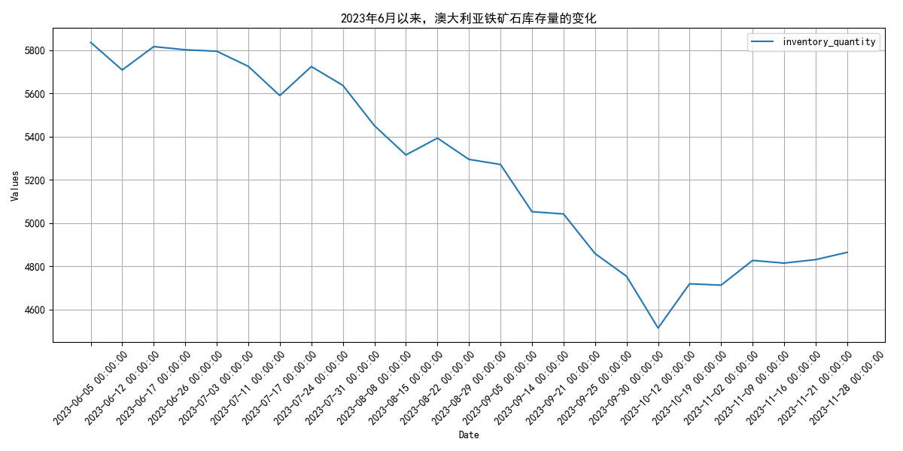
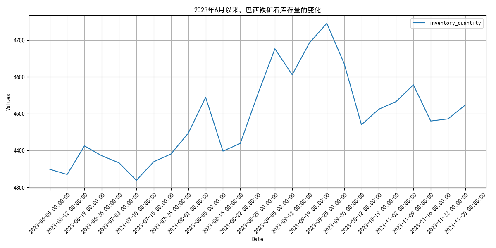

## **四大矿山年度产量波动分析**
自2023年6月以来，2023年6月以来，四大矿山年度产量波动，部分月份增减不一。 指标走势方面，2023年6月以来，国际铁矿石供给情况显示四大矿山（巴西的淡水河谷、澳大利亚的力拓、必和必拓和福蒂斯丘）的年度年产量有所波动。具体来看，2022年12月至2023年5月，Total_Shipment从12597.9万吨增至11628.3万吨，Aus_Bra_Shipment从10535.2万吨降至9922.7万吨，Aus_Shipment从7768.1万吨降至7115.79万吨。FMG_Shipment从1546.699万吨降至1507.9万吨，BHP_Shipment从2188.9万吨降至2187.7万吨，Rio_Tinto_Shipment从2892.6万吨降至2386.0万吨，Vale_Shipment从2060.3万吨降至2078万吨。整体来看，各矿山的发货量在此期间呈现波动，部分月份有所增加，部分月份有所减少。 2023年6月以来，国际铁矿石供给情况显示四大矿山（巴西的淡水河谷、澳大利亚的力拓、必和必拓和福蒂斯丘）的年度年产量有所波动。具体来看，2022年12月至2023年5月，Total_Shipment从12597.9万吨增至11628.3万吨，Aus_Bra_Shipment从10535.2万吨降至9922.7万吨，Aus_Shipment从7768.1万吨降至7115万吨。FMG_Shipment从1546.6万吨降至1507.9万吨，BHP_Shipment从2188.9万吨降至2187万吨，Rio_Tinto_Shipment从2892万吨降至2386.0万吨，Vale_Shipment从2060.3万吨降至2078万吨。整体来看，各矿山的发货量在此期间呈现波动，部分月份有所增加，部分月份有所减少。原因可能包括市场需求波动、矿山生产调整以及全球经济环境变化。展望未来，随着全球经济逐步复苏和市场需求增加，预计四大矿山的年度年产量将呈现稳定增长趋势。
        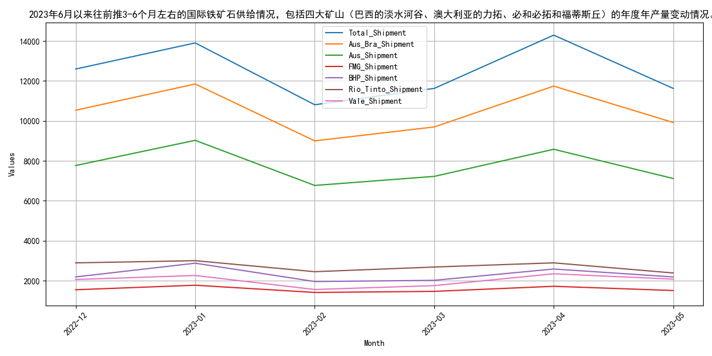
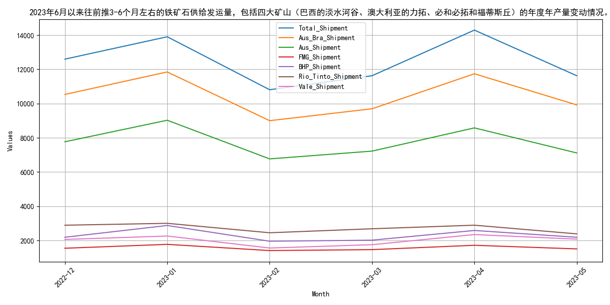

## **2023年上半年国内铁矿石原矿产量波动分析**
自2023年6月以来，2023年上半年，国内铁矿石原矿产量波动较大，3月达峰值后回落。 指标走势方面，2023年1月至6月，国内铁矿石原矿产量呈现波动变化。1月和2月产量分别为7862.2万吨和7863.2万吨，基本持平。3月产量显著增加至8640.3万吨，达到上半年最高点。随后4月产量大幅下降至7509.6万吨，5月略有回升至7760.1万吨。整体来看，上半年产量波动较大，3月达到峰值后出现明显回落。 2023年1月至6月，国内铁矿石原矿产量呈现波动变化。1月和2月产量分别为7862.2万吨和7863.2万吨，基本持平。3月产量显著增加至8640.3万吨，达到上半年最高点。随后4月产量大幅下降至7509.6万吨，5月略有回升至7760.1万吨。整体来看，上半年产量波动较大，3月达到峰值后出现明显回落。原因可能包括春节后的生产恢复、政策调控以及市场需求变化。预计下半年，随着国内经济活动的进一步恢复和政策支持，铁矿石原矿产量可能会有所回升，但具体增长幅度还需观察国内外市场需求和政策导向。
        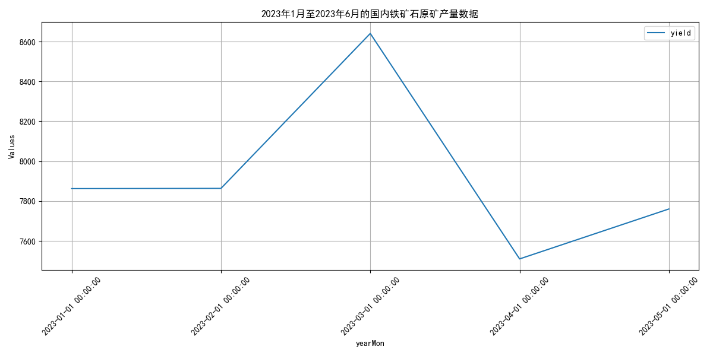

## **2023年6月国内铁矿石供应波动分析**
自2023年6月以来，2023年6月，国内铁矿石供应波动，澳大利亚发货量增加，全球发货量上升。 指标走势方面，2023年6月以来，国内铁矿石供应总量呈现波动，3月份达到8640.3万吨的高点，随后在4月份降至7509.6万吨，5月份略有回升至7760.1万吨。澳大利亚到中国的铁矿石发货量在同一时期也表现出波动，从1月份的1446.0万吨逐渐增加至6月份的1795.0万吨，其中4月份出现较低值971.0万吨。全球铁矿石发货量整体呈现上升趋势，从1月份的3247.2万吨增加至6月份的3231.0万吨。澳大利亚和巴西的铁矿石产量在2023年上半年保持相对稳定，澳大利亚产量从1月份的1890.7万吨波动至6月份的1817.8万吨，巴西产量从1月份的925.3万吨波动至6月份的860.0万吨。 2023年6月以来，国内铁矿石供应总量呈现波动，3月份达到8640.3万吨的高点，随后在4月份降至7509.6万吨，5月份略有回升至7760.1万吨。澳大利亚到中国的铁矿石发货量在同一时期也表现出波动，从1月份的1446.0万吨逐渐增加至6月份的1795.0万吨，其中4月份出现较低值971.0万吨。全球铁矿石发货量整体呈现上升趋势，从1月份的3247.2万吨增加至6月份的3231.0万吨。澳大利亚和巴西的铁矿石产量在2023年上半年保持相对稳定，澳大利亚产量从1月份的1890.7万吨波动至6月份的1817.8万吨，巴西产量从1月份的925.3万吨波动至6月份的860.0万吨。
        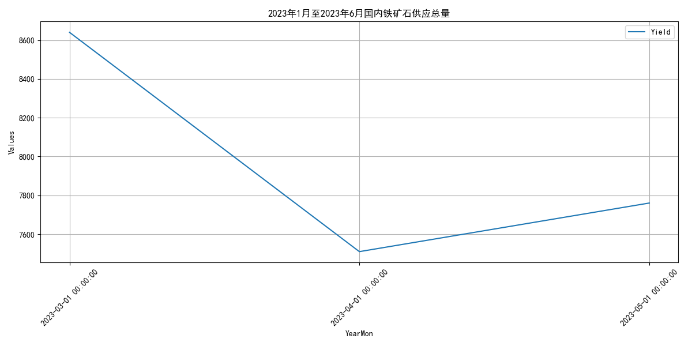
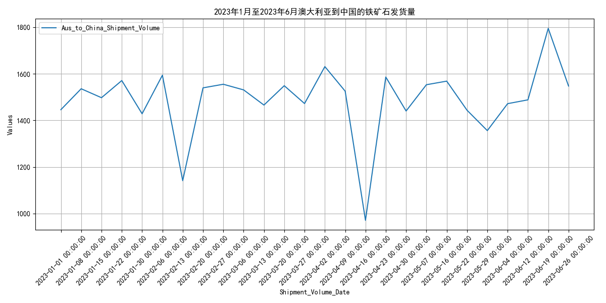
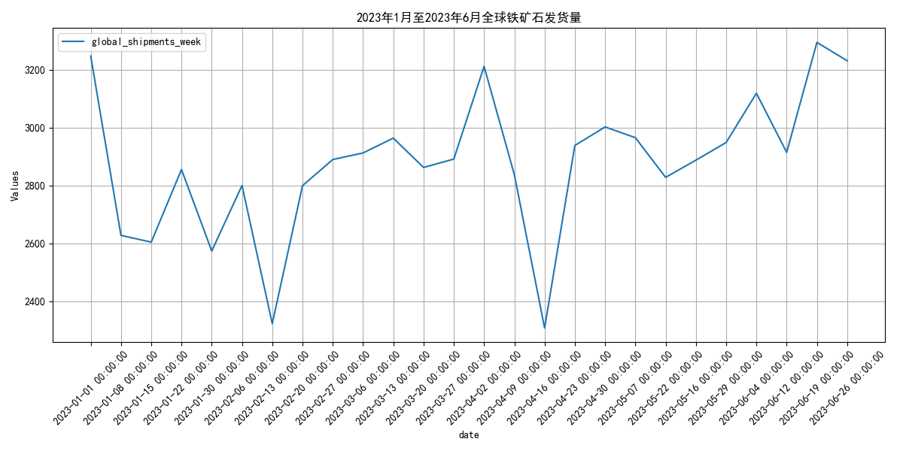
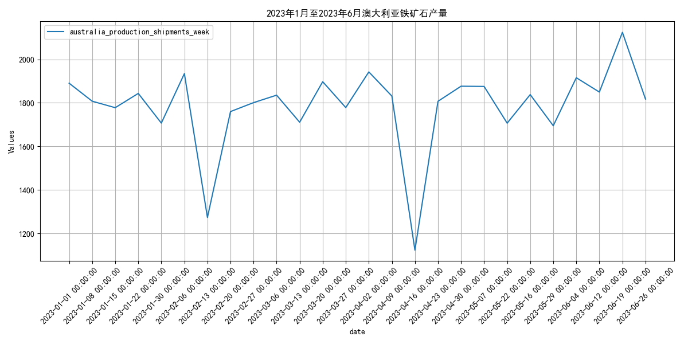
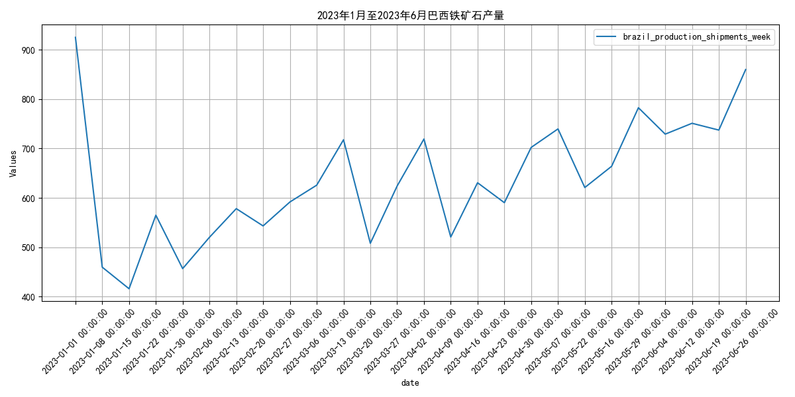
