# 2023年8月月报：走势回顾与供给分析：铁矿石
## **8月铁矿石价格波动与合约上涨分析**
自2023年8月以来，8月日照港Pb粉现货价格波动，DCE合约价格上涨，市场预期乐观但波动性大。 指标走势方面，2023年8月以来，日照港Pb粉现货价格呈现波动，从8月初的876元/吨降至8月底的907元/吨，显示出市场价格的不稳定性。同时，DCE01合约价格从751元/吨上涨至849元/吨，DCE05合约从724.5元/吨上涨至807元/吨，DCE07合约从838.5元/吨上涨至929.5元/吨，各合约价格均有所上升，反映出市场对铁矿石的预期较为乐观。整体来看，铁矿石市场在8月份表现出价格上涨的趋势，但现货市场的波动性较大，需要关注后续市场动态。 2023年8月以来，日照港Pb粉现货价格呈现波动，从8月初的876元/吨降至8月底的907元/吨，显示出市场价格的不稳定性。同时，DCE01合约价格从751元/吨上涨至849元/吨，DCE05合约从724.5元/吨上涨至807元/吨，DCE07合约从838.5元/吨上涨至929.5元/吨，各合约价格均有所上升，反映出市场对铁矿石的预期较为乐观。整体来看，铁矿石市场在8月份表现出价格上涨的趋势，但现货市场的波动性较大，需要关注后续市场动态。
        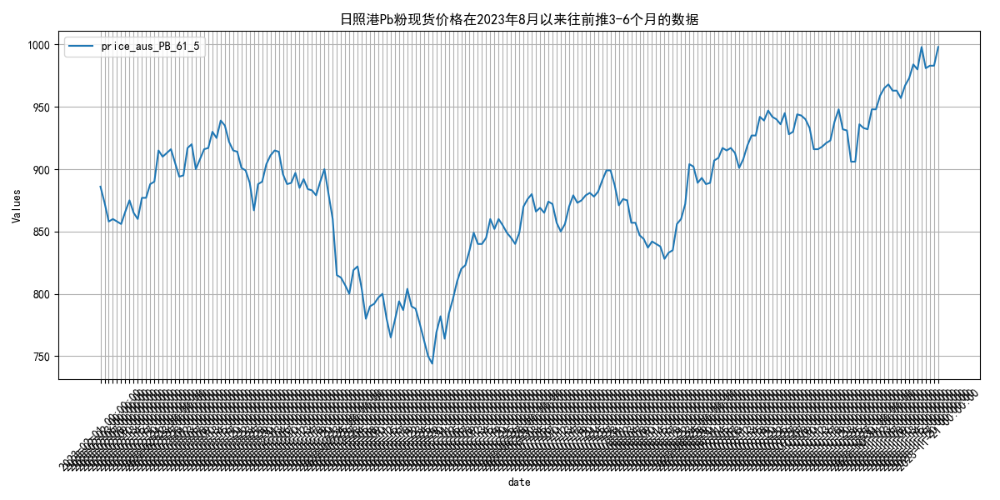
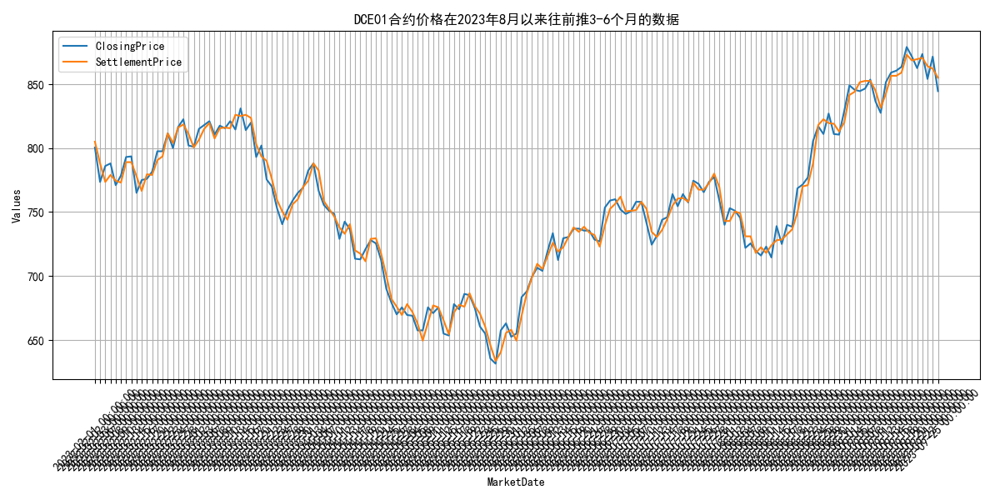
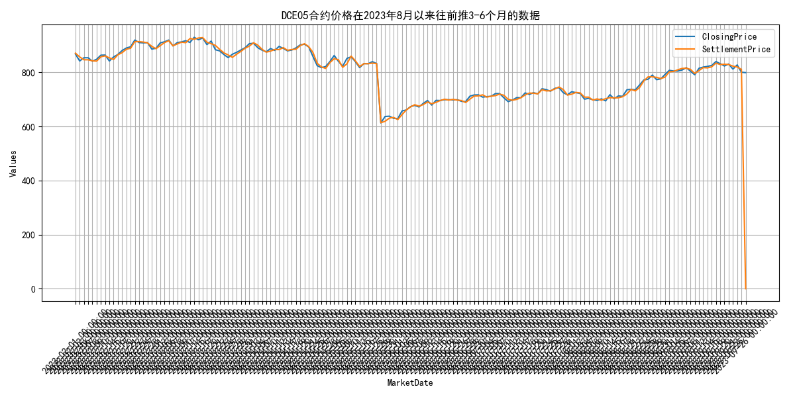
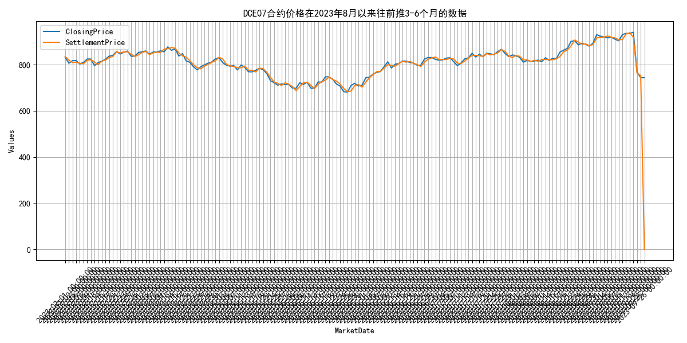

## **2023年8月铁矿石供给波动分析**
自2023年8月以来，2023年8月，全球铁矿石发货量波动，澳大利亚和巴西发货量稳定，非主流矿发货量显著增加。 指标走势方面，2023年2月至2023年8月，全球铁矿石发货量整体呈现波动，从2799.6万吨增至3289.1万吨，最高达到3468.1万吨。澳大利亚和巴西铁矿石发货量主要集中在2454.9万吨至2943.9万吨之间，最高达到2943.9万吨。非主流矿发货量波动较大，从344.7万吨增至611.8万吨，最高达到611.8万吨。国内铁矿石供应总量从8640.3万吨降至7509.6万吨，再回升至8570.9万吨。澳大利亚铁矿石库存量从6468.26万吨降至5294.27万吨，巴西铁矿石库存量从4890.32万吨增至4551.04万吨。 2023年2月至2023年8月，全球铁矿石发货量波动较大，从2799.6万吨增至3289.1万吨，最高达到3468.1万吨。澳大利亚和巴西铁矿石发货量主要集中在2454.9万吨至2943.9万吨之间，最高达到2943.9万吨。非主流矿发货量波动显著，从344.7万吨增至611.8万吨，最高达到611.8万吨。国内铁矿石供应总量从8640.3万吨降至7509.6万吨，再回升至8570.9万吨。澳大利亚铁矿石库存量从6468.26万吨降至5294.27万吨，巴西铁矿石库存量从4890.32万吨增至4551.04万吨。这些变化可能受到全球经济复苏、矿山产能调整、以及国际贸易政策的影响。预计未来几个月，随着全球经济的进一步复苏和矿山产能的逐步释放，铁矿石发货量和库存量将继续呈现波动，但总体趋势可能保持稳定增长。
        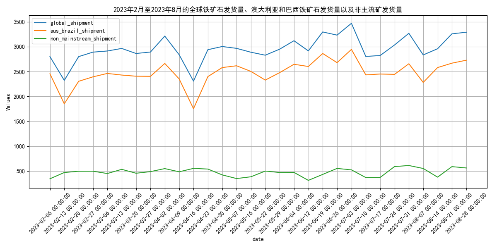
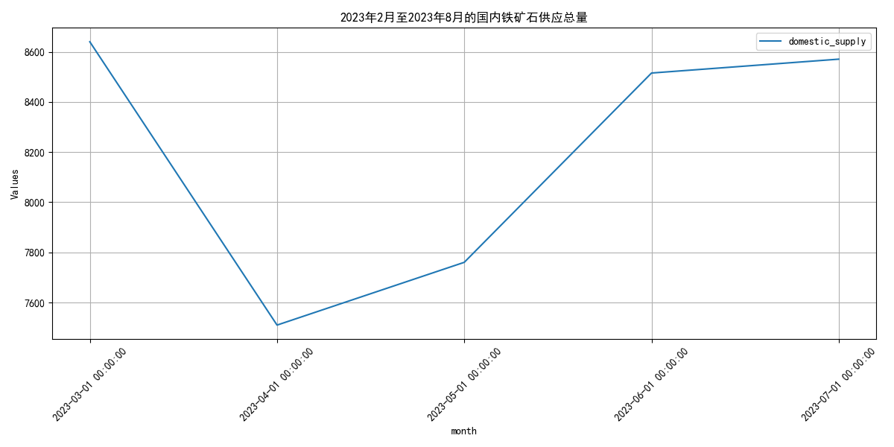

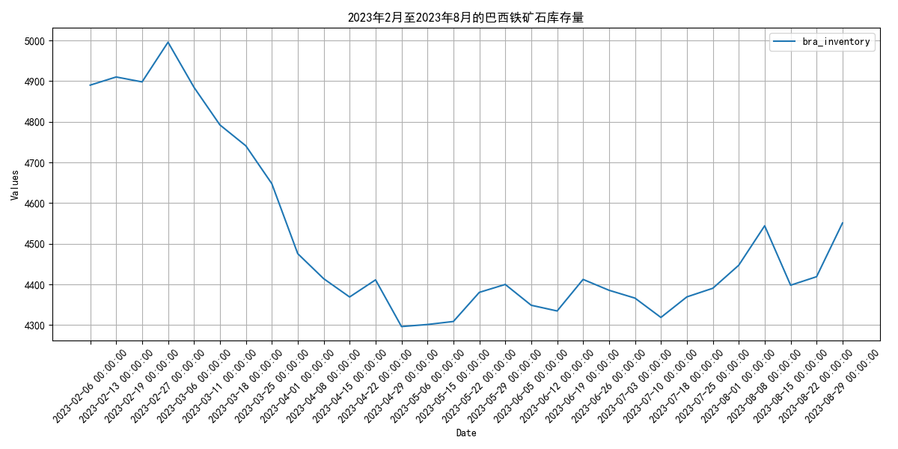

## **2023年8月铁矿石供给波动分析**
自2023年8月以来，2023年2月至8月，四大矿山铁矿石发货量波动，4月峰值后回落，库存波动反映供需动态变化。 指标走势方面，2023年2月至8月期间，四大矿山铁矿石发货量呈现波动。2月总发货量为10810.1万吨，随后在4月达到峰值14295.8万吨，之后有所下降，8月为12336.1万吨。澳大利亚和巴西的总发货量（Aus_Bra_Shipment）从2月的9001.9万吨增加到7月的12923.6万吨，8月略有下降至10254.3万吨。澳大利亚的发货量（Aus_Shipment）从2月的6769.0万吨增加到7月的9031.4万吨，8月下降至7117.6万吨。福蒂斯丘（FMG）、必和必拓（BHP）、力拓（Rio Tinto）和淡水河谷（Vale）的发货量也呈现类似波动趋势，其中力拓和淡水河谷在7月达到各自高点后，8月有所回落。库存方面，总库存从2月的45976.85万吨波动至8月的43811.29万吨，显示出供需关系的动态变化。 2023年2月至8月，四大矿山铁矿石发货量波动明显，4月达到峰值后逐渐回落。澳大利亚和巴西的总发货量在7月达到高点后，8月有所下降。库存方面，总库存呈现波动，从2月的45976.85万吨降至8月的43811.29万吨。这种波动可能受全球经济复苏速度、钢铁需求变化及矿山生产策略调整影响。预计未来几个月，随着全球经济逐步稳定和钢铁需求恢复，铁矿石发货量和库存将趋于稳定，但仍需关注全球经济政策变动和矿山生产动态。
        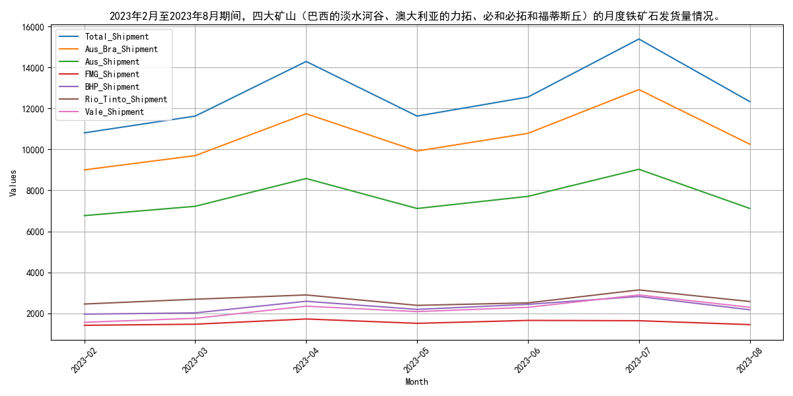
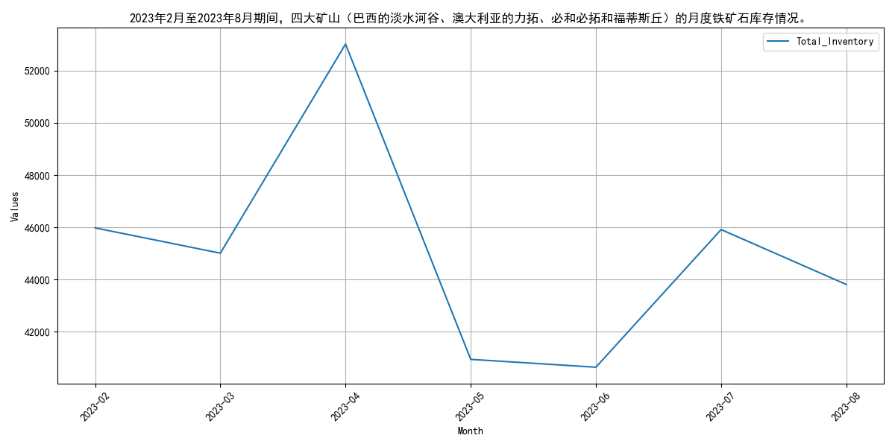

## **2023年8月国内铁矿石原矿产量波动上升**
自2023年8月以来，2023年8月，国内铁矿石原矿产量连续三个月超8500万吨，整体呈上升趋势。 指标走势方面，2023年2月至2023年8月，国内铁矿石原矿产量呈现波动上升趋势。具体来看，2月至3月产量从7863.2万吨增加至8640.3万吨，随后在4月下降至7509.6万吨，5月小幅回升至7760.1万吨，6月至8月连续三个月产量超过8500万吨，分别为8515.54万吨、8570.9万吨和8633.3万吨。这一期间，产量整体呈现上升趋势，尽管在4月有所下降，但随后迅速恢复并持续增长。 2023年2月至2023年8月，国内铁矿石原矿产量呈现波动上升趋势。2月至3月产量从7863.2万吨增加至8640.3万吨，随后在4月下降至7509.6万吨，5月小幅回升至7760.1万吨，6月至8月连续三个月产量超过8500万吨，分别为8515.54万吨、8570.9万吨和8633.3万吨。这一期间，产量整体呈现上升趋势，尽管在4月有所下降，但随后迅速恢复并持续增长。原因可能包括国内需求的稳定增长以及矿山生产的逐步恢复。展望未来，考虑到国内经济的持续复苏和基础设施投资的增加，预计铁矿石原矿产量将继续保持增长态势。
        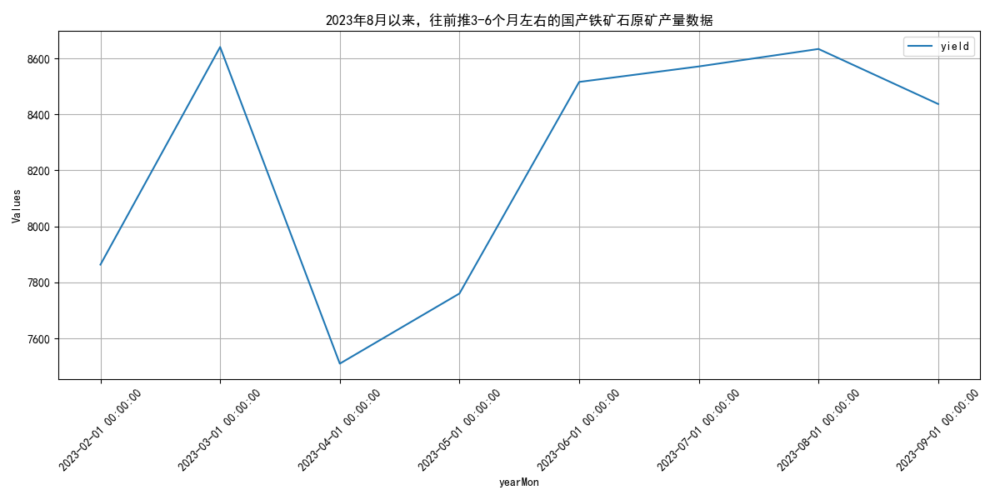

## **国内铁矿石供应波动，全球发货量上升**
自2023年8月以来，2023年2月至8月，国内铁矿石供应波动，全球发货量上升，澳大利亚和巴西产量波动。 指标走势方面，2023年2月至2023年8月期间，国内铁矿石供应总量呈现波动，3月达到8640.3万吨，4月下降至7509.6万吨，5月回升至7760.1万吨，6月进一步上升至8515.54万吨，7月略微增加至8570.9万吨。澳大利亚到中国的铁矿石发货量在此期间也表现出波动，2月至8月的发货量从1594.0万吨到1521.0万吨不等。全球铁矿石发货量整体呈现上升趋势，从2月的2799.6万吨增加到8月的3289.1万吨。澳大利亚和巴西的铁矿石产量也显示出波动，澳大利亚的产量从1934.8万吨到1816.0万吨，巴西的产量从520.1万吨到911.1万吨。 2023年2月至2023年8月期间，国内铁矿石供应总量呈现波动，3月达到8640.3万吨，4月下降至7509.6万吨，5月回升至7760.1万吨，6月进一步上升至8515.54万吨，7月略微增加至8570.9万吨。澳大利亚到中国的铁矿石发货量在此期间也表现出波动，2月至8月的发货量从1594.0万吨到1521.0万吨不等。全球铁矿石发货量整体呈现上升趋势，从2月的2799.6万吨增加到8月的3289.1万吨。澳大利亚和巴西的铁矿石产量也显示出波动，澳大利亚的产量从1934.8万吨到1816.0万吨，巴西的产量从520.1万吨到911.1万吨。这些波动可能受到全球经济复苏、市场需求变化以及政策调控的影响。展望未来，随着全球经济的进一步复苏和市场需求的稳定增长，预计铁矿石供应将保持稳定增长态势，但需关注政策调控和市场变化对供应的影响。
        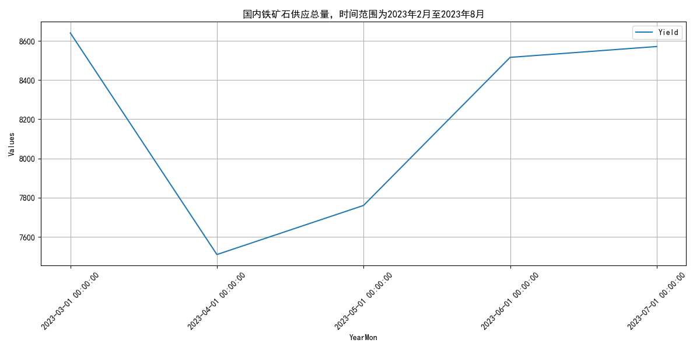
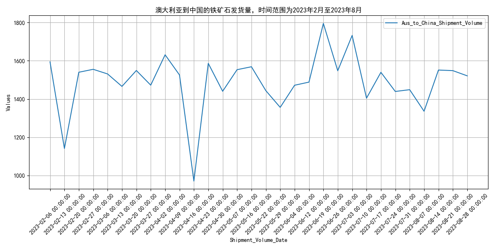
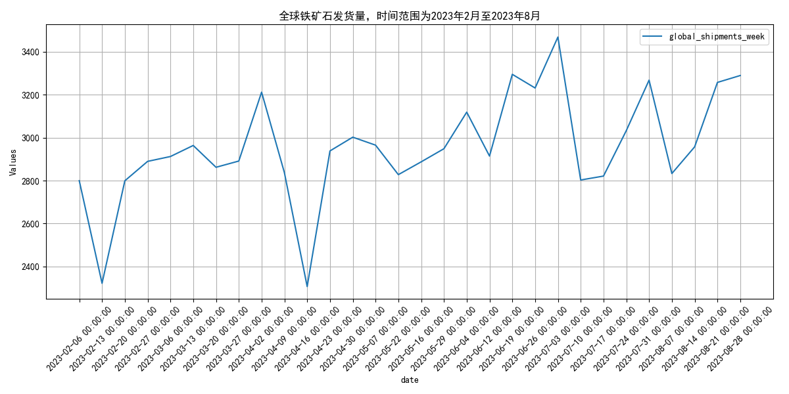
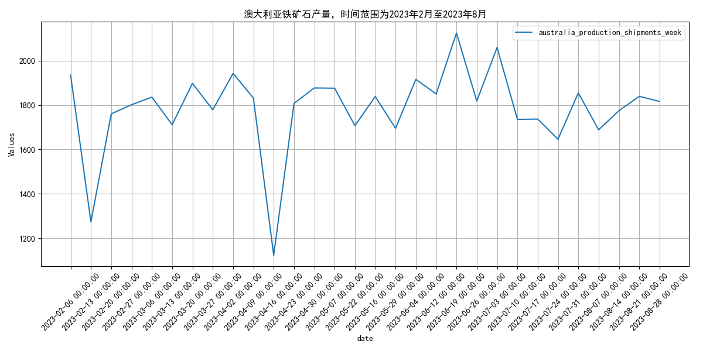

