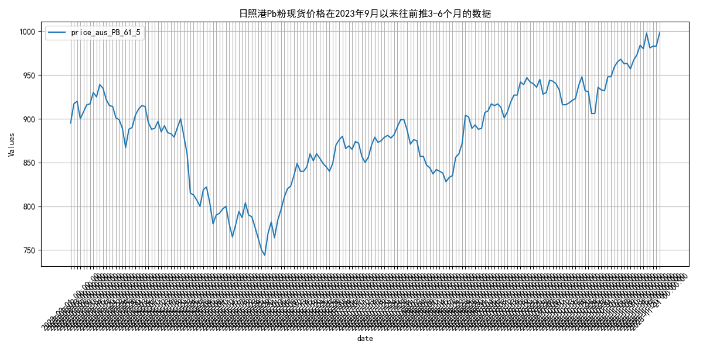
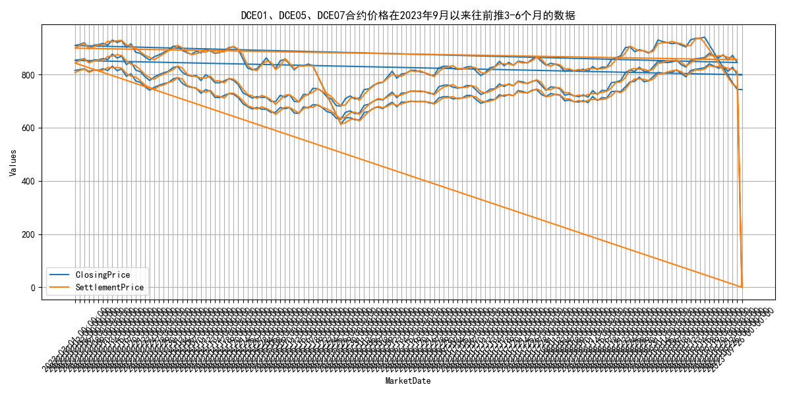
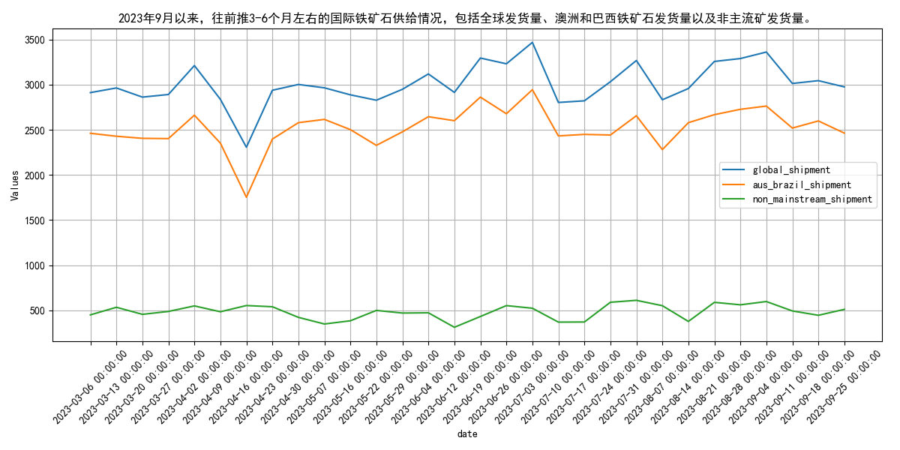
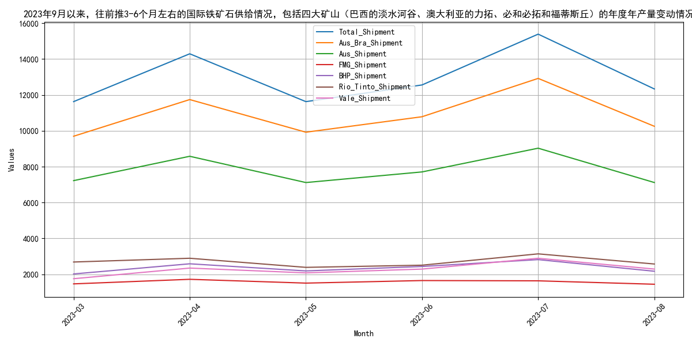
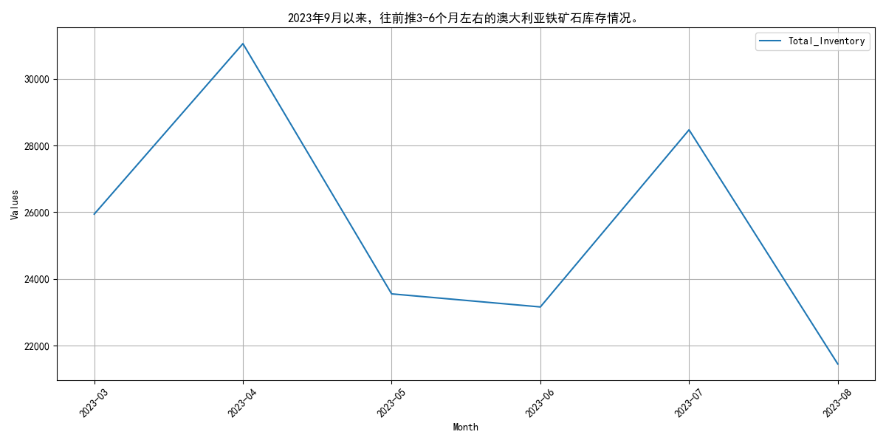
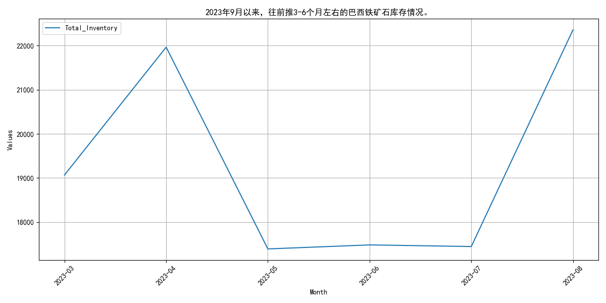
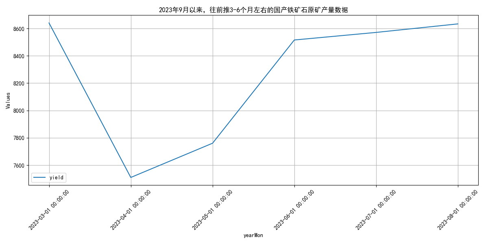
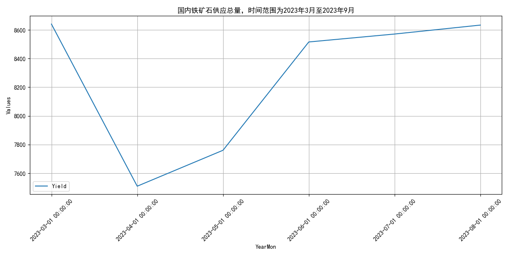
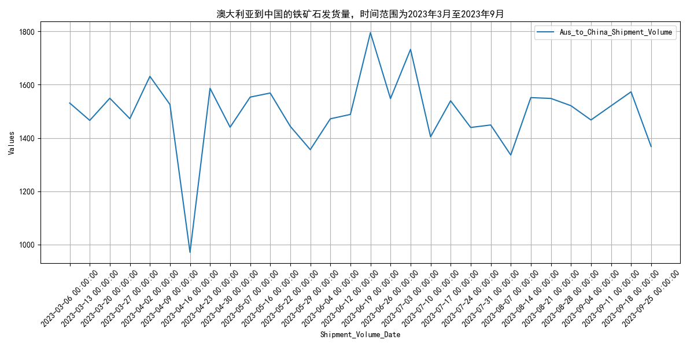
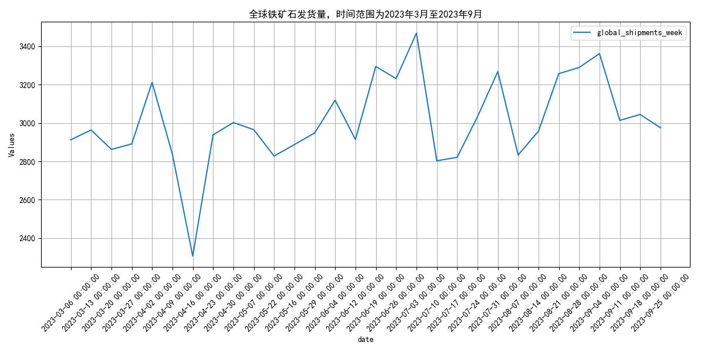

# 2023年9月月报：走势回顾与供给分析：铁矿石
## **2023年9月铁矿石价格波动回顾与分析**
自2023年9月以来，2023年9月，铁矿石价格从895元/吨升至944元/吨，DCE合约价格波动，市场供需调整影响价格。 指标走势方面，2023年3月至9月，日照港PB粉现货价格呈现波动走势，从895元/吨上升至944元/吨，期间最高达到942元/吨，最低为744元/吨。DCE01合约价格从815元/吨波动至844.5元/吨，DCE05合约从908.5元/吨波动至919.5元/吨，DCE07合约从852.5元/吨波动至923元/吨。整体来看，铁矿石价格在经历了一段时间的下跌后，自2023年6月开始逐步回升，显示出市场供需关系的调整和价格波动的复杂性。 2023年3月至9月，日照港PB粉现货价格经历了显著波动，从895元/吨上升至944元/吨，期间最高达到942元/吨，最低为744元/吨。DCE01合约价格从815元/吨波动至844.5元/吨，DCE05合约从908.5元/吨波动至919.5元/吨，DCE07合约从852.5元/吨波动至923元/吨。整体来看，铁矿石价格在经历了一段时间的下跌后，自2023年6月开始逐步回升，显示出市场供需关系的调整和价格波动的复杂性。这一变化可能受到国内新建、改扩建铁矿项目进展的影响，以及市场对未来供需关系的预期调整。随着新建产能的逐步释放，预计铁矿石价格将趋于稳定，但短期内仍可能受到市场情绪和宏观经济因素的影响而波动。
        

## **2023年9月铁矿石供给波动分析**
自2023年9月以来，2023年9月，全球铁矿石发货量波动，主流与非主流矿均增，最高点在9月4日。 指标走势方面，2023年3月至9月，国际铁矿石供给情况显示，全球发货量整体呈现波动，从3月的2912.1万吨增至9月的3361.2万吨，最高点出现在9月4日。澳洲和巴西铁矿石发货量（主流矿）在此期间也呈现波动，从3月的2461.3万吨增至9月的2762.9万吨，最高点同样出现在9月4日。非主流矿发货量从3月的450.8万吨增至9月的598.3万吨，最高点出现在9月4日。整体来看，主流矿和非主流矿的发货量在2023年3月至9月期间均有所增加，但存在一定的波动性。 2023年3月至9月，国际铁矿石供给情况显示，全球发货量整体呈现波动，从3月的2912.1万吨增至9月的3361.2万吨，最高点出现在9月4日。澳洲和巴西铁矿石发货量（主流矿）在此期间也呈现波动，从3月的2461.3万吨增至9月的2762.9万吨，最高点同样出现在9月4日。非主流矿发货量从3月的450.8万吨增至9月的598.3万吨，最高点出现在9月4日。整体来看，主流矿和非主流矿的发货量在2023年3月至9月期间均有所增加，但存在一定的波动性。这可能是由于全球经济复苏带动需求增加，以及部分矿山的产能扩张和设备升级。展望未来，随着全球经济的进一步复苏和矿山产能的持续释放，预计铁矿石发货量将继续保持增长态势，但需关注全球贸易政策和矿山运营风险对供给的影响。
        

## **2023年9月四大矿山铁矿石发货量波动分析**
自2023年9月以来，2023年9月，四大矿山铁矿石发货量波动，7月达峰值15391.8万吨，8月和9月略有下降。 指标走势方面，2023年3月至9月期间，四大矿山铁矿石发货量呈现波动。3月总发货量为11628.6万吨，4月增至14295.8万吨，5月回落至11628.3万吨，6月略升至12558.4万吨，7月达到峰值15391.8万吨，8月降至12336.1万吨，9月为12393.7万吨。澳大利亚和巴西的总发货量（Aus_Bra_Shipment）从3月的9698.1万吨增至7月的12923.6万吨，8月和9月略有下降。澳大利亚的发货量（Aus_Shipment）在7月达到9031.4万吨的高点，随后在8月和9月下降。福蒂斯丘（FMG）、必和必拓（BHP）、力拓（Rio Tinto）和淡水河谷（Vale）的发货量也呈现类似波动趋势，其中力拓和淡水河谷在7月达到发货高峰，随后有所下降。 2023年3月至9月，四大矿山铁矿石发货量波动明显，3月为11628.6万吨，4月增至14295.8万吨，5月回落至11628.3万吨，6月略升至12558.4万吨，7月达到峰值15391.8万吨，8月降至12336.1万吨，9月为12393.7万吨。澳大利亚和巴西的总发货量从3月的9698.1万吨增至7月的12923.6万吨，8月和9月略有下降。澳大利亚的发货量在7月达到9031.4万吨的高点，随后在8月和9月下降。福蒂斯丘、必和必拓、力拓和淡水河谷的发货量也呈现类似波动趋势，其中力拓和淡水河谷在7月达到发货高峰，随后有所下降。库存方面，澳大利亚和巴西的铁矿石库存呈现波动，澳大利亚库存从3月的25942.3万吨增至4月的31052.05万吨，随后波动下降至8月的21452.18万吨；巴西库存从3月的19066.22万吨增至4月的21965.96万吨，随后波动下降至8月的22359.11万吨。预计未来几个月，随着全球经济复苏和需求增加，铁矿石发货量和库存可能会有所增加，但需关注全球经济政策和市场需求变化。
        

## **2023年9月国产铁矿石原矿产量稳定**
自2023年9月以来，2023年9月，国产铁矿石原矿产量稳定在8633.3万吨，经历4月低点后逐步回升。 指标走势方面，2023年3月至2023年9月，国产铁矿石原矿产量呈现波动变化。具体来看，3月份产量为8640.3万吨，4月份下降至7509.6万吨，5月份回升至7760.1万吨，6月份进一步增加至8515.54万吨，7月份和8月份分别维持在8570.9万吨和8633.3万吨。整体来看，国产铁矿石原矿产量在经历4月份的低点后，逐步回升并在7月和8月保持相对稳定。 2023年3月至2023年9月，国产铁矿石原矿产量呈现波动变化。3月份产量为8640.3万吨，4月份下降至7509.6万吨，5月份回升至7760.1万吨，6月份进一步增加至8515.54万吨，7月份和8月份分别维持在8570.9万吨和8633.3万吨。4月份的产量下降可能与季节性调整和市场需求波动有关，而随后的回升则可能受到国内经济复苏和基础设施投资的推动。展望未来，随着国内经济的持续恢复和基础设施项目的加速推进，预计国产铁矿石原矿产量将保持稳定增长态势。
        

## **2023年9月铁矿石供应稳定，产能利用率波动**
自2023年9月以来，2023年9月，国内铁矿石供应总量波动，澳大利亚发货量稳定，全球发货量上升，产能利用率波动。 指标走势方面，2023年3月至9月，国内铁矿石供应总量呈现波动，从8640.3万吨降至7509.6万吨，随后回升至8633.3万吨。澳大利亚到中国的铁矿石发货量在此期间也表现出波动，从1530.9万吨至1368.1万吨不等。全球铁矿石发货量整体呈现上升趋势，从2912.1万吨增至2975.0万吨。生铁产量在同一时期从7806.84万吨略降至7462.3万吨，显示出一定的下降趋势。这些数据表明，尽管国内供应总量和生铁产量有所波动，但全球和澳大利亚的发货量整体保持稳定，反映出铁矿石市场的供应稳定性。 2023年3月至9月，国内铁矿石供应总量呈现波动，从8640.3万吨降至7509.6万吨，随后回升至8633.3万吨。澳大利亚到中国的铁矿石发货量在此期间也表现出波动，从1530.9万吨至1368.1万吨不等。全球铁矿石发货量整体呈现上升趋势，从2912.1万吨增至2975.0万吨。生铁产量在同一时期从7806.84万吨略降至7462.3万吨，显示出一定的下降趋势。这些数据表明，尽管国内供应总量和生铁产量有所波动，但全球和澳大利亚的发货量整体保持稳定，反映出铁矿石市场的供应稳定性。展望未来，随着全球经济的逐步复苏和国内需求的稳定增长，预计铁矿石供应将继续保持稳定，产能利用率可能会有所提升，以满足不断增长的市场需求。
        

