# 2022年11月月报：走势回顾与供给分析：铁矿石

## **2022年11月铁矿石价格走势回顾与分析**
自2022年11月以来，铁矿石价格整体呈现下降趋势，普氏62%指数、日照港PB粉、DCE合约均出现回落，但月底有所回升。具体来看，普氏62%指数价格从5月的139.0美元/吨降至11月的80.15美元/吨，整体下降趋势明显，但在6月和11月分别出现两次显著反弹。日照港PB粉矿61.5%车板价从978元/吨降至643元/吨，同样呈现下降趋势，但在11月有所回升。DCE01合约价格从823.0元/吨降至628.0元/吨，DCE05合约价格从990.0元/吨降至604.0元/吨，DCE07合约价格从871.5元/吨降至579.0元/吨，均呈现下降趋势，但在11月有所回升。整体来看，铁矿石价格在2022年5月至11月期间虽整体下降，但在11月出现回升迹象。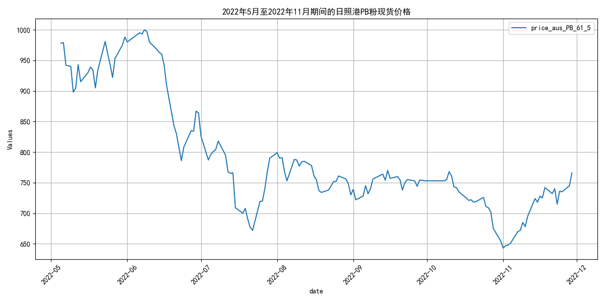
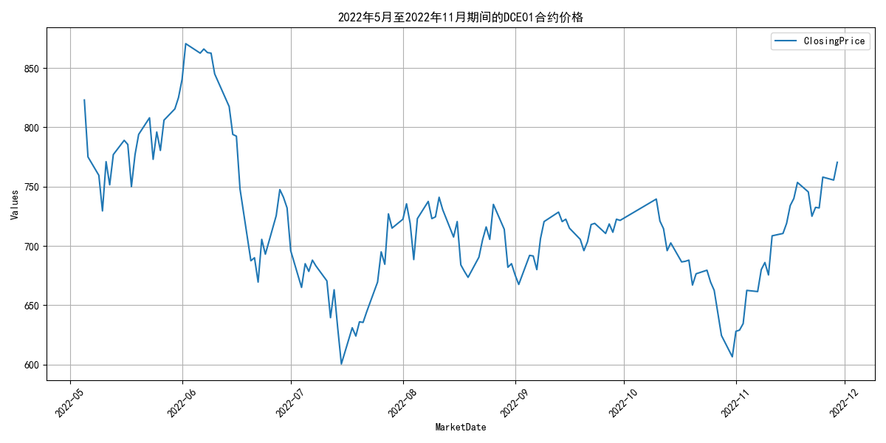
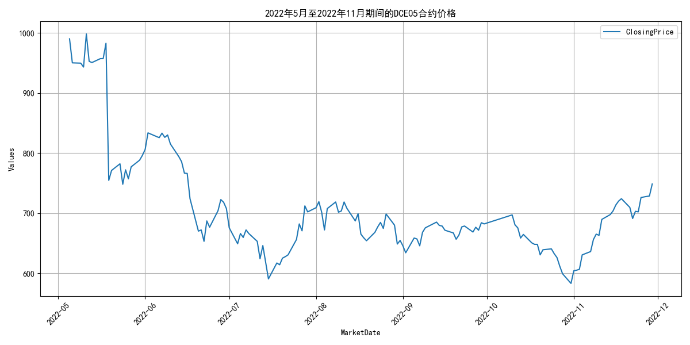
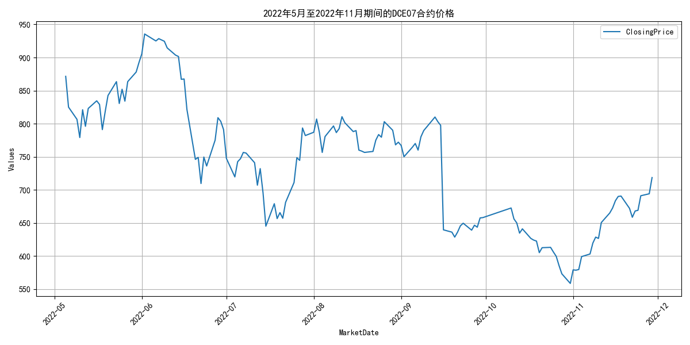
## **2022年11月铁矿石供给波动分析**
自2022年11月以来，全球铁矿石发货量呈现显著波动。具体数据显示，11月全球铁矿石发货总量为3103.2万吨，其中主流矿2514.8万吨，非主流矿305.3万吨。回顾2022年5月至11月的指标走势，全球铁矿石发货量整体波动明显，10月达到峰值3226.1万吨，而11月则小幅回落至3103.2万吨。

在主流矿方面，澳洲和巴西的发货量在6月达到峰值2860.9万吨，随后呈现波动下降趋势，至11月降至2514.8万吨。而非主流矿的发货量波动更为剧烈，7月达到高点580.3万吨，但11月已大幅降至305.3万吨。总体而言，主流矿的发货量相对稳定，非主流矿的发货量则表现出较大的波动性。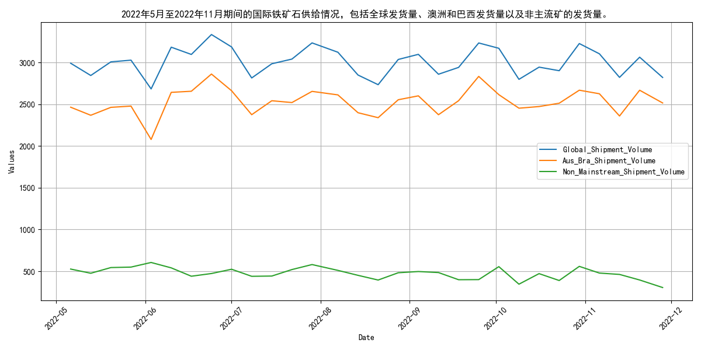
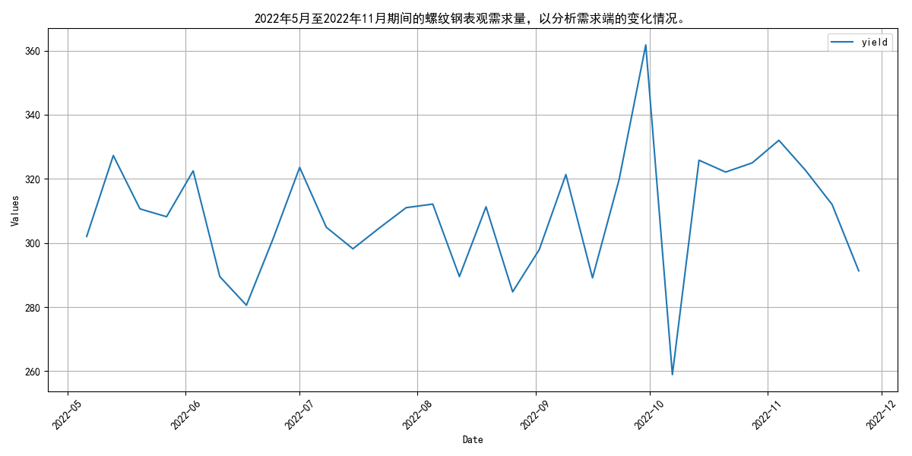
## **四大矿山发货量波动，7月峰值后回落**
自2022年5月以来，四大矿山的发货量呈现波动趋势，7月达到峰值后逐步回落，主要受全球经济放缓和需求减弱的影响。具体来看，2022年5月至11月期间，四大矿山（巴西的淡水河谷、澳大利亚的力拓、必和必拓和福蒂斯丘）的月度发货量波动明显。淡水河谷的发货量在5月为1908.1万吨，7月达到峰值2911.8万吨，11月回落至2032.8万吨。力拓的发货量在5月为2531.2万吨，10月达到峰值3222.0万吨，11月略降至2645.1万吨。必和必拓的发货量在5月为2257.7万吨，7月达到峰值2767.6万吨，11月回落至2305.1万吨。福蒂斯丘的发货量在5月为1572.1万吨，7月达到峰值1835.6万吨，11月回落至1577.0万吨。整体来看，四大矿山的发货量在7月达到峰值后，8月至11月呈现回落趋势，主要受全球经济放缓、需求减弱以及部分矿山生产调整的影响。展望未来，随着全球经济逐步复苏和需求回升，预计四大矿山的发货量将逐步恢复增长。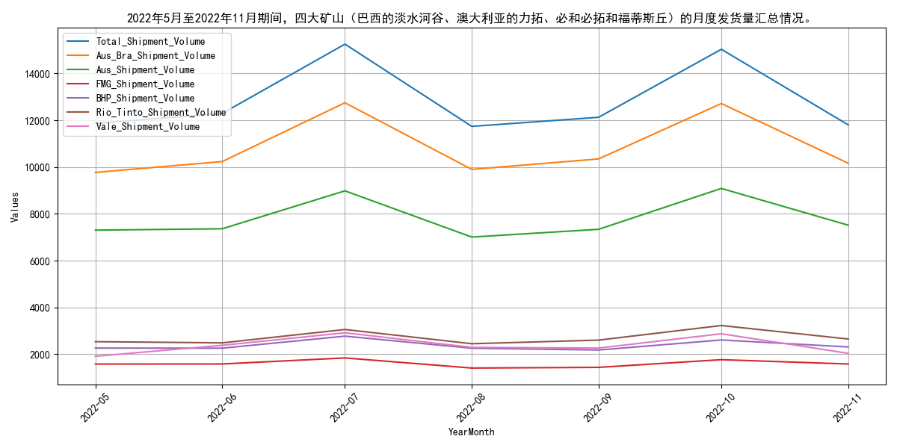
## **国产铁矿石原矿产量波动下降**
自2022年5月以来，国产铁矿石原矿产量呈现波动下降趋势，7月起持续低于8000万吨，供给端压力逐渐显现。具体来看，5月产量为9780.5万吨，6月小幅上升至9871.08万吨，但7月大幅下降至8022.68万吨，8月略有回升至8113.3万吨，9月再次下降至7897.6万吨，10月进一步降至7267.5万吨。整体而言，自7月以来，国产铁矿石原矿产量持续低于8000万吨，供给端压力明显。展望未来，若无重大政策调整或市场变化，预计国产铁矿石原矿产量短期内仍将维持在较低水平，供给端压力持续存在。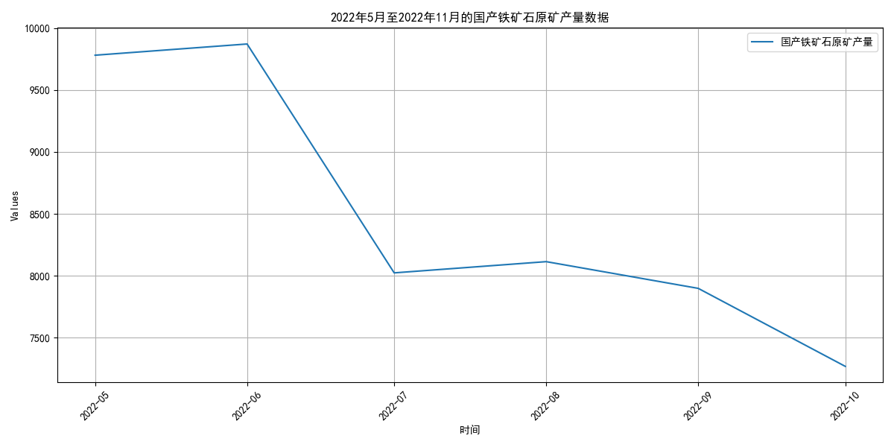
## **国内铁矿石供应波动下降，11月略有回升**

自2022年5月以来，国内铁矿石供应总量呈现波动下降趋势，至11月略有回升。具体来看，供应量从5月的9780.5万吨降至10月的7267.5万吨，随后在11月小幅回升。与此同时，全球铁矿石库存整体呈下降态势，从5月初的14324.82万吨降至11月底的13484.64万吨。澳大利亚和巴西的铁矿石库存也同步下降，分别从5月初的6747.32万吨和4674.2万吨降至11月底的6081.05万吨和4737.16万吨。

在发货量方面，全球及主要矿山的发货量在6月至7月间有所下降，但随后逐渐回升。至11月，全球发货量已达到3103.2万吨，主要矿山的发货量也有所增加。整体来看，尽管国内供应量在短期内有所波动，但全球库存的持续下降及发货量的逐步恢复，为市场提供了一定的支撑。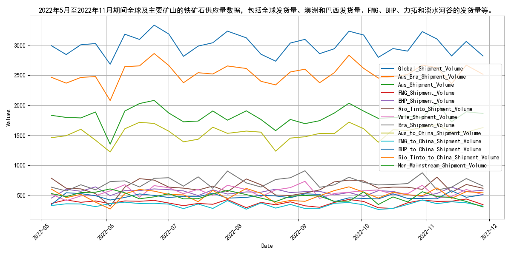
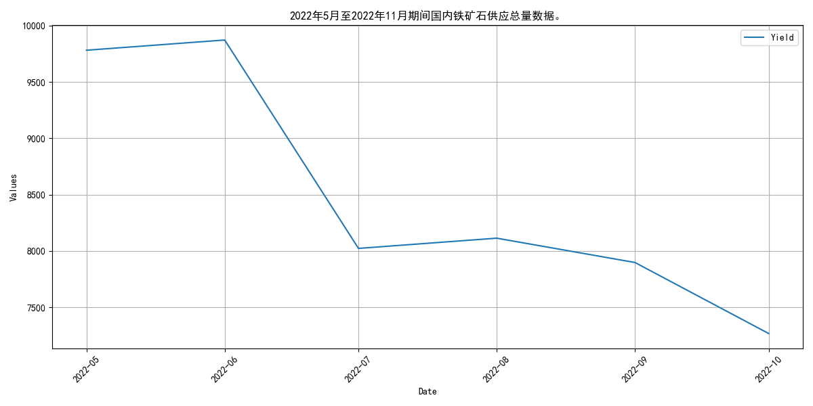
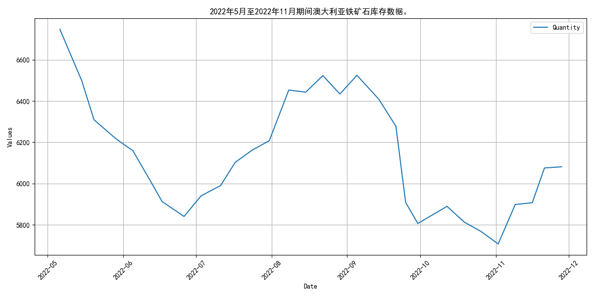
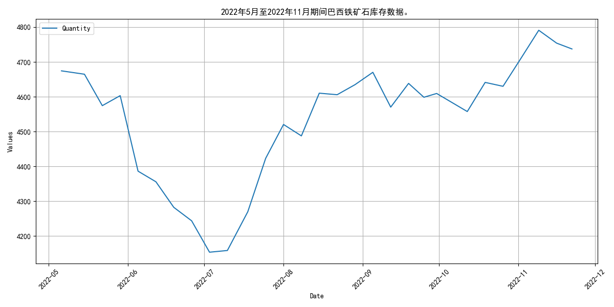
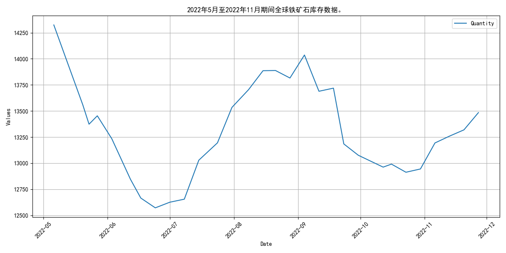
