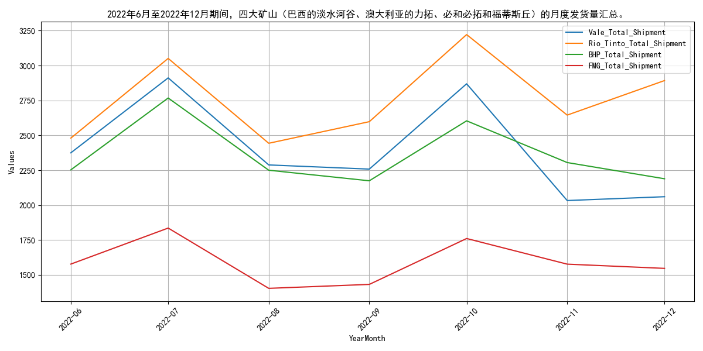

# 2022年12月月报：走势回顾与供给分析：铁矿石
## **2022年12月铁矿石价格全面上涨**

自2022年12月以来，普氏62%指数、日照港Pb粉现货及DCE合约价格均呈现显著上涨态势。具体来看，普氏62%指数价格从月初的103.1美元/吨攀升至月末的115.55美元/吨，涨幅高达12.08%。日照港Pb粉现货价格亦从月初的766元/吨上涨至月末的843元/吨，涨幅为10.05%。DCE01合约价格从月初的766.5元/吨上涨至月末的865元/吨，涨幅达12.85%。DCE05合约价格从月初的753.5元/吨上涨至月末的863元/吨，涨幅为14.53%。DCE07合约价格从月初的727.5元/吨上涨至月末的837.5元/吨，涨幅更是高达15.12%。整体而言，铁矿石价格在2022年12月展现出明显的上涨趋势。

## **2022年12月铁矿石供给波动分析**
自2022年12月以来，全球铁矿石发货量呈现波动上升态势，其中主流矿供应稳定，非主流矿则波动显著。具体来看，2022年6月至12月期间，全球铁矿石发货量整体呈现波动上升趋势，从6月初的2682.9万吨增至12月底的3194.9万吨。澳洲和巴西发货量（主流矿）在同一时期内也表现出类似趋势，从2077.7万吨增至2763.8万吨。相比之下，非主流矿发货量波动较大，从605.2万吨增至567.4万吨，期间多次出现下降，如7月底的439.7万吨和11月底的305.3万吨。整体而言，主流矿发货量占比较大且稳定，非主流矿发货量波动较大，反映出非主流矿供应的不稳定性。

## **2022年四大矿山发货量波动分析**
自2022年6月以来，四大矿山（巴西的淡水河谷、澳大利亚的力拓、必和必拓和福蒂斯丘）的月度发货量呈现波动。具体来看，力拓的发货量从6月的2480.2万吨增至12月的2892.6万吨，而淡水河谷、必和必拓和福蒂斯丘的发货量则有所下降。淡水河谷的发货量从6月的2374.9万吨降至12月的2060.3万吨；必和必拓的发货量从6月的2252.8万吨降至12月的2188.9万吨；福蒂斯丘的发货量从6月的1577.5万吨降至12月的1546.7万吨。整体而言，2022年下半年四大矿山的发货量呈现波动，其中力拓的发货量有所增加，而其他三家矿山的发货量则有所下降。

力拓发货量的增加可能与市场需求增加和生产效率提升有关，而其他三家矿山发货量的下降可能受到供应链中断、天气影响或内部生产调整的影响。预计未来力拓的发货量可能继续保持增长，而其他矿山的发货量可能会有所回升，但需关注全球经济形势和市场需求变化。
## **2022年下半年国产铁矿石原矿产量波动下降**

自2022年6月以来，国产铁矿石原矿产量呈现波动下降趋势。具体来看，6月产量为9871.08万吨，随后7月大幅下降至8022.68万吨，8月略有回升至8113.3万吨，9月再次下降至7897.6万吨，10月进一步降至7267.5万吨，11月则回升至7953.6万吨。整体而言，下半年国产铁矿石原矿产量较上半年有所减少，且波动较为显著。

导致这一现象的原因可能包括环保政策的加强、矿山安全检查的频繁以及市场需求的不稳定性。预计未来几个月，随着环保政策的持续执行和市场需求的变化，国产铁矿石原矿产量将继续呈现波动趋势，但整体可能维持在较低水平。
## **2022年12月国内铁矿石供应波动分析**

自2022年12月以来，国内铁矿石供应总量呈现波动下降态势。全球发运量波动显著，澳大利亚和巴西的库存量有所增加，而主要港口的库存量波动较小。具体来看，2022年6月至12月，国内铁矿石供应总量从6月的9871.08万吨波动下降至10月的7267.5万吨，随后在11月略有回升至7953.6万吨。全球铁矿石发运量在同一时期内波动较大，6月为2682.9万吨，12月则增至3194.9万吨，其中澳大利亚和巴西的发运量占据较大比重。澳大利亚的铁矿石库存量从6月的6158.63万吨逐步增加至12月的6282.58万吨，而巴西的库存量则从4386.0万吨增至4785.48万吨。主要港口的铁矿石库存量在6月至12月间波动较小，从323.42万吨降至283.84万吨，12月略有回升至304.37万吨。全球铁矿石库存量从6月的13233.8万吨降至9月的13075.64万吨，随后逐步回升至12月的13185.63万吨。

