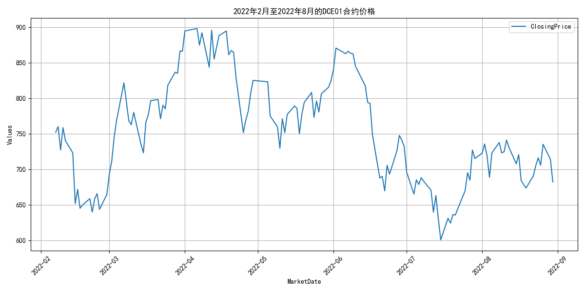
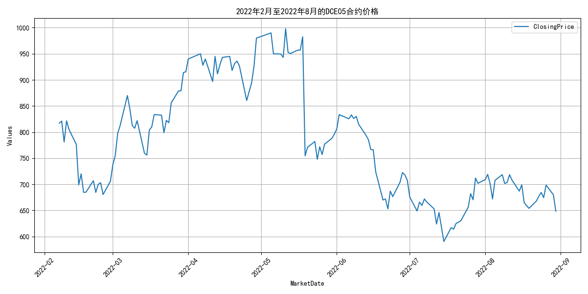
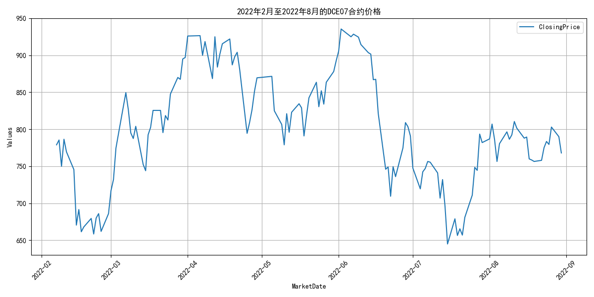
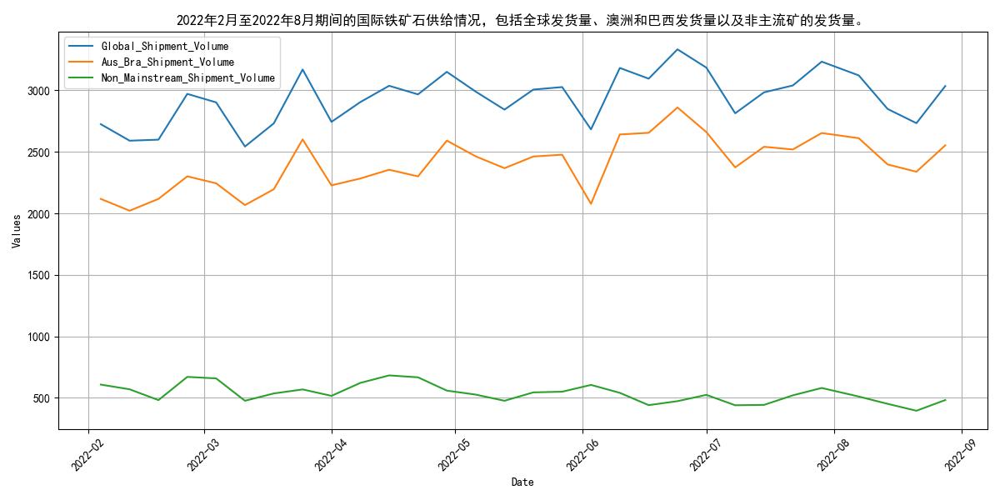
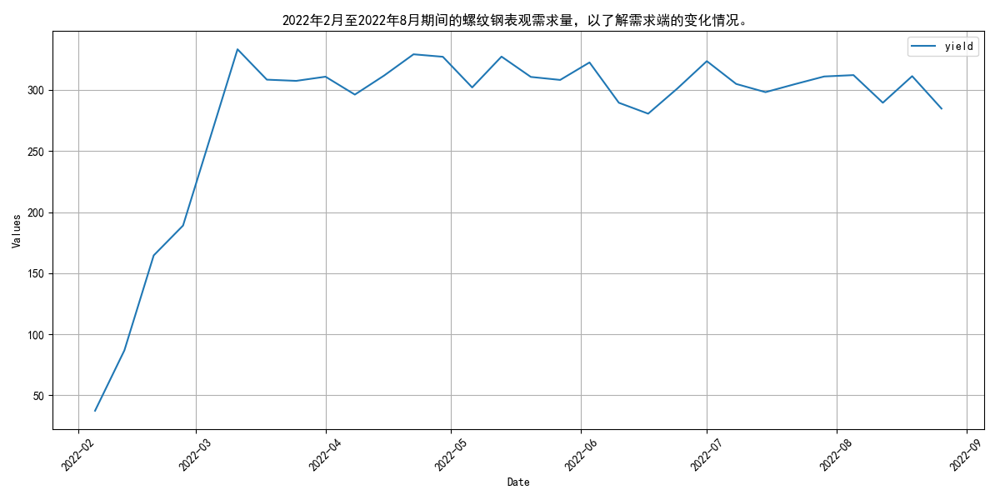
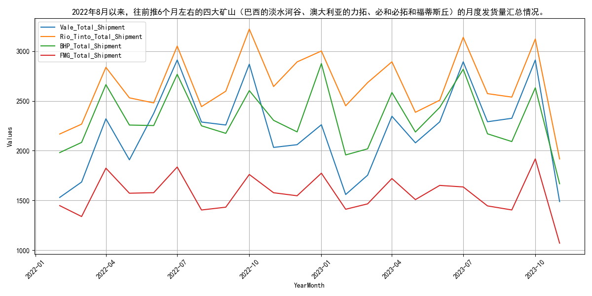
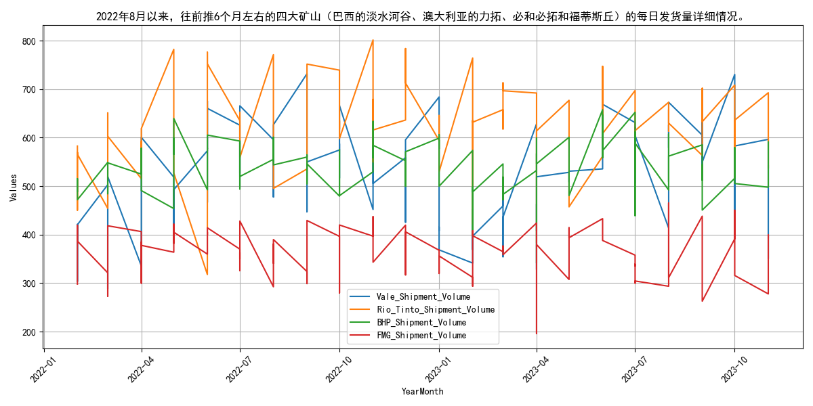
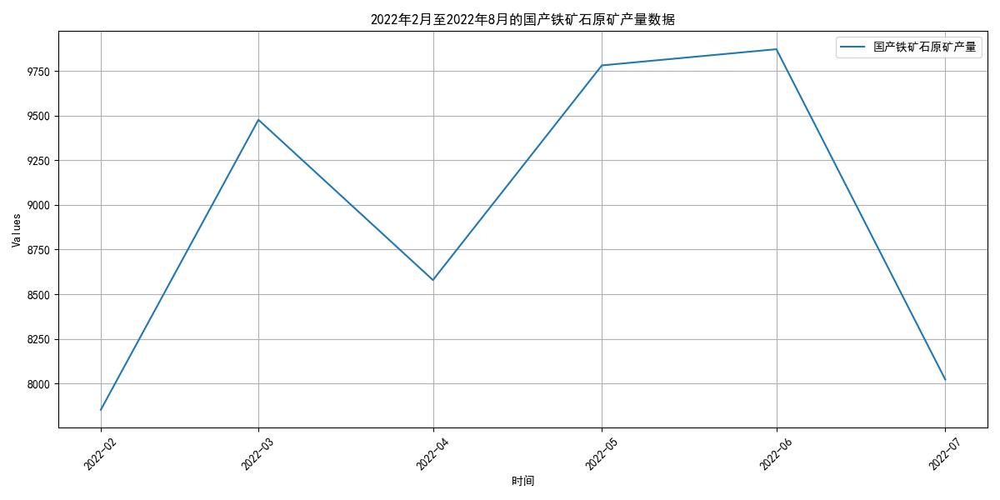
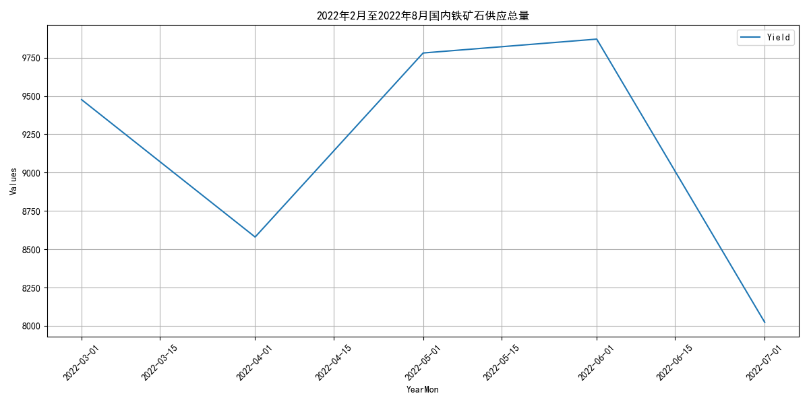
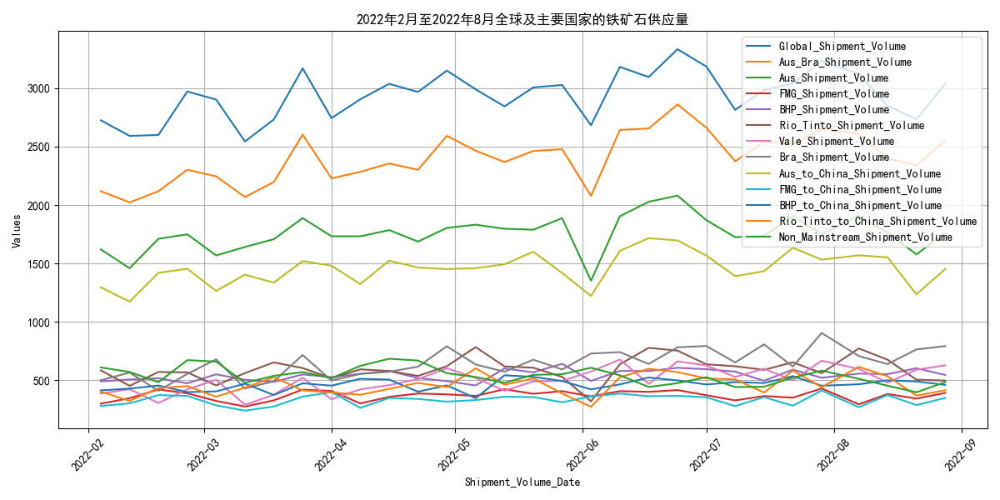

# 2022年8月月报：走势回顾与供给分析：铁矿石
## **2022年8月铁矿石价格持续走低**

自2022年8月以来，普氏62%指数和日照港PB粉现货价格持续下降，DCE合约价格整体疲软。具体来看，2月至8月期间，普氏62%指数价格从141.75美元/吨波动至101.75美元/吨，整体呈现下降趋势，最大跌幅达28.22%。日照港PB粉现货价格从941元/吨降至748元/吨，跌幅20.51%。DCE01合约价格从752.0元/吨降至682.0元/吨，跌幅9.31%；DCE05合约价格从817.0元/吨降至648.5元/吨，跌幅20.62%；DCE07合约价格从779.0元/吨降至768.0元/吨，跌幅1.41%。整体来看，铁矿石价格在2月至8月期间持续走低，市场表现疲软。

## **2022年8月铁矿石供给波动分析**

自2022年8月以来，全球铁矿石发货量增至3122.0万吨，其中主流矿供给稳定，非主流矿波动显著。具体来看，2022年2月至8月期间，全球铁矿石发货量整体呈现波动上升态势，从2月的2725.3万吨增至8月的3122.0万吨。澳洲和巴西发货量（主流矿）在此期间从2117.6万吨增至2611.4万吨，显示出较强的供给稳定性。相比之下，非主流矿发货量波动较大，从2月的607.7万吨降至8月的510.6万吨，表明非主流矿供给存在较大不确定性。

需求端方面，螺纹钢表观需求量在2月至8月间波动显著，从37.43万吨增至312.1万吨，显示出需求的不稳定性。供给端方面，全球发货量和主流矿发货量的增加主要受全球经济复苏和基础设施建设需求增加的驱动，而非主流矿发货量的波动则可能与矿山生产不稳定、运输成本变化等因素密切相关。

展望未来，随着全球经济持续复苏和基础设施建设的推进，铁矿石需求有望保持稳定增长。然而，非主流矿供给的不确定性仍需持续关注。

## **四大矿山月度发货量波动分析**
自2022年8月以来，四大矿山（巴西的淡水河谷、澳大利亚的力拓、必和必拓和福蒂斯丘）的月度发货量呈现波动。具体来看，淡水河谷的发货量在2022年8月为2288.0万吨，随后在2022年10月达到高峰2869.4万吨，之后逐渐下降至2023年2月的1559.1万吨，再回升至2023年4月的2346.1万吨。力拓的发货量在2022年8月为2443.2万吨，2022年10月达到高峰3222.0万吨，之后波动下降至2023年2月的2451.2万吨，再回升至2023年4月的2893.7万吨。必和必拓的发货量在2022年8月为2250.1万吨，2022年10月达到高峰2604.0万吨，之后波动下降至2023年2月的1957.2万吨，再回升至2023年4月的2585.0万吨。福蒂斯丘的发货量在2022年8月为1403.6万吨，2022年10月达到高峰1760.7万吨，之后波动下降至2023年2月的1410.9万吨，再回升至2023年4月的1719.9万吨。整体而言，四大矿山的发货量自2022年8月以来呈现先升后降再回升的趋势。

## **2022年8月国产铁矿石原矿产量波动分析**

自2022年8月以来，国产铁矿石原矿产量呈现出显著的波动特征。具体来看，2月至8月期间，产量经历了多次起伏。2月至3月，产量显著增加，从7853.2万吨跃升至9476.2万吨，增幅高达20.67%。然而，4月产量出现回落，降至8579.4万吨，环比下降9.46%。5月产量再度攀升至9780.5万吨，环比增长13.99%。6月产量微增至9871.08万吨，环比增长0.93%，达到这一时期的最高点。然而，7月产量大幅下降至8022.68万吨，环比下降18.73%，成为2月至8月期间的最低点。整体而言，2月至8月国产铁矿石原矿产量波动较大，最高点出现在6月，最低点则出现在2月。

展望未来，考虑到市场供需关系及政策因素，预计国产铁矿石原矿产量将继续呈现波动趋势。短期内，环保政策及市场需求变化可能对产量产生较大影响。
## **国内铁矿石供应波动与全球市场关联分析**

自2022年2月以来，国内铁矿石供应总量呈现出明显的波动趋势，与全球供应量的变化趋势高度一致，这表明国内产能利用率与全球市场供应情况紧密相连。具体来看，2022年2月至8月期间，国内铁矿石供应总量经历了多次起伏。3月达到峰值9476.2万吨，随后在4月降至8579.4万吨，5月又回升至9780.5万吨，6月继续攀升至9871.08万吨，而7月则回落至8022.68万吨。

与此同时，全球及主要铁矿石供应国的数据也显示出较大的波动。2月至8月间，全球铁矿石供应量从2725.3万吨增至3035.5万吨。澳大利亚和巴西作为主要供应国，其供应量也呈现出波动趋势。澳大利亚的供应量从2月4日的1618.9万吨增至8月28日的1762.5万吨，而巴西的供应量则从2月4日的498.7万吨增至8月28日的790.9万吨。

国内供应量的波动与全球供应量的变化趋势基本吻合，这进一步印证了国内矿山产能利用率的波动与全球市场供应情况的密切关联。展望未来，随着全球经济的逐步复苏和需求的持续增长，预计国内铁矿石供应量将保持稳定增长的态势。

