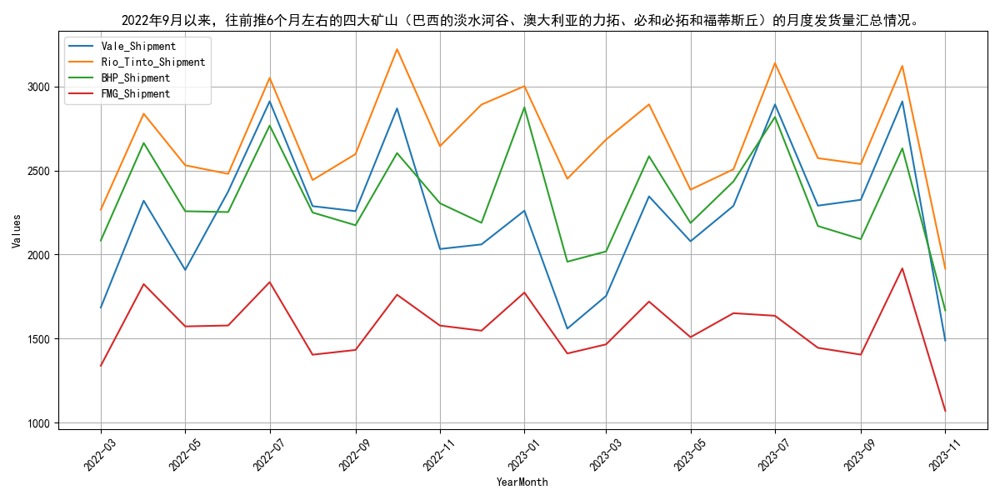
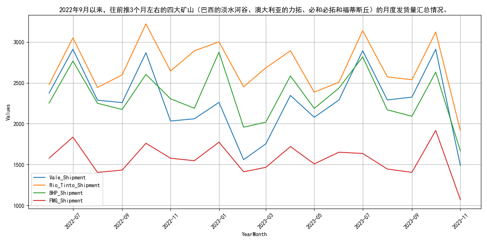

# 2022年9月月报：走势回顾与供给分析：铁矿石

## **2022年9月铁矿石价格波动上升**

自2022年9月以来，普氏62%指数和日照港Pb粉价格均呈现波动上升态势，DCE合约价格亦同步上涨后有所回落。具体来看，普氏62%指数价格自9月初的100.95美元/吨逐步攀升至12月底的117.35美元/吨，随后在1月初达到127.4美元/吨的高点，之后略有回调。日照港Pb粉现货价格同样表现出波动上升趋势，从9月初的739元/吨上涨至12月底的843元/吨，1月初触及886元/吨的高点，随后小幅回落。DCE01合约价格自9月初的675.5元/吨上涨至12月底的865元/吨，1月初达到900元/吨的高点，之后回落至800元/吨左右。DCE05合约价格从9月初的645.5元/吨上涨至12月底的863元/吨，1月初达到881元/吨的高点，之后回落至800元/吨左右。DCE07合约价格从9月初的767元/吨上涨至12月底的837.5元/吨，1月初达到854元/吨的高点，之后回落至800元/吨左右。整体来看，2022年9月以来，铁矿石价格虽有波动，但整体呈现上升趋势，显示出市场对铁矿石的需求依然强劲。

## **2022年9月铁矿石供给分析：主流矿增长，非主流矿下降**

自2022年9月以来，全球铁矿石发货量增至3233.0万吨，其中主流矿（澳洲和巴西）增至2832.9万吨，非主流矿降至400.1万吨。从2022年3月至9月的指标走势来看，全球铁矿石发货量呈现波动，从2902.7万吨增至3233.0万吨。同期，澳洲和巴西发货量（主流矿）从2244.5万吨增至2832.9万吨，而非主流矿发货量则从658.2万吨降至400.1万吨。整体而言，主流矿发货量稳步增长，而非主流矿发货量显著下降。主流矿的增长主要得益于澳洲和巴西矿山的稳定生产和出口，而非主流矿的下降可能与部分矿山减产或关闭有关。预计未来主流矿发货量将继续保持稳定增长，而非主流矿发货量可能维持低位。

## **四大矿山月度发货量波动分析**
自2022年9月以来，四大矿山（巴西的淡水河谷、澳大利亚的力拓、必和必拓和福蒂斯丘）的月度发货量呈现波动，整体趋势保持稳定。具体来看，淡水河谷的发货量在2022年9月为2258.1万吨，随后在10月达到2869.4万吨的高点，之后逐渐下降至2023年3月的1753.5万吨，随后又有所回升。力拓的发货量在2022年9月为2598.0万吨，10月达到3222.0万吨的高点，之后波动下降至2023年9月的2538.7万吨。必和必拓的发货量在2022年9月为2174.4万吨，10月达到2604.0万吨的高点，之后波动下降至2023年9月的2091.6万吨。福蒂斯丘的发货量在2022年9月为1431.9万吨，10月达到1760.7万吨的高点，之后波动下降至2023年9月的1404.0万吨。总体来看，四大矿山的发货量在2022年9月至2023年9月期间虽有波动，但整体趋势较为稳定。

## **2022年9月国产铁矿石原矿产量波动分析**

自2022年9月以来，国产铁矿石原矿产量呈现出明显的波动趋势。具体来看，3月至9月期间，产量经历了多次起伏。3月产量为9476.2万吨，4月下降至8579.4万吨，5月回升至9780.5万吨，6月继续上升至9871.08万吨，7月则大幅下降至8022.68万吨，8月略有回升至8113.3万吨。整体而言，3月至6月产量呈上升态势，7月出现显著下滑，8月则小幅回升。

7月产量的显著下降可能与环保限产政策或矿山安全检查有关，而8月的回升则可能反映了生产活动的逐步恢复。预计9月产量将继续保持回升态势，但需密切关注环保政策和市场需求变化对产量的潜在影响。
## **2022年9月国内铁矿石供给波动分析**

自2022年9月以来，国内铁矿石供给呈现波动态势，原矿产量与全球库存均有所下降，澳大利亚发货量亦出现波动。具体来看，2022年3月至9月期间，国内铁矿石供给情况波动明显。原矿产量在3月达到9476.2万吨的高点后，4月降至8579.4万吨，随后在5月回升至9780.5万吨，6月进一步增至9871.08万吨，然而7月和8月又分别降至8022.68万吨和8113.3万吨。与此同时，澳大利亚和巴西的铁矿石库存总体呈下降趋势，全球库存亦呈现类似走势，从3月初的15854.52万吨降至9月底的13184.2万吨。澳大利亚发货到中国的总量在3月至9月期间波动较大，最高达到1717.3万吨，最低为1220.6万吨。这些波动可能受到全球经济环境、政策调整以及市场需求变化等多重因素的影响。展望未来，随着全球经济逐步复苏和政策环境的稳定，预计铁矿石供给将趋于平稳，产能利用率有望保持稳定。

