# 2023年3月月报：走势回顾与供给分析：铁矿石
## **2023年3月铁矿石价格波动上升**
自2023年3月以来，普氏62%指数和日照港PB粉现货价格均呈现波动上升态势，DCE合约价格亦同步走高。具体来看，2022年9月1日至2023年3月31日期间，普氏62%指数价格从100.95美元/吨波动上升至126.7美元/吨，日照港PB粉现货价格从739元/吨波动上升至881元/吨。同时，DCE01合约价格从675.5元/吨波动上升至804元/吨，DCE05合约价格从645.5元/吨波动上升至866元/吨，DCE07合约价格从767元/吨波动上升至830元/吨。整体而言，铁矿石价格在2022年9月至2023年3月期间呈现波动上升趋势，主要受供需关系阶段性紧张及宏观政策预期影响。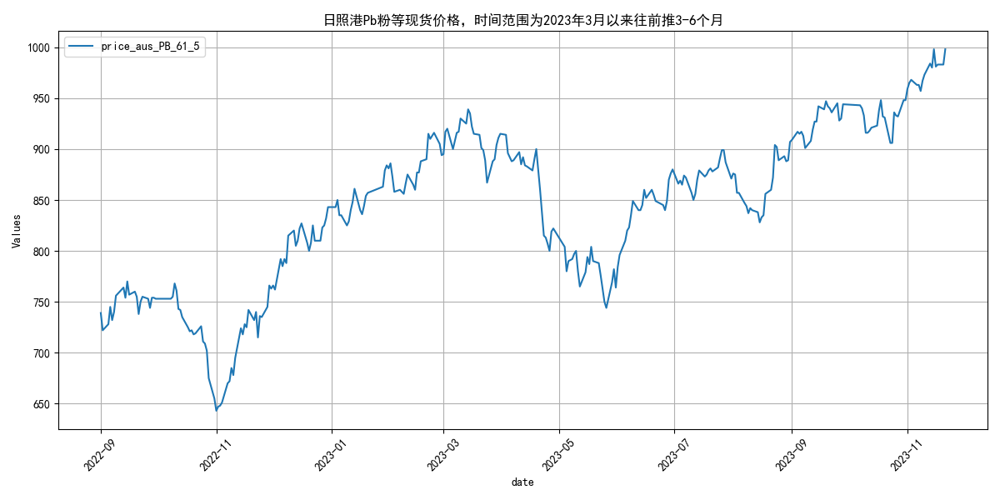
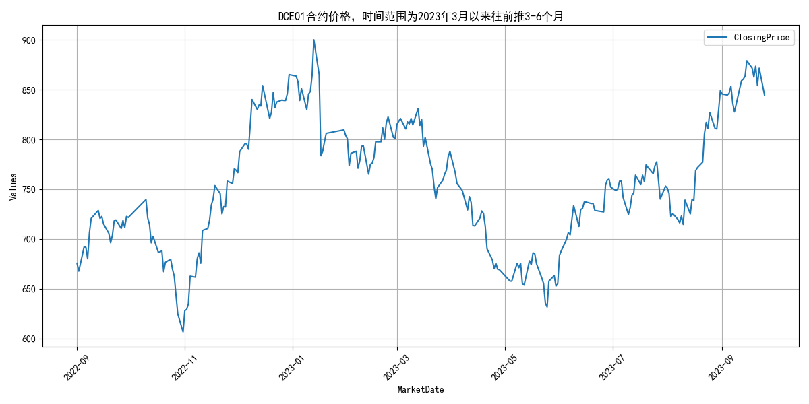
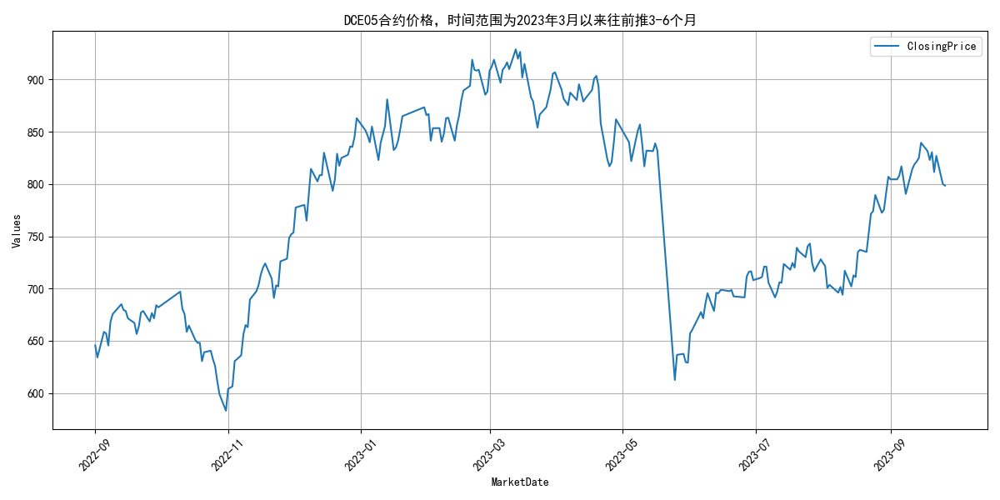
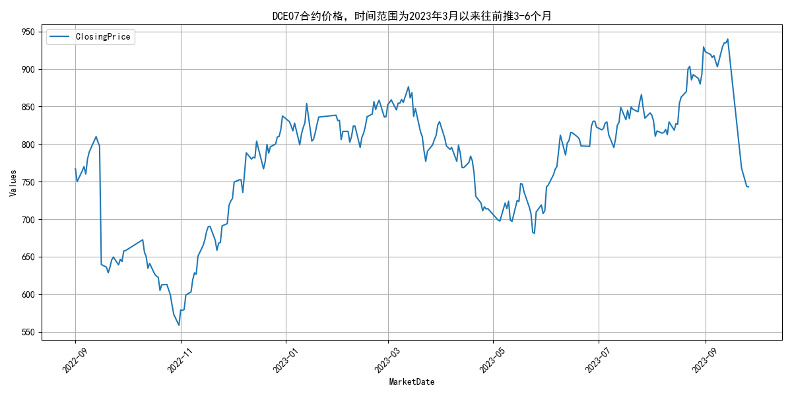
## **2023年3月铁矿石供给分析：主流矿稳定，非主流矿增长**

自2023年3月以来，全球铁矿石发货量呈现波动上升态势，其中主流矿保持稳定，非主流矿则显著增长。具体来看，3月6日至3月27日期间，全球铁矿石发货量从2912.1万吨增至2891.0万吨。澳洲和巴西的发货量（主流矿）在此期间从2461.3万吨略降至2402.5万吨，显示出一定的稳定性。而非主流矿的发货量则从450.8万吨增至488.5万吨，呈现出较为明显的增长趋势。整体而言，主流矿发货量保持相对稳定，非主流矿发货量则有所增加。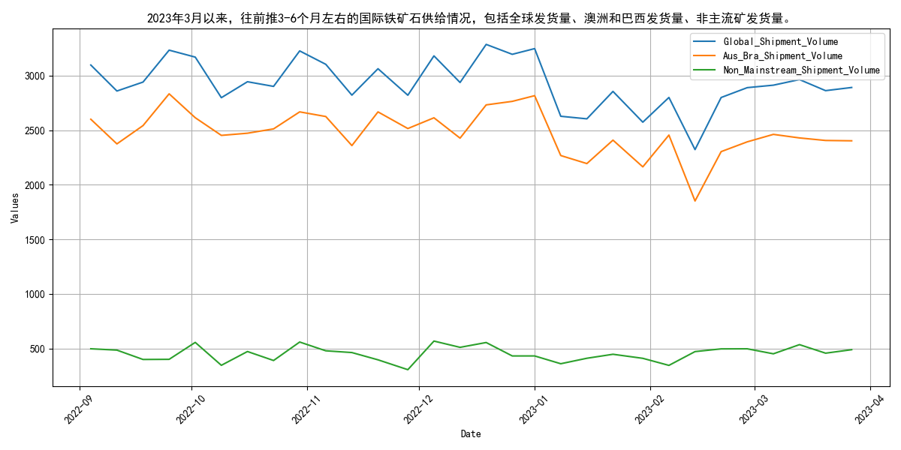
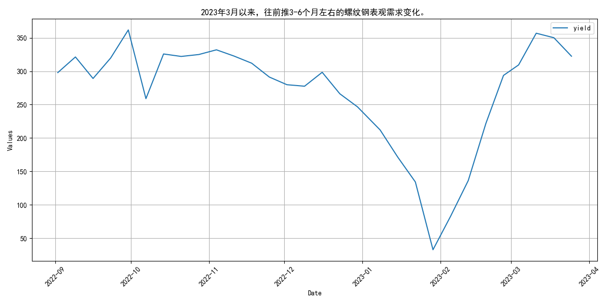
## **四大矿山2023年3月至6月发货量波动上升**

自2023年3月以来，四大矿山（巴西的淡水河谷、澳大利亚的力拓、必和必拓和福蒂斯丘）的月度发货量呈现波动上升趋势。具体来看，淡水河谷的发货量从2023年2月的1559.1万吨回升至3月的1753.5万吨，随后在4月达到2346.1万吨的高点，5月回落至2078.9万吨，6月再次回升至2289.7万吨。力拓的发货量在3月至6月间波动较小，维持在2386.0万吨至2893.7万吨之间。必和必拓的发货量在3月至6月间从2018.6万吨逐步增加至2435.1万吨。福蒂斯丘的发货量在3月至6月间从1465.3万吨波动至1650.8万吨。总体来看，四大矿山的发货量在2023年3月至6月间呈现波动上升趋势。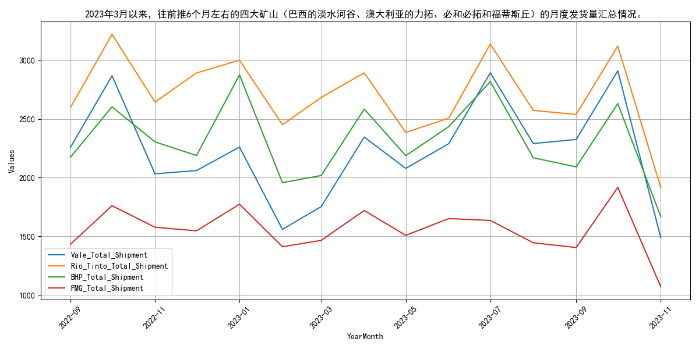
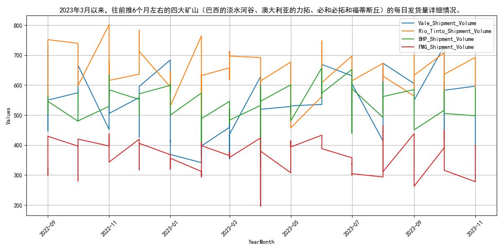
## **2023年3月国产铁矿石原矿产量稳定**

自2023年3月以来，国产铁矿石原矿产量保持稳定，自2022年10月后逐步回升，2023年初维持平稳。指标走势方面，2022年9月至2023年3月期间，国产铁矿石原矿产量呈现波动变化。2022年9月产量为7897.6万吨，10月降至7267.5万吨，主要受国庆假期和环保限产政策影响，矿山生产活动减少。11月回升至7953.6万吨，得益于政策放松和市场需求回暖。12月略降至7861.2万吨，可能与年底库存调整和部分矿山季节性检修有关。2023年1月和2月产量分别为7862.2万吨和7863.2万吨，基本保持稳定，反映出春节假期后矿山逐步恢复正常生产。整体来看，国产铁矿石原矿产量在2022年10月出现明显下降后逐步回升，2023年初保持平稳。展望未来，随着环保政策的持续执行和市场需求的变化，预计国产铁矿石原矿产量将继续保持稳定或小幅波动。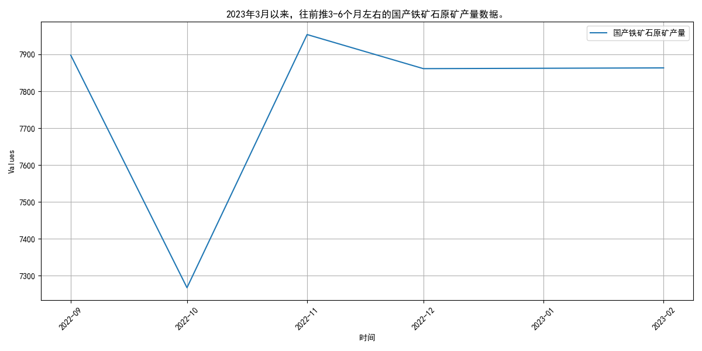
## **国内矿山产能利用率稳步提升**
自2023年3月以来，国内铁矿石原矿产量持续增长，2022年1-3月同比增2.1%，3月单月产量更是创下新高，显示出矿山产能利用率的显著提升。根据国家统计局数据，2022年1-3月份全国铁矿石原矿产量达到25555.8万吨，同比增加2.1%，折算后同比增加525.6万吨。按照精矿品位65%（原矿品位25%*回收率75%）理论折算，精矿产量同比增加152万吨。其中，3月份中国原矿石产量达到9476.2万吨，同比增长8.6%，创下2018年以来的单月产量新高，这充分说明了“基石计划”政策引导的显著效果。

这一增长态势主要得益于国内矿山的逐步复工和产能利用率的提升。尽管进口矿供应环比有所下滑，但国产矿的增加有效填补了供应缺口。展望未来，随着国内矿山产能的进一步释放和政策的持续支持，预计矿山产能利用率将继续保持上升趋势，从而支撑铁矿石供应的稳定增长。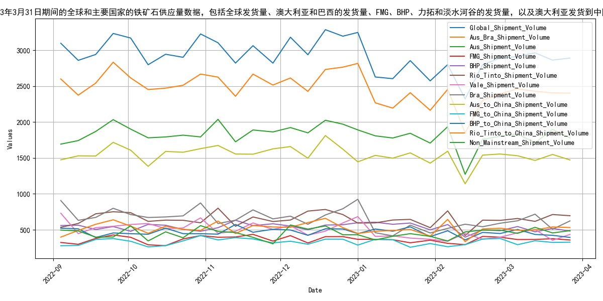
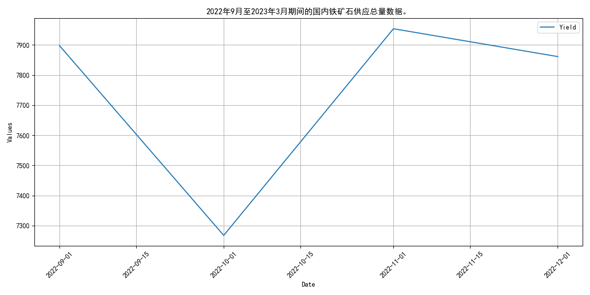
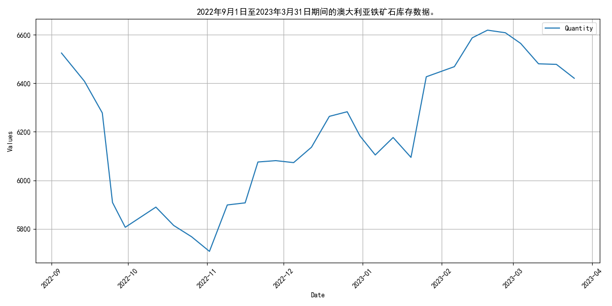
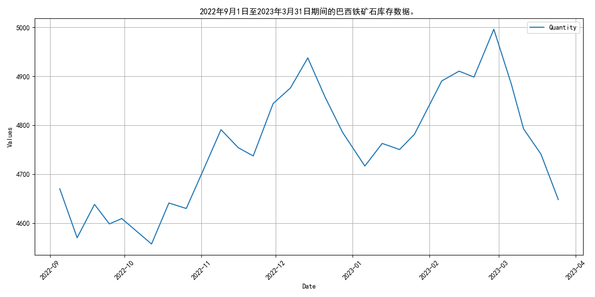
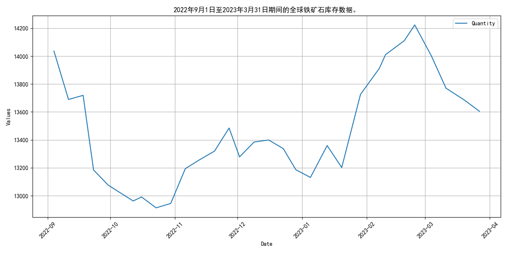
