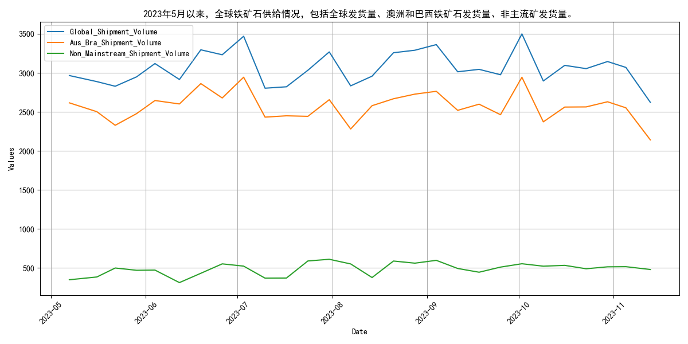
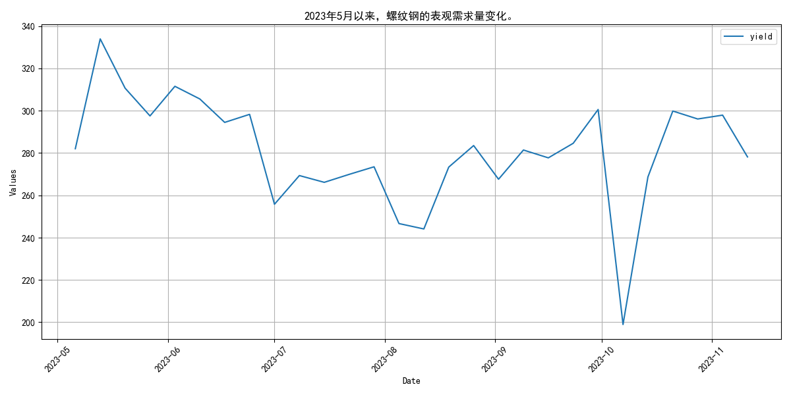
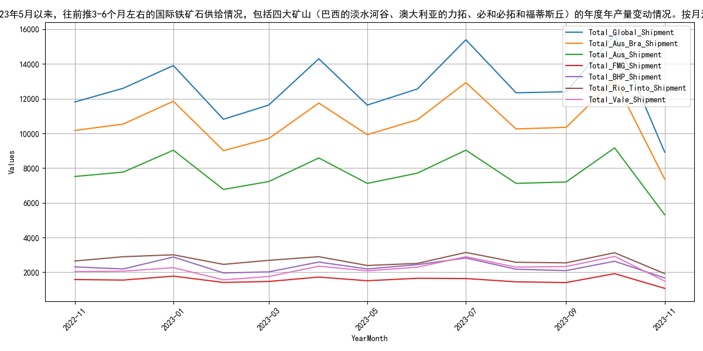
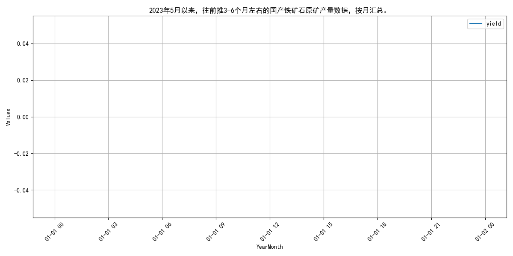
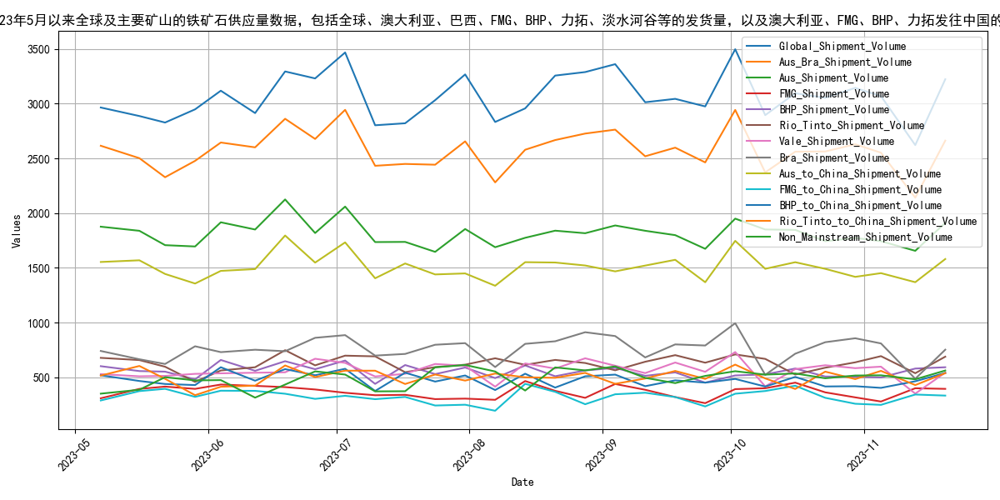
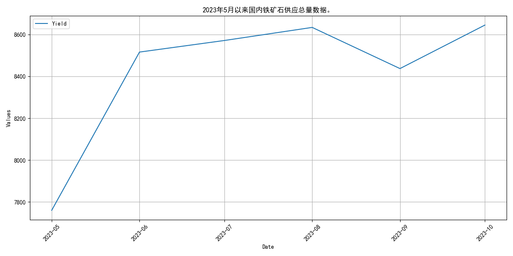
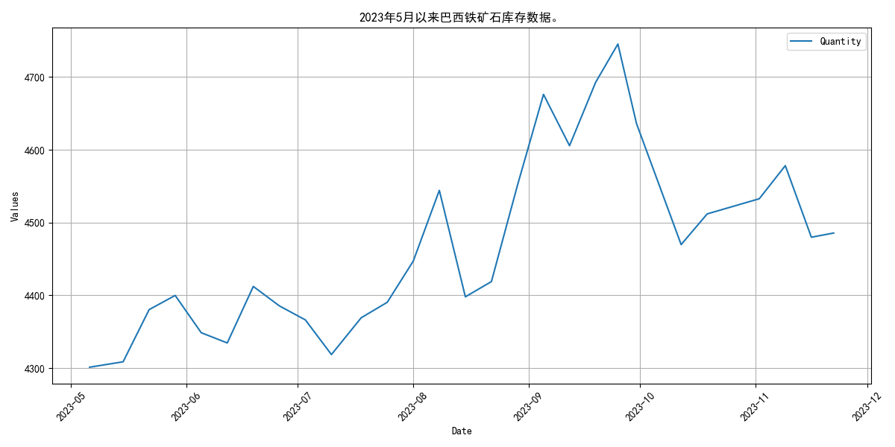
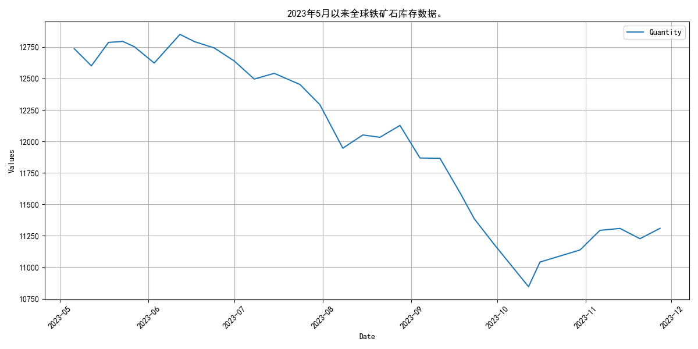

# 2023年5月月报：走势回顾与供给分析：铁矿石
## **2023年5月铁矿石价格波动上升**

自2023年5月以来，普氏62%指数和日照港Pb粉现货价格均呈现波动上升态势，DCE合约价格亦同步上涨。具体来看，普氏62%指数价格自5月初的103.65美元/吨波动上升至10月底的126.6美元/吨，期间最高触及125.6美元/吨。日照港Pb粉现货价格同样表现出波动上升趋势，从5月初的790元/吨攀升至10月底的948元/吨，最高达到942元/吨。DCE01合约价格从5月初的657.5元/吨上升至10月底的844.5元/吨，最高触及879元/吨。DCE05合约价格从5月初的840元/吨波动上升至10月底的800元/吨，最高达到839.5元/吨。DCE07合约价格从5月初的698.5元/吨上升至10月底的768元/吨，最高触及860.5元/吨。整体而言，2023年5月至10月期间，铁矿石价格整体呈现波动上升趋势。

## **2023年5月全球铁矿石供给波动分析**

自2023年5月以来，全球铁矿石发货量呈现波动上升趋势，主流矿供应稳定，非主流矿波动较大，整体供给虽有增长，但稳定性受非主流矿影响。具体来看，全球铁矿石发货量从5月初的2965.0万吨增至10月初的3497.7万吨。澳洲和巴西的主流矿发货量总体保持稳定，但存在周期性波动，从5月初的2615.4万吨增至10月初的2943.0万吨。非主流矿发货量波动显著，从5月初的349.6万吨增至10月初的554.7万吨，显示出非主流矿供应的不稳定性。整体而言，2023年5月至10月间，全球铁矿石供给持续增长，但非主流矿的供应波动对整体供给稳定性构成一定影响。

## **四大矿山发货量波动下降**
自2023年5月以来，四大矿山全球发货量在7月达到峰值后呈现波动下降趋势，至11月显著降低。具体来看，2023年5月至11月期间，四大矿山（巴西的淡水河谷、澳大利亚的力拓、必和必拓和福蒂斯丘）的年度产量变动显示，全球铁矿石发货量在2023年7月达到峰值15391.8万吨，随后在11月降至8914.1万吨。澳大利亚和巴西的总发货量在7月达到12923.6万吨，11月则降至7355.2万吨。

具体到各矿山，力拓在7月发货量最高，达到3139.4万吨，11月降至1916.4万吨；必和必拓在7月发货2818.6万吨，11月降至1667.6万吨；福蒂斯丘在10月发货1917.3万吨，11月降至1070.0万吨；淡水河谷在7月发货2893.7万吨，11月降至1488.2万吨。整体而言，四大矿山的发货量在2023年下半年呈现波动下降趋势。
## **国产铁矿石原矿产量波动分析**
自2023年5月以来，国产铁矿石原矿产量波动显著，3月创新高后4月回落，受政策与市场供需双重影响。指标走势显示，2022年11月至2023年4月，产量分别为7953.6万吨、7861.2万吨、7862.2万吨、7863.2万吨、8640.3万吨和7509.6万吨。其中，2023年3月产量达到8640.3万吨，创近六个月新高，随后4月回落至7509.6万吨。整体而言，产量波动较大，3月显著增长后4月出现明显下滑。原因可能与政策调整及市场供需变化密切相关。3月份产量创新高或得益于“基石计划”政策的推动，而4月份的回落则可能反映了市场需求调整及环保限产的影响。展望未来，若政策持续支持且市场需求稳定，预计产量将保持相对稳定；若市场需求进一步下滑或环保政策趋严，产量可能继续波动。
## **国内铁矿石供给稳中有增，产能利用率回升**

自2023年5月以来，国内铁矿石供应总量从7760.1万吨增至8644.5万吨，矿山产能利用率呈现波动回升态势。根据国家统计局数据，2022年1-3月份全国铁矿石原矿产量为25555.8万吨，同比增加2.1%，折算精矿产量同比增加152万吨。其中，3月份中国原矿石产量达到9476.2万吨，同比增长8.6%，创下2018年以来单月产量新高，显示出“基石计划”政策引导效果显著。

尽管2022年1-8月份生铁和粗钢产量同比下降，进口铁矿石量也相应减少，反映出供给端整体偏弱，但2023年5月以来国内铁矿石供应总量的逐步增加，表明矿山产能利用率有所回升。预计未来随着政策支持和市场需求的恢复，矿山产能利用率将继续保持稳中有增的态势。

