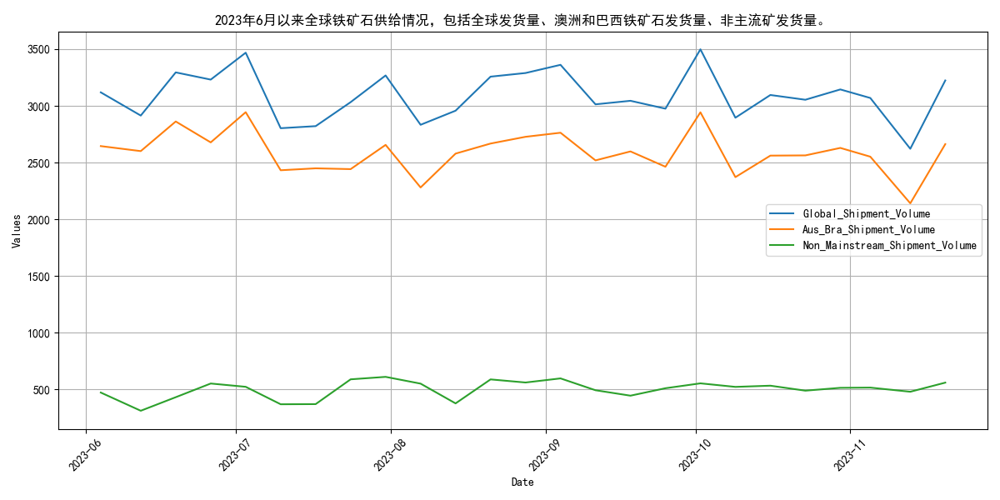
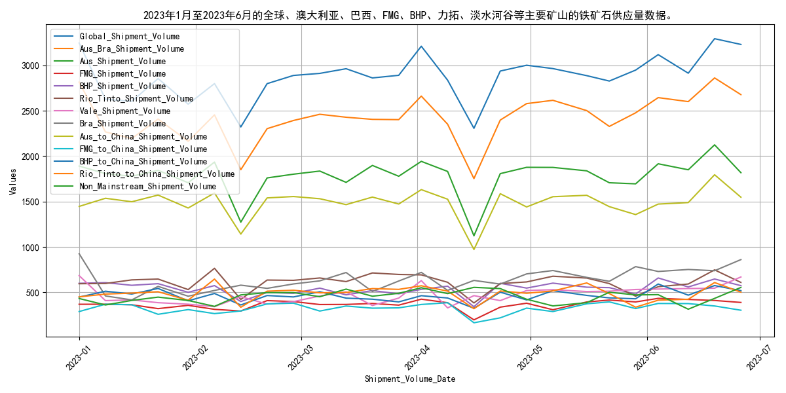

# 2023年6月月报：走势回顾与供给分析：铁矿石

## **6月铁矿石价格整体上涨，现货期货均表现强劲**

自2023年6月以来，普氏62%指数、日照港Pb粉现货及DCE01、DCE05、DCE07合约价格均呈现上涨趋势，涨幅分别为6.9%、12.3%、10.1%、7.8%和10.7%。具体来看，普氏62%指数价格从104.35美元/吨上涨至111.6美元/吨，涨幅约6.9%；日照港Pb粉现货价格从784元/吨上涨至880元/吨，涨幅约12.3%；DCE01合约价格从683.5元/吨上涨至752元/吨，涨幅约10.1%；DCE05合约价格从657元/吨上涨至708元/吨，涨幅约7.8%；DCE07合约价格从743元/吨上涨至822.5元/吨，涨幅约10.7%。整体来看，铁矿石价格在6月份呈现上涨趋势，现货和期货价格均有不同程度的上涨。

[//]: # (![日照港Pb粉等现货价格，时间范围为2023年6月以来往前推6个月]&#40;assets/日照港Pb粉等现货价格，时间范围为2023年6月以来往前推6个月.png&#41;)

## **2023年6月铁矿石供给波动分析**
自2023年6月以来，全球铁矿石发货量呈现显著波动，其中主流矿发货量波动尤为剧烈，而非主流矿则相对稳定。具体来看，全球铁矿石发货量从6月初的3118.6万吨逐步降至7月初的2802.8万吨，随后在10月初回升至3497.7万吨，然而至11月中旬再次回落至2621.6万吨。澳洲和巴西（主流矿）的发货量在6月初为2645.1万吨，7月初降至2432.4万吨，随后虽有波动但至10月初回升至2943.0万吨，然而至11月中旬再次大幅降至2140.9万吨。非主流矿方面，发货量在6月初为473.5万吨，7月初降至313.2万吨，随后波动回升至10月初的554.7万吨，至11月中旬则微降至480.7万吨。总体而言，主流矿发货量的波动性明显高于非主流矿，后者在整个期间内保持了相对的稳定性。

## **四大矿山铁矿石发货量波动分析**
自2023年6月以来，四大矿山铁矿石发货量波动显著，7月和10月呈现显著上升趋势，而8月和11月则出现回落，这一波动反映了市场需求与生产调整的相互作用。具体来看，2023年6月，四大矿山（巴西的淡水河谷、澳大利亚的力拓、必和必拓和福蒂斯丘）的总发货量为12558.4万吨。随后，7月发货量增至15391.8万吨，8月回落至12336.1万吨，9月略增至12393.7万吨，10月大幅上升至15686.3万吨，而11月则骤降至8914.1万吨。

在各矿山的发货量方面，淡水河谷的发货量从6月的2289.7万吨增至7月的2893.7万吨，8月回落至2290.9万吨，9月略增至2325.7万吨，10月大幅上升至2911.6万吨，11月骤降至1488.2万吨。力拓的发货量从6月的2507.4万吨增至7月的3139.4万吨，8月回落至2573.5万吨，9月略增至2538.7万吨，10月大幅上升至3122.5万吨，11月骤降至1916.4万吨。必和必拓的发货量从6月的2435.1万吨增至7月的2818.6万吨，8月回落至2169.6万吨，9月略增至2091.6万吨，10月大幅上升至2632.0万吨，11月骤降至1667.6万吨。福蒂斯丘的发货量从6月的1650.8万吨增至7月的1635.4万吨，8月回落至1444.7万吨，9月略增至1404.0万吨，10月大幅上升至1917.3万吨，11月骤降至1070.0万吨。

总体来看，四大矿山的发货量自2023年6月以来呈现明显的波动趋势。这种波动可能与全球经济复苏、市场需求变化以及矿山自身的生产调整密切相关。例如，7月和10月的发货量大幅增加可能反映了市场需求的强劲复苏，而8月和11月的回落则可能与市场需求的暂时性疲软或矿山的生产调整有关。
## **2023年上半年国产铁矿石原矿产量波动分析**

自2023年6月以来，回顾上半年，国产铁矿石原矿产量呈现出先增后降再回升的波动走势。具体来看，3月产量显著增加，4月则大幅下降，5月再次回升。从指标走势分析，2023年1月至6月，国产铁矿石原矿产量经历了波动变化。1月和2月产量分别为7862.2万吨和7863.2万吨，基本持平。3月产量显著增加至8640.3万吨，环比增长10.1%，主要得益于春节后复工及市场需求回升。4月产量大幅下降至7509.6万吨，环比减少13.1%，可能与环保限产政策及市场需求波动有关。5月产量回升至7760.1万吨，环比增长3.3%，显示出市场供需关系有所改善。展望未来，随着环保政策的持续实施及市场需求的变化，预计国产铁矿石原矿产量将继续呈现波动趋势，短期内可能受政策和市场因素影响较大。
## **国内铁矿石供应波动，产能利用率分析**

自2023年1月以来，国内铁矿石供应总量呈现显著波动。具体来看，3月份供应量达到8640.3万吨的高点，随后在4月份降至7509.6万吨，5月份则小幅回升至7760.1万吨。与此同时，全球铁矿石供应量也表现出类似波动趋势，1月份为3247.2万吨，至6月份增至3231.0万吨。

在主要供应国方面，澳大利亚和巴西的铁矿石供应量波动尤为明显。澳大利亚的供应量从1月份的1890.7万吨逐步增至6月份的2124.7万吨，而巴西的供应量则从1月份的925.3万吨降至6月份的860.0万吨。库存方面，澳大利亚和巴西的铁矿石库存均呈现下降态势。澳大利亚的库存从1月份的6104.46万吨降至6月份的5801.18万吨，巴西的库存则从1月份的4716.55万吨降至6月份的4385.51万吨。

总体来看，2023年上半年，国内及全球铁矿石供应均经历了显著波动，主要供应国的供应量和库存变化进一步加剧了市场的复杂性。

