# 2023年8月月报：走势回顾与供给分析：铁矿石
## **8月铁矿石价格波动回顾与分析**
自2023年8月以来，铁矿石价格呈现先降后升的波动走势。日照港Pb粉现货价格从8月初的876元/吨降至8月中旬的828元/吨，随后回升至8月底的889元/吨。DCE01合约价格从751元/吨降至722元/吨，随后回升至829元/吨。DCE05合约价格从724.5元/吨降至700.5元/吨，随后回升至792元/吨。DCE07合约价格从838.5元/吨降至810.5元/吨，随后回升至893元/吨。整体来看，铁矿石价格在8月经历了先降后升的波动过程。这一波动主要受到供需关系、宏观经济政策及市场预期等多重因素的影响。短期内，随着需求边际回升及供应端边际走弱，铁矿石供需关系由宽松走向平衡偏紧，支撑铁矿石价格走强。然而，当前钢厂补库进入尾声，叠加冬奥会限产预期，钢厂进一步复产及补库需求均受到抑制，短期铁矿石需求面临阶段性压力。供应方面，巴西降水影响减弱后澳巴发运有所回升，到港量短期相对坚挺但由于前期发运减少导致将出现一定回落。随着需求阶段性压力出现，矿价继续走强驱动略有不足，然而中期市场整体预期铁水仍将有较大增加空间，仍建议关注螺矿比套利策略。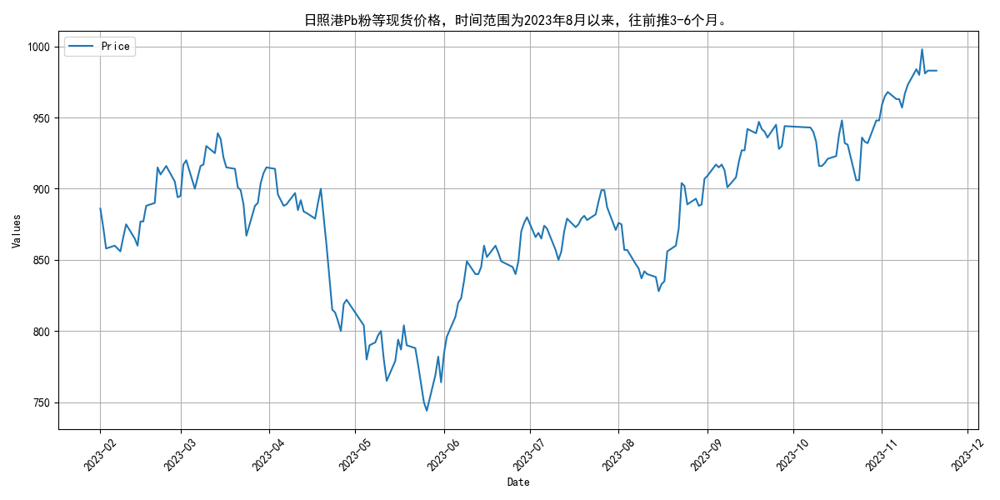
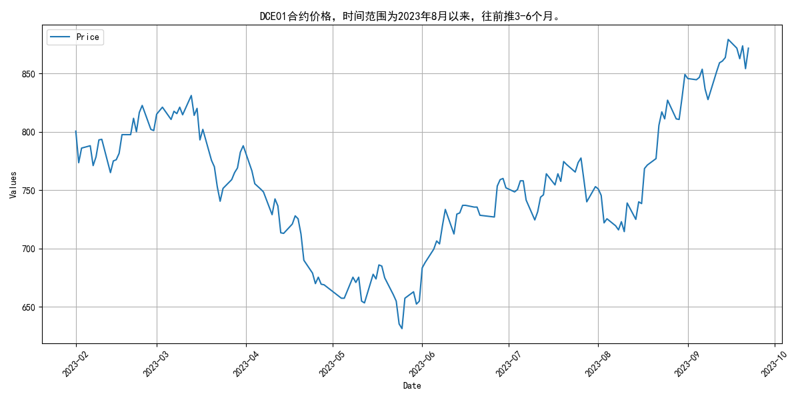
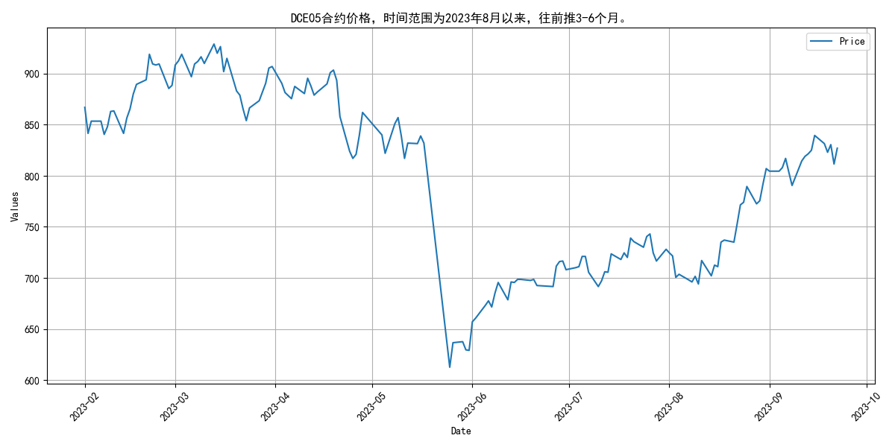
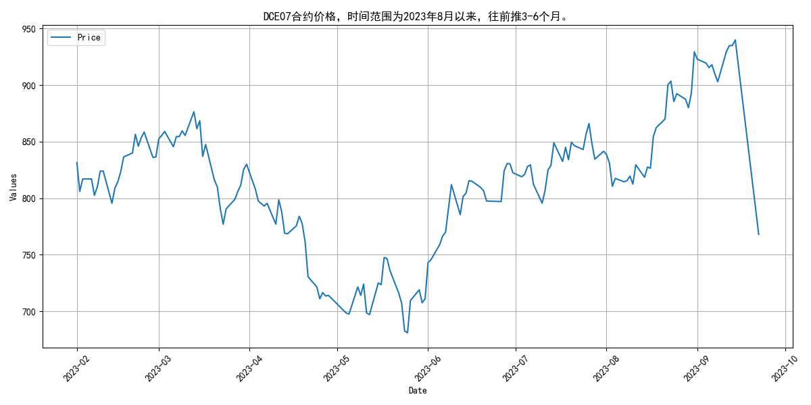
## **8月全球铁矿石发货量波动上升**
自2023年8月以来，全球铁矿石发货量整体呈现波动上升趋势。主流矿和非主流矿的发货量均有所增加。具体来看，8月初全球铁矿石发货量为2832.9万吨，至9月初已增至3361.2万吨。澳洲和巴西（主流矿）的发货量在8月上旬有所下降，分别为2280.7万吨和2579.0万吨，但随后逐步回升，至9月初分别达到2762.9万吨和2943.0万吨。非主流矿的发货量在8月上旬为552.2万吨，随后波动上升，至9月初达到598.3万吨。整体而言，8月至9月期间，主流矿和非主流矿的发货量均实现了增长。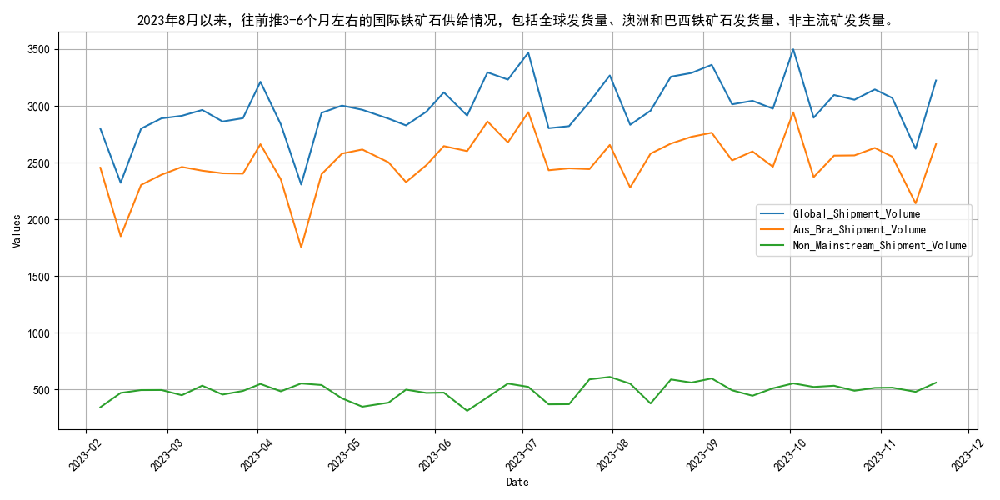
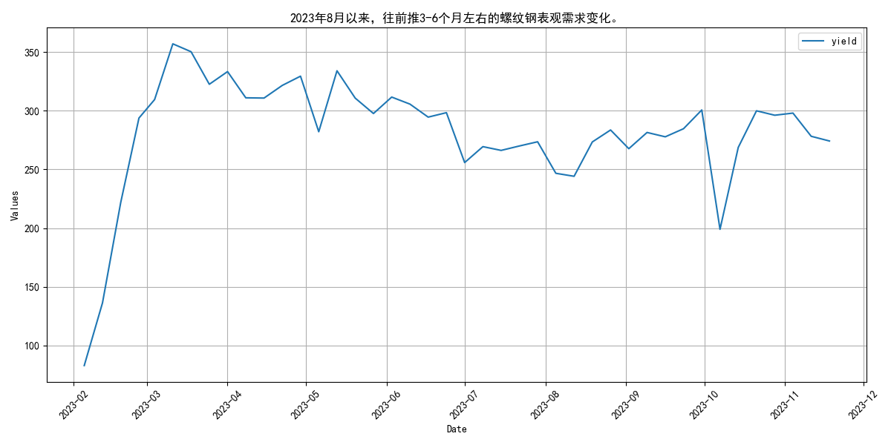
## **四大矿山2023年8月铁矿石发货量波动分析**

自2023年8月以来，四大矿山铁矿石发货量呈现波动。具体来看，淡水河谷、力拓、必和必拓和福蒂斯丘的发货量分别为2290.9万吨、2573.5万吨、2169.6万吨和1444.7万吨。从指标走势来看，2023年2月至8月期间，四大矿山（巴西的淡水河谷、澳大利亚的力拓、必和必拓和福蒂斯丘）的月度发货量整体呈现波动趋势。2月总发货量为10810.1万吨，3月增至11628.6万吨，4月达到峰值14295.8万吨，随后5月回落至11628.3万吨，6月小幅上升至12558.4万吨，7月再次攀升至15391.8万吨，8月则降至12336.1万吨。

具体到各矿山，淡水河谷的发货量从2月的1559.1万吨逐步增加至7月的2893.7万吨，8月略有下降至2290.9万吨；力拓的发货量从2月的2451.2万吨波动上升至7月的3139.4万吨，8月降至2573.5万吨；必和必拓的发货量从2月的1957.2万吨稳步增加至7月的2818.6万吨，8月回落至2169.6万吨；福蒂斯丘的发货量从2月的1410.9万吨波动上升至4月的1719.9万吨，随后波动下降至8月的1444.7万吨。整体来看，四大矿山的发货量在2023年2月至8月期间呈现明显的波动特征，反映出市场供需关系的动态变化。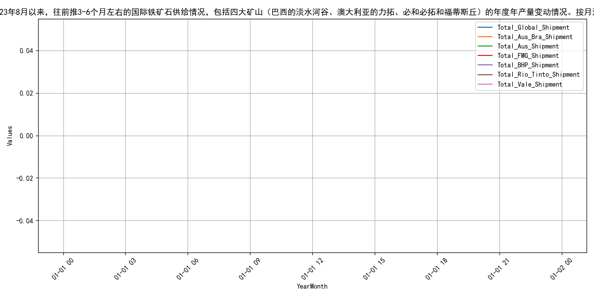
## **国产铁矿石原矿产量波动上升**
自2023年8月以来，国产铁矿石原矿产量持续回升，8月产量达8633.3万吨，较4月低点显著增长。从指标走势来看，2023年2月至9月，国产铁矿石原矿产量呈现波动上升态势。具体来看，2月产量为7863.2万吨，3月增至8640.3万吨，4月回落至7509.6万吨，5月小幅回升至7760.1万吨，6月大幅增至8515.54万吨，7月继续上升至8570.9万吨，8月达到8633.3万吨，9月略有下降至8436.8万吨。整体而言，国产铁矿石原矿产量在经历4月的低点后，自5月起持续回升，至8月达到较高水平，9月略有回调。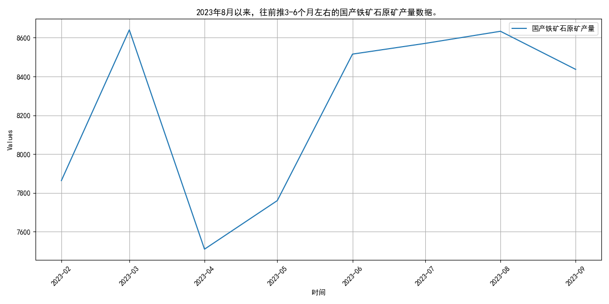
## **国内铁矿石供应波动，库存持续下降**

自2023年8月以来，国内铁矿石供应总量呈现波动趋势，澳大利亚和巴西的库存持续下降，全球库存亦同步减少。具体来看，3月至5月国内铁矿石供应量分别为8640.3万吨、7509.6万吨和7760.1万吨，6月回升至8515.54万吨，7月和8月则分别为8570.9万吨和8633.3万吨。澳大利亚铁矿石库存自2月起持续下降，从6468.26万吨降至8月的5450.38万吨；巴西铁矿石库存同样呈现下降态势，从2月的4890.32万吨降至8月的4544.19万吨。全球铁矿石库存自2月以来持续减少，从13911.29万吨降至8月的11945.91万吨。供应总量的波动可能受全球经济复苏和需求变化的影响，而库存下降则反映了市场需求的增加和供应端的调整。预计未来几个月，随着全球经济进一步复苏和需求持续增长，国内铁矿石供应总量和库存水平将继续保持动态平衡。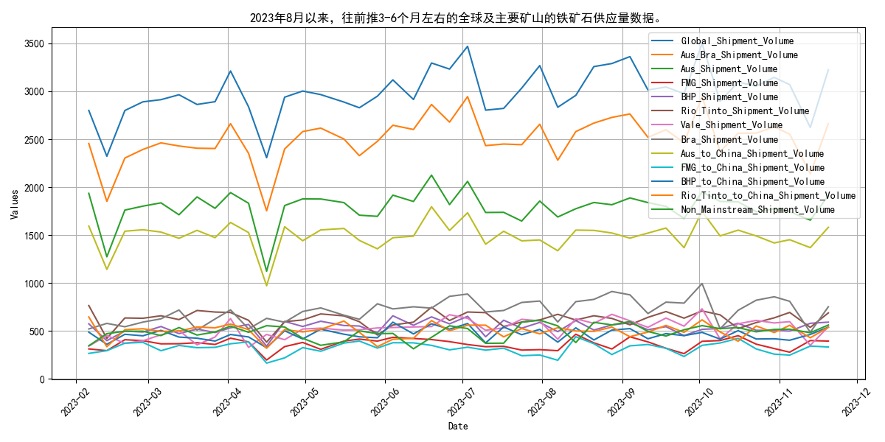
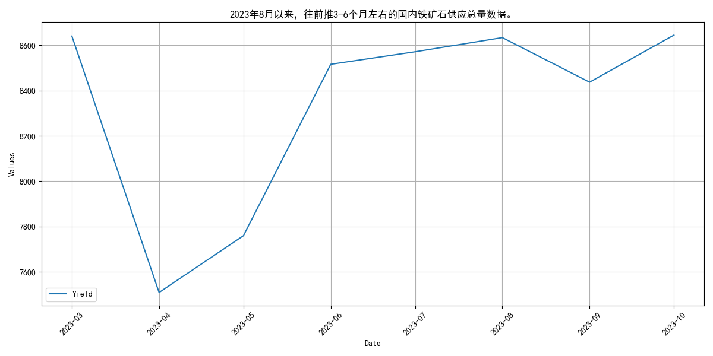
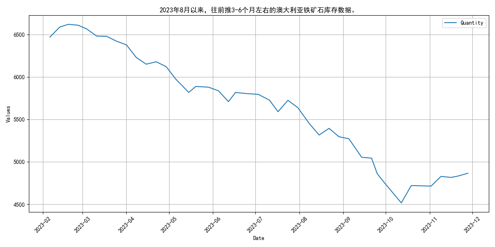
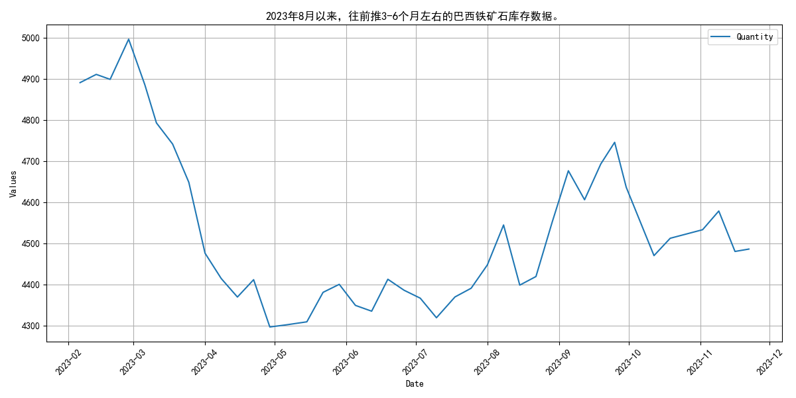
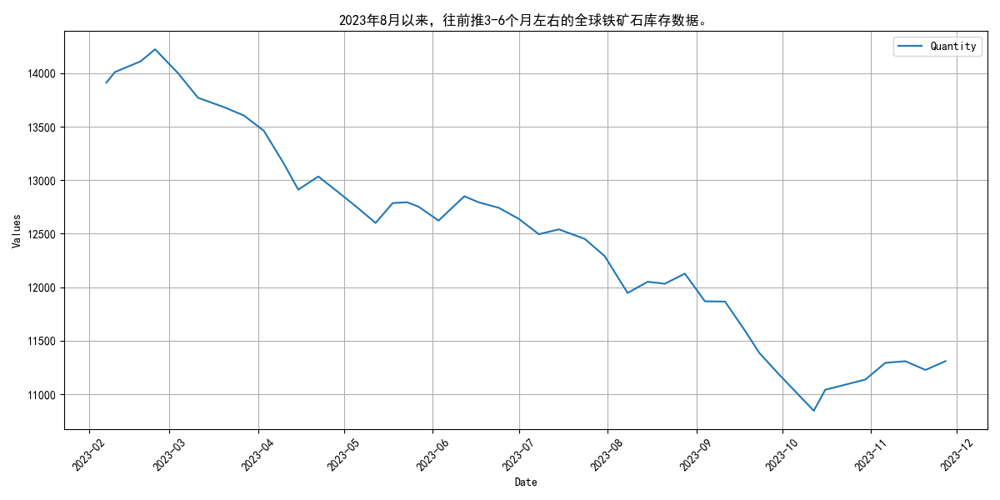
