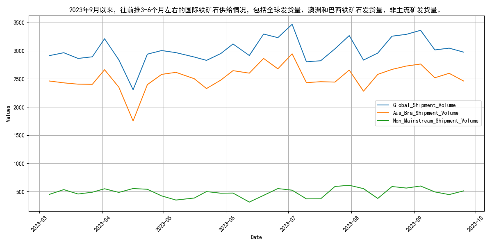
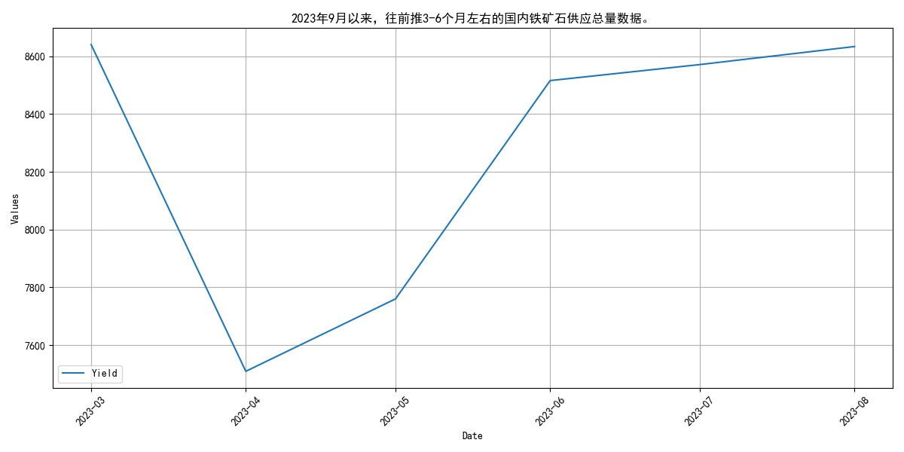
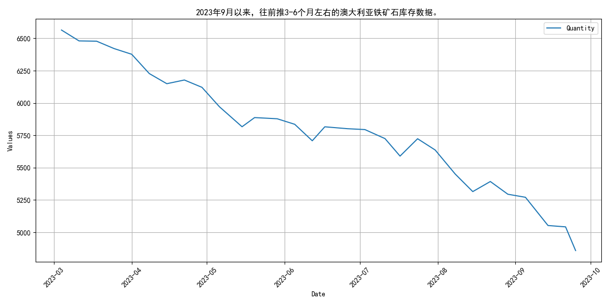

# 2023年9月月报：走势回顾与供给分析：铁矿石## **9月铁矿石价格波动上涨，涨幅放缓**
自2023年9月以来，铁矿石价格呈现波动上涨态势。具体来看，日照港PB粉现货价格从9月初的909元/吨上涨至9月底的944元/吨，涨幅约为3.85%。DCE01合约价格从845.5元/吨上涨至871.5元/吨，涨幅约为3.08%。DCE05合约价格从804.5元/吨上涨至827.0元/吨，涨幅约为2.79%。DCE07合约价格从923.0元/吨上涨至940.0元/吨，涨幅约为1.84%。整体而言，9月份铁矿石价格虽保持上涨趋势，但涨幅有所放缓。

## **2023年9月铁矿石供给波动分析**
自2023年9月以来，全球铁矿石发货量呈现波动上升态势，其中主流矿供应相对稳定，非主流矿则表现出较大的波动性。具体来看，2023年3月至9月，全球铁矿石发货量整体呈现波动上升趋势，从2912.1万吨增至3361.2万吨。澳洲和巴西发货量（主流矿）在2461.3万吨至2762.9万吨之间波动，显示出相对稳定的供应态势。而非主流矿发货量则从450.8万吨增至598.3万吨，波动较大，反映出非主流矿供应的不稳定性。总体而言，尽管非主流矿供应存在较大波动，但全球铁矿石发货量整体呈上升趋势，主流矿的稳定供应为市场提供了一定的支撑。

## **四大矿山月度发货量波动分析**
自2023年9月以来，四大矿山——淡水河谷、力拓、必和必拓和福蒂斯丘的月度发货量呈现出不同程度的增减，整体趋势保持稳定。具体来看，淡水河谷的发货量从3月的1753.5万吨逐步攀升至7月的2893.7万吨，随后在8月和9月有所回落。力拓的发货量在4月达到2893.7万吨的峰值后，逐渐下滑至9月的2538.7万吨。必和必拓的发货量在7月创下2818.6万吨的高点，之后在8月和9月也出现了下降。福蒂斯丘的发货量在3月至7月间波动较大，从1465.3万吨增至1635.4万吨，随后同样在8月和9月有所减少。总体而言，尽管四大矿山的发货量在2023年3月至9月间存在波动，但整体趋势仍保持相对稳定。
## **国产铁矿石原矿产量波动分析**
自2023年3月以来，国产铁矿石原矿产量呈现出先降后升的波动趋势，整体维持在较高水平。具体来看，3月份产量达到8640.3万吨，随后在4月份降至7509.6万吨，这一下降可能与市场需求的季节性调整有关。然而，5月份产量迅速回升至7760.1万吨，6月份进一步攀升至8515.54万吨，显示出国内矿山逐步复工及政策支持下产能的释放。7月和8月的产量分别为8570.9万吨和8633.3万吨，显示出市场供需关系的相对稳定。整体而言，尽管短期内经历了波动，但国产铁矿石原矿产量总体保持在较高水平，预计短期内将继续维持这一趋势。
## **国内铁矿石供给波动，全球库存下降**
自2023年9月以来，国内铁矿石供应总量呈现波动，全球库存持续下降，对产能利用率产生压力。具体来看，国内铁矿石供给在2023年3月至9月期间波动明显。供应总量从3月的8640.3万吨降至4月的7509.6万吨，随后在5月回升至7760.1万吨，6月进一步增至8515.54万吨，7月和8月分别维持在8570.9万吨和8633.3万吨。与此同时，全球铁矿石库存从3月初的14000.56万吨逐步下降至9月底的11385.42万吨，显示出全球范围内的铁矿石供应紧张态势。澳大利亚和巴西的铁矿石库存也呈现下降趋势，分别从3月初的6563.98万吨和4884.97万吨降至9月底的4858.83万吨和4745.19万吨。这些数据表明，尽管国内供应总量有所波动，但全球铁矿石库存的持续下降可能对国内矿山产能利用率产生一定压力。

